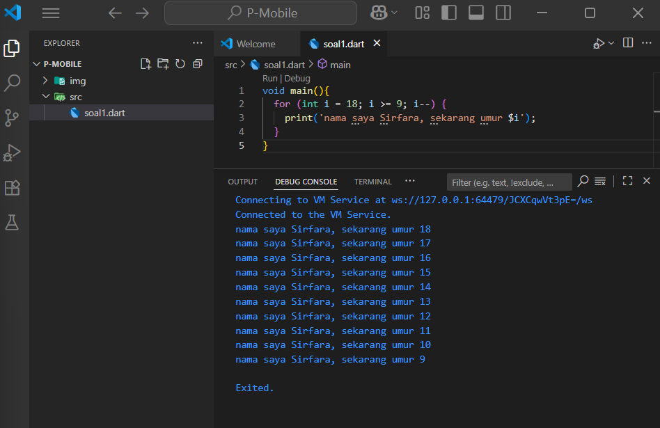
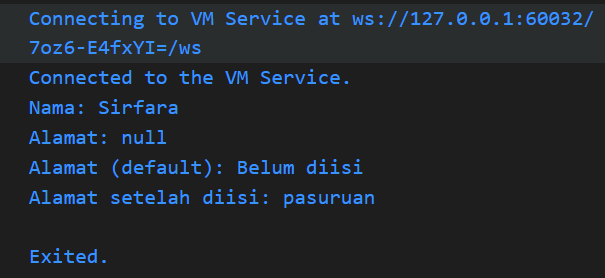
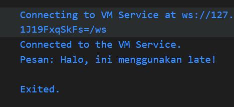

# Tugas Praktikum

1. Modifikasilah kode pada baris 3 di VS Code atau Editor Code favorit Anda berikut ini agar mendapatkan keluaran (output) sesuai yang diminta! Output yang diminta (Gantilah Fulan dengan nama Anda) 
jawab:
kode program 
void main(){
  for (int i = 18; i >= 9; i--) {
    print('nama saya Sirfara, sekarang umur $i');
  }
}

3. Mengapa sangat penting untuk memahami bahasa pemrograman Dart sebelum kita menggunakan framework Flutter ? Jelaskan!
jawab: Dasar dari flutter adalah dart, dengan memahami dart, lebih mudah membaca, menulis dan memodifikasi kode di flutter. Dart juga menggunakan OOP yang menjadi dasar logika dalam flutter.

4. Rangkumlah materi dari codelab ini menjadi poin-poin penting yang dapat Anda gunakan untuk membantu proses pengembangan aplikasi mobile menggunakan framework Flutter.
Jawab: Dart merupakan bahasa inti di balik Flutter digunakan baik untuk aplikasi pengguna, plugin dan pengelolaan dependensi. Dasar Dart sebagai bahasa flutter memahami Dart berarti memahami fondasi Flutter struktur kode, logika UI, dan pengelolaan state. kelebihan bahasa dart yaitu productive tooling, garbage collection type annotations, statically typed with type inference, portability.

5. Buatlah penjelasan dan contoh eksekusi kode tentang perbedaan Null Safety dan Late variabel !
jawab: Null Safety adalah fitur Dart yang memastikan bahwa variabel tidak bisa berisi null kecuali memang diizinkan secara eksplisit. sedangkan late variabel igunakan untuk menunda inisialisasi variabel non-nullable. 
contoh kode program null safety ada di file kode src.
output:
 contoh kode program late variable ada di file kode src. output 

