# PERTEMUAN 10 Dasar Manajemen State di Flutter

## PRAKTIKUM 1: Mengambil Foto dengan Kamera di Flutter

### Langkah 1: Buat Project Baru
Buat project flutter baru dengan nama master_plan
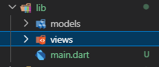

### Langkah 2: Membuat model task.dart
Buat file bernama task.dart 
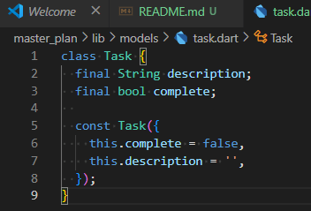

### Langkah 3: Buat file plan.dart
Buat file bernama plan..dart 
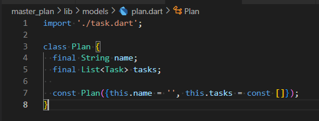

### Langkah 4: Buat file data_layer.dart
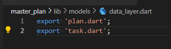

### Langkah 5: Pindah ke file main.dart
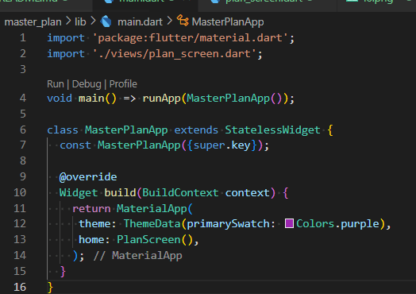

### Langkah 6: buat plan_screen.dart
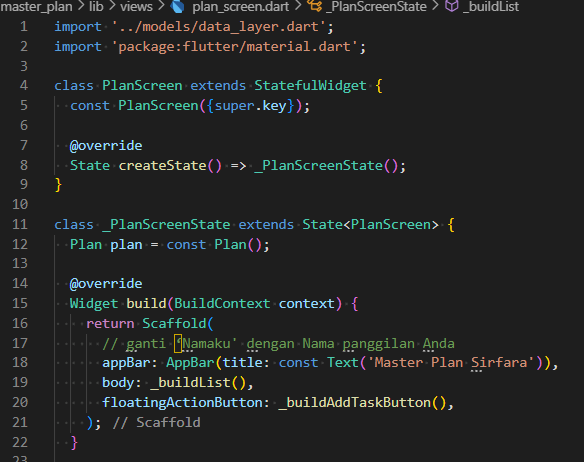

### Langkah 7: buat method _buildAddTaskButton()

### Langkah 8: buat widget _buildList()
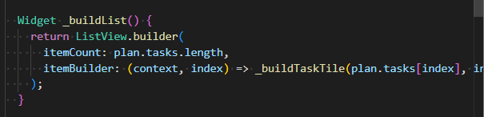
### Langkah 9: buat widget _buildTaskTile
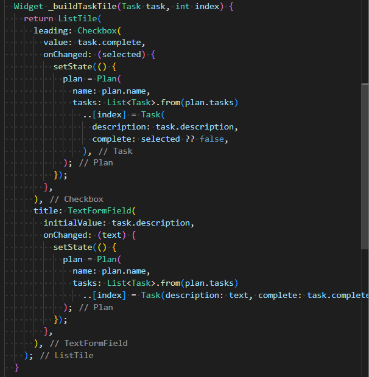
### Langkah 10: Tambah Scroll Controller
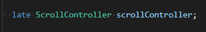
### Langkah 11: Tambah Scroll Listener
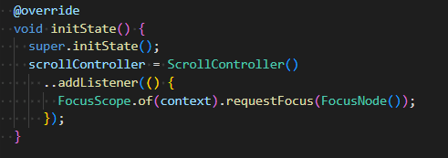
### Langkah 12: Tambah controller dan keyboard behavior
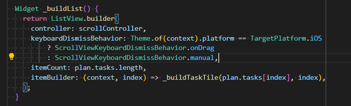
### Langkah 13: Terakhir, tambah method dispose()
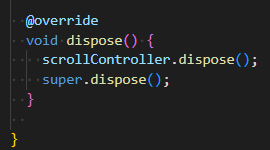
### Langkah 14: Hasil
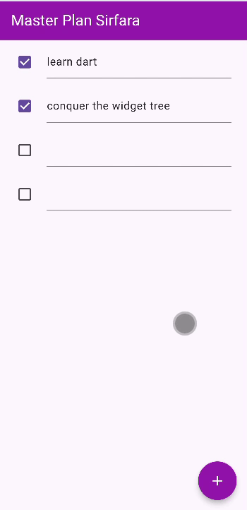

## TUGAS PRAKTIKUM 1: Dasar State dengan Model-View
1. Selesaikan langkah-langkah praktikum tersebut, lalu dokumentasikan berupa GIF hasil akhir praktikum beserta penjelasannya di file README.md! Jika Anda menemukan ada yang error atau tidak berjalan dengan baik, silakan diperbaiki.
 
Hasil akhir aplikasi Master Plan, daftar tugas dengan fitur centang dan tombol + untuk menambah tugas baru. Saat tombol ditekan, tugas baru muncul di daftar. Tampilan menggunakan AppBar ungu dan Floating Action Button bulat ungu

2. Jelaskan maksud dari langkah 4 pada praktikum tersebut! Mengapa dilakukan demikian?  
Pada langkah 4 agar semua model plan.dart, task.dart dapat diimport secara efisien melalui satu file yaitu data_layer.dart. untuk membantu menjaga kode tetap rapi, terstruktur, dan mudah dikembangkan saat aplikasi bertambah besar.

3. Mengapa perlu variabel plan di langkah 6 pada praktikum tersebut? Mengapa dibuat konstanta ?  
Variabel plan digunakan untuk menyimpan data rencana (plan) yang akan ditampilkan dan dikelola di halaman PlanScreen.

4. Lakukan capture hasil dari Langkah 9 berupa GIF, kemudian jelaskan apa yang telah Anda buat!

Tampilan aplikasi Master Plan yang menampilkan daftar tugas dengan checkbox dan tombol Floating Action Button (FAB) berikon “+”. Saat tombol + ditekan, aplikasi menambahkan baris tugas baru ke dalam daftar.

5. Apa kegunaan method pada Langkah 11 dan 13 dalam lifecyle state ?  
Method initState() digunakan untuk menginisialisasi data atau objek yang diperlukan sebelum widget ditampilkan, seperti membuat ScrollController dan menambahkan listener agar keyboard tertutup saat pengguna melakukan scroll.   Method dispose() digunakan untuk membersihkan resource seperti menutup scrollController ketika widget sudah tidak digunakan lagi.

##  Praktikum 2: Mengelola Data Layer dengan InheritedWidget dan InheritedNotifier

### Langkah 1: Buat file plan_provider.dart
### Langkah 2: Edit main.dart

### Langkah 3: Buat file plan.dart
### Langkah 4: Buat file data_layer.dart
### Langkah 5: Edit method _buildAddTaskButton
### Langkah 6: Edit method _buildTaskTile
### Langkah 7: Edit _buildList
### Langkah 8: Tetap di class PlanScreen
### Langkah 9: Tambah widget SafeArea

## Tugas Praktikum 2: InheritedWidget

## Praktikum 3: Membuat State di Multiple Screens
### Langkah 1: Edit PlanProvider
### Langkah 2: Edit main.dart
### Langkah 3: Edit plan_screen.dart
### Langkah 4: Error
### Langkah 5: Tambah getter Plan
### Langkah 6: Method initState()
### Langkah 7: Widget build
### Langkah 8: Edit _buildTaskTile
### Langkah 9: Buat screen baru
### Langkah 10: Pindah ke class _PlanCreatorScreenState
### Langkah 11: Pindah ke method build
### Langkah 12: Buat widget _buildListCreator
### Langkah 13: Buat void addPlan()
### Langkah 14: Buat widget _buildMasterPlans()

## Tugas Praktikum 3: State di Multiple Screens
