# PERTEMUAN 10 Dasar Manajemen State di Flutter

## PRAKTIKUM 1: Mengambil Foto dengan Kamera di Flutter

### Langkah 1: Buat Project Baru
Buat project flutter baru dengan nama master_plan <br>


### Langkah 2: Membuat model task.dart
Buat file bernama task.dart  <br>


### Langkah 3: Buat file plan.dart
Buat file bernama plan..dart 


### Langkah 4: Buat file data_layer.dart


### Langkah 5: Pindah ke file main.dart


### Langkah 6: buat plan_screen.dart


### Langkah 7: buat method _buildAddTaskButton()


### Langkah 8: buat widget _buildList()

### Langkah 9: buat widget _buildTaskTile

### Langkah 10: Tambah Scroll Controller

### Langkah 11: Tambah Scroll Listener

### Langkah 12: Tambah controller dan keyboard behavior

### Langkah 13: Terakhir, tambah method dispose()

### Langkah 14: Hasil


## TUGAS PRAKTIKUM 1: Dasar State dengan Model-View
1. Selesaikan langkah-langkah praktikum tersebut, lalu dokumentasikan berupa GIF hasil akhir praktikum beserta penjelasannya di file README.md! Jika Anda menemukan ada yang error atau tidak berjalan dengan baik, silakan diperbaiki. <br>
 <br>
Hasil akhir aplikasi Master Plan, daftar tugas dengan fitur centang dan tombol + untuk menambah tugas baru. Saat tombol ditekan, tugas baru muncul di daftar. Tampilan menggunakan AppBar ungu dan Floating Action Button bulat ungu

2. Jelaskan maksud dari langkah 4 pada praktikum tersebut! Mengapa dilakukan demikian? <br>
Pada langkah 4 agar semua model plan.dart, task.dart dapat diimport secara efisien melalui satu file yaitu data_layer.dart. untuk membantu menjaga kode tetap rapi, terstruktur, dan mudah dikembangkan saat aplikasi bertambah besar.

3. Mengapa perlu variabel plan di langkah 6 pada praktikum tersebut? Mengapa dibuat konstanta ? <br>
Variabel plan digunakan untuk menyimpan data rencana (plan) yang akan ditampilkan dan dikelola di halaman PlanScreen.

4. Lakukan capture hasil dari Langkah 9 berupa GIF, kemudian jelaskan apa yang telah Anda buat! <br>
 <br>
Tampilan aplikasi Master Plan yang menampilkan daftar tugas dengan checkbox dan tombol Floating Action Button (FAB) berikon “+”. Saat tombol + ditekan, aplikasi menambahkan baris tugas baru ke dalam daftar.

5. Apa kegunaan method pada Langkah 11 dan 13 dalam lifecyle state ? <br>
Method initState() digunakan untuk menginisialisasi data atau objek yang diperlukan sebelum widget ditampilkan, seperti membuat ScrollController dan menambahkan listener agar keyboard tertutup saat pengguna melakukan scroll. <br> Method dispose() digunakan untuk membersihkan resource seperti menutup scrollController ketika widget sudah tidak digunakan lagi.


##  Praktikum 2: Mengelola Data Layer dengan InheritedWidget dan InheritedNotifier

### Langkah 1: Buat file plan_provider.dart
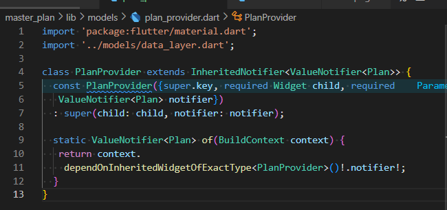
### Langkah 2: Edit main.dart
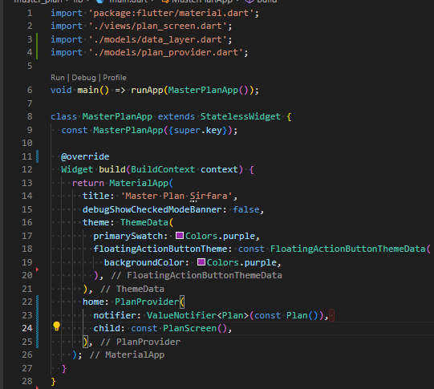
### Langkah 3: Tambah method pada model plan.dart
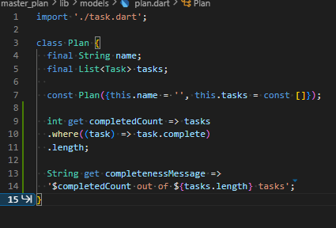
### Langkah 4: Pindah ke PlanScreen
Edit PlanScreen agar menggunakan data dari PlanProvider. Hapus deklarasi variabel plan (ini akan membuat error). Kita akan perbaiki pada langkah 5 berikut ini.
### Langkah 5: Edit method _buildAddTaskButton
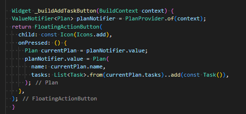

### Langkah 6: Edit method _buildTaskTile
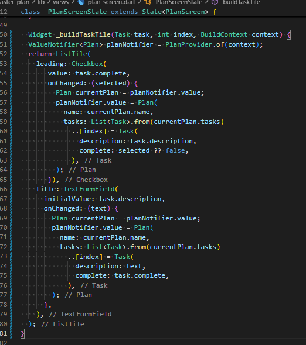

### Langkah 7: Edit _buildList
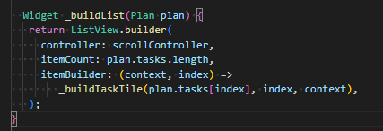

### Langkah 8: Tetap di class PlanScreen
Edit method build sehingga bisa tampil progress pada bagian bawah (footer). Caranya, bungkus (wrap) _buildList dengan widget Expanded dan masukkan ke dalam widget Column seperti kode pada Langkah 9.
### Langkah 9: Tambah widget SafeArea
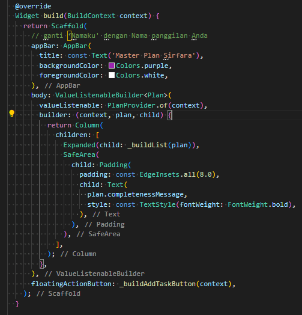
## Tugas Praktikum 2: InheritedWidget
2. Jelaskan mana yang dimaksud InheritedWidget pada langkah 1 tersebut! Mengapa yang digunakan InheritedNotifier? <br> 
InheritedWidget digunakan untuk mewariskan data ke widget turunannya tanpa perlu meneruskan lewat konstruktor.Tetapi ini digunakan InheritedNotifier karena memakai ValueNotifier<Plan> yang bisa memberi tahu perubahan data secara otomatis ke widget lain.
3. Jelaskan maksud dari method di langkah 3 pada praktikum tersebut! Mengapa dilakukan demikian?
<br> Method (getter) itu dibuat untuk menghitung progres tugas secara otomatis dari data. completedCount menghitung berapa tugas yang sudah selesai. completenessMessage menampilkan hasilnya dalam bentuk teks. agar logika perhitungan progres tersimpan di model (Plan), bukan di tampilan (UI).
4. Lakukan capture hasil dari Langkah 9 berupa GIF, kemudian jelaskan apa yang telah Anda buat!
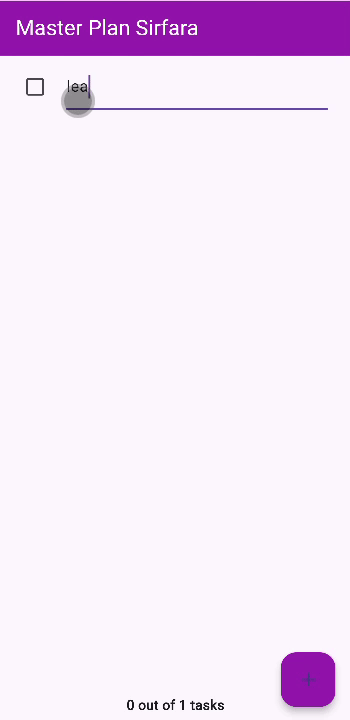 <br> Tampilan master plan menggunakan Flutter yang menampilkan daftar tugas (to-do list) dengan fitur untuk menambah, mengedit, dan menandai tugas sebagai selesai. Setiap perubahan data otomatis memperbarui tampilan berkat penggunaan state management sederhana dengan InheritedNotifier dan ValueNotifier.


## Praktikum 3: Membuat State di Multiple Screens
### Langkah 1: Edit PlanProvider
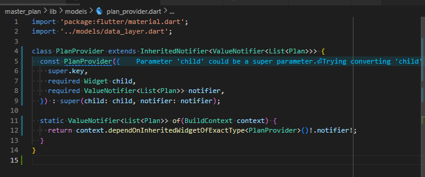
### Langkah 2: Edit main.dart
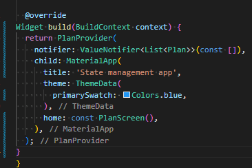
### Langkah 3: Edit plan_screen.dart
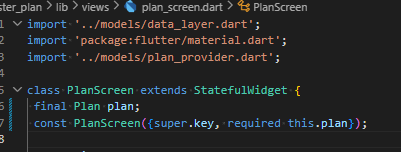
### Langkah 4: Error
Itu akan terjadi error setiap kali memanggil PlanProvider.of(context). Itu terjadi karena screen saat ini hanya menerima tugas-tugas untuk satu kelompok Plan, tapi sekarang PlanProvider menjadi list dari objek plan tersebut.
### Langkah 5: Tambah getter Plan
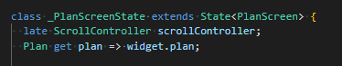
### Langkah 6: Method initState()
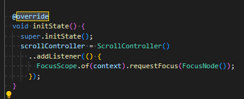
### Langkah 7: Widget build
```dart
 @override
  Widget build(BuildContext context) {
    ValueNotifier<List<Plan>> plansNotifier = PlanProvider.of(context);

    return Scaffold(
      appBar: AppBar(title: Text(_plan.name)),
      body: ValueListenableBuilder<List<Plan>>(
        valueListenable: plansNotifier,
        builder: (context, plans, child) {
          Plan currentPlan = plans.firstWhere((p) => p.name == plan.
name);
          return Column(
            children: [
              Expanded(child: _buildList(currentPlan)),
              SafeArea(child: Text(currentPlan.
completenessMessage)),
            ],);},),
      floatingActionButton: _buildAddTaskButton(context,)
  ,);
 }

  Widget _buildAddTaskButton(BuildContext context) {
    ValueNotifier<List<Plan>> planNotifier = PlanProvider.
of(context);
    return FloatingActionButton(
      child: const Icon(Icons.add),
      onPressed: () {
        Plan currentPlan = plan;
        int planIndex =
            planNotifier.value.indexWhere((p) => p.name == currentPlan.name);
        List<Task> updatedTasks = List<Task>.from(currentPlan.tasks)
          ..add(const Task());
        planNotifier.value = List<Plan>.from(planNotifier.value)
          ..[planIndex] = Plan(
            name: currentPlan.name,
            tasks: updatedTasks,
          );
        plan = Plan(
          name: currentPlan.name,
          tasks: updatedTasks,
        );},);
  }
```
### Langkah 8: Edit _buildTaskTile
```dart
 Widget _buildTaskTile(Task task, int index, BuildContext context)
{
    ValueNotifier<List<Plan>> planNotifier = PlanProvider.
of(context);

    return ListTile(
      leading: Checkbox(
         value: task.complete,
         onChanged: (selected) {
           Plan currentPlan = plan;
           int planIndex = planNotifier.value
              .indexWhere((p) => p.name == currentPlan.name);
           planNotifier.value = List<Plan>.from(planNotifier.value)
             ..[planIndex] = Plan(
               name: currentPlan.name,
               tasks: List<Task>.from(currentPlan.tasks)
                 ..[index] = Task(
                   description: task.description,
                   complete: selected ?? false,
                 ),);
         }),
      title: TextFormField(
        initialValue: task.description,
        onChanged: (text) {
          Plan currentPlan = plan;
          int planIndex =
             planNotifier.value.indexWhere((p) => p.name ==
currentPlan.name);
          planNotifier.value = List<Plan>.from(planNotifier.value)
            ..[planIndex] = Plan(
              name: currentPlan.name,
              tasks: List<Task>.from(currentPlan.tasks)
                ..[index] = Task(
                  description: text,
                  complete: task.complete,
                ),
            );
},),);}
```
### Langkah 9: Buat screen baru
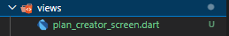
### Langkah 10: Pindah ke class _PlanCreatorScreenState
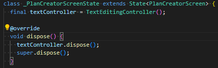
### Langkah 11: Pindah ke method build
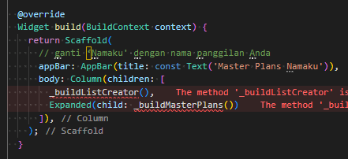

### Langkah 12: Buat widget _buildListCreator
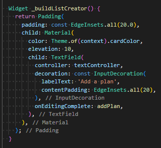

### Langkah 13: Buat void addPlan()
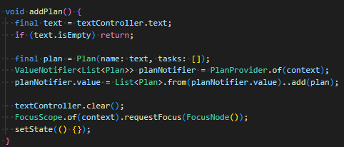

### Langkah 14: Buat widget _buildMasterPlans()
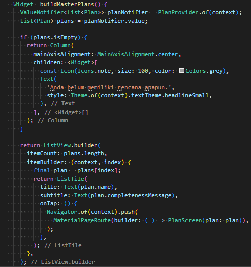

## Tugas Praktikum 3: State di Multiple Screens
2. Berdasarkan Praktikum 3 yang telah Anda lakukan, jelaskan maksud dari gambar diagram berikut ini! <br>
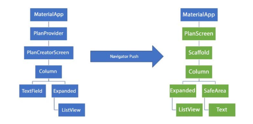 <br>
Diagram diatas menunjukkan bagaimana state tunggal berupa daftar Plan dikelola di PlanProvider (InheritedWidget) yang berada di atas widget tree sehingga dapat diakses oleh beberapa screen. Di PlanCreatorScreen, pengguna dapat menambah plan baru dan melihat daftar plan melalui ListView. Saat salah satu plan dipilih, Navigator.push membuka PlanScreen yang menampilkan detail task dan completenessMessage plan tersebut. Konsep ini menekankan “Lift State Up”, di mana state tetap berada di tingkat atas, memungkinkan kedua screen membaca dan memodifikasi state yang sama sehingga perubahan di satu screen langsung tercermin di screen lain.
3. Lakukan capture hasil dari Langkah 14 berupa GIF, kemudian jelaskan apa yang telah Anda buat!
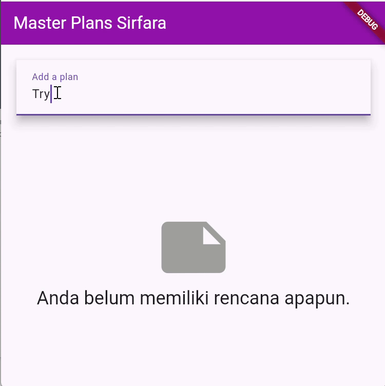 <br>
Membuat fitur menambahkan plan baru di aplikasi Master Plans. Pengguna mengetik nama plan di TextField “Add a plan”, kemudian menekan enter, dan plan tersebut langsung muncul di daftar di bawahnya. Sebelumnya tampilan menampilkan pesan “Anda belum memiliki rencana apapun”, tetapi setelah plan ditambahkan, pesan ini hilang dan plan baru tampil di ListView.