# PERTEMUAN 11 Pemrograman Asynchronous 

## PRAKTIKUM 1:Mengunduh Data dari Web Service (API)

### Langkah 1: Buat Project Baru
Buatlah sebuah project flutter baru dengan nama books di folder src week-11 repository GitHub Anda.
Tambahkan dependensi http 
"flutter pub add http" <br>

### Langkah 2: Cek file pubspec.yaml

### Langkah 3: Buka file main.dart
#### Soal 1 
Tambahkan nama panggilan Anda pada title app sebagai identitas hasil pekerjaan Anda. <br>


```dart
import 'dart:async';
import 'package:flutter/material.dart';
import 'package:http/http.dart' as http;

void main() {
  runApp(const MyApp());
}

class MyApp extends StatelessWidget {
  const MyApp({super.key});

  @override
  Widget build(BuildContext context) {
    return MaterialApp(
      title: 'Future Demo',
      theme: ThemeData(
        primarySwatch: Colors.blue,
        visualDensity: VisualDensity.adaptivePlatformDensity,
      ),
      home: const FuturePage(),
    );
  }
}

class FuturePage extends StatefulWidget {
  const FuturePage({super.key});

  @override
  State<FuturePage> createState() => _FuturePageState();
}

class _FuturePageState extends State<FuturePage> {
  String result = '';

  @override
  Widget build(BuildContext context) {
    return Scaffold(
      appBar: AppBar(
        title: const Text('Sirfara'),
      ),
      body: Center(
        child: Column(
          children: [
            const Spacer(),
            ElevatedButton(
              child: const Text('GO!'),
              onPressed: () {},
            ),
            const Spacer(),
            Text(result),
            const Spacer(),
            const CircularProgressIndicator(),
            const Spacer(),
          ],
        ),
      ),
    );
  }
}
```

### Langkah 4: Tambah method getData()
Tambah method ini ke dalam class _FuturePageState yang berguna untuk mengambil data dari API Google Books.


#### Soal 2 
1. Carilah judul buku favorit Anda di Google Books, lalu ganti ID buku pada variabel path di kode tersebut. Caranya ambil di URL browser Anda seperti gambar berikut ini. <br>
2. Kemudian cobalah akses di browser URI tersebut dengan lengkap seperti ini. Jika menampilkan data JSON, maka Anda telah berhasil. Lakukan capture milik Anda dan tulis di README pada laporan praktikum. Lalu lakukan commit dengan pesan "W11: Soal 2" <br>


### Langkah 5: Tambah kode di ElevatedButton
Tambahkan kode  pada onPressed di ElevatedButton. <br>

#### Soal 3
1. Jelaskan maksud kode langkah 5 tersebut terkait substring dan catchError! <br> jawaban: substring(0,300) membatasi tampilan hasil JSON agar tidak terlalu panjang, sedangkan catchError menangkap kesalahan agar program tidak crash dan bisa menampilkan pesan error dengan aman.
2. Capture hasil praktikum Anda berupa GIF dan lampirkan di README. Lalu lakukan commit dengan pesan "W11: Soal 3". <br>


## Praktikum 2: Menggunakan await/async untuk menghindari callbacks
### Langkah 1: Buka file main.dart
menambahkan tiga method berisi kode seperti berikut di dalam class _FuturePageState.

```dart
Future<int> returnOneAsync() async {
  await Future.delayed(const Duration(seconds: 3));
  return 1;
}

Future<int> returnTwoAsync() async {
  await Future.delayed(const Duration(seconds: 3));
  return 2;
}

Future<int> returnThreeAsync() async {
  await Future.delayed(const Duration(seconds: 3));
  return 3;
}
```

### Langkah 2: Tambah method count()
```dart
Future count() async {
    int total = 0;
    total = await returnOneAsync();
    total += await returnTwoAsync();
    total += await returnThreeAsync();

    setState(() {
      result = total.toString();
    });
  }
```
### Langkah 3: Panggil count()
```dart
onPressed: () {
  count();
},
```
### Langkah 4: Run

#### Soal 4
1. Jelaskan maksud kode langkah 1 dan 2 tersebut! <br> Jawaban: Langkah 1 membuat tiga fungsi asynchronous yang menunggu tiga detik sebelum mengembalikan nilai 1, 2, dan 3. Langkah 2 menggunakan fungsi count() untuk memanggil ketiganya secara berurutan, menjumlahkan hasilnya menjadi 6, lalu menampilkannya di layar dengan setState().
2. Capture hasil praktikum Anda berupa GIF dan lampirkan di README. Lalu lakukan commit dengan pesan "W11: Soal 4" <br> 

## Praktikum 3: Menggunakan Completer di Future

### Langkah 1: Buka file main.dart
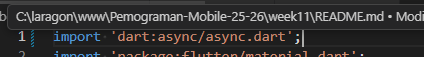
### Langkah 2: Tambahkan variabel dan method
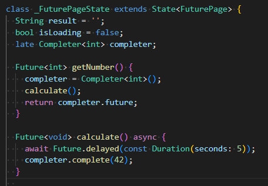
### Langkah 3: Ganti isi kode onPressed()
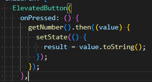
### Langkah 4: Run
 Run, Setelah 5 detik, maka angka 42 akan tampil.
#### Soal 5 
1. Jelaskan maksud kode langkah 2 tersebut! <br> Jawaban : Variabel late Completer completer digunakan untuk mengontrol Future secara manual. Method getNumber() membuat Completer baru, memanggil calculate(), dan mengembalikan Future yang belum selesai. Method calculate() menunggu 5 detik dengan Future.delayed(), kemudian menyelesaikan Completer menggunakan completer.complete(42) yang memberikan nilai 42.

2. Capture hasil praktikum Anda berupa GIF dan lampirkan di README. Lalu lakukan commit dengan pesan "W11: Soal 5". <br> 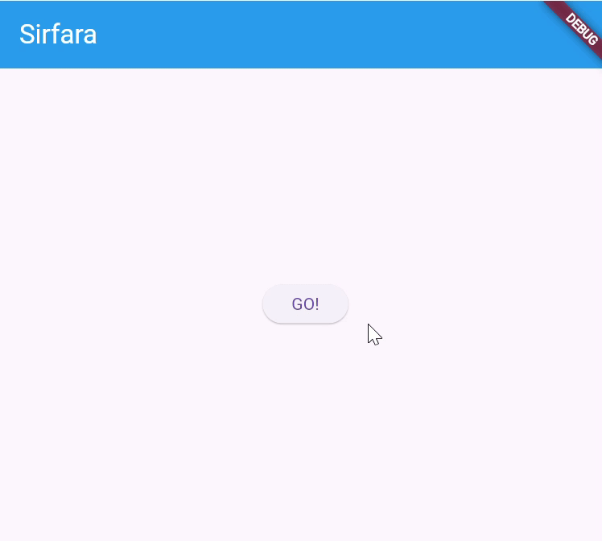
### Langkah 5: Ganti method calculate()
Gantilah isi code method calculate() <br> 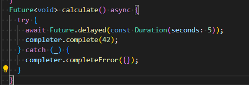
### Langkah 6: Pindah ke onPressed()
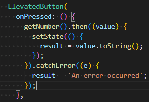
#### Soal 6
1. Jelaskan maksud perbedaan kode langkah 2 dengan langkah 5-6 tersebut!
<br> Langkah 2 menggunakan method calculate() tanpa penanganan error, sehingga jika terjadi kesalahan aplikasi akan crash. Langkah 5 menambahkan try-catch untuk menangkap error dan mengirimnya melalui completer.completeError({}). Langkah 6 menambahkan .catchError() pada UI untuk menampilkan pesan "An error occurred" kepada user. Dengan penambahan error handling ini, aplikasi menjadi lebih stabil dan user-friendly. <br>
Kesimpulan perbedaan: <br>
| Aspek | Langkah 2 | Langkah 5-6 |
|-------|-----------|-------------|
| **Error Handling** | Tidak ada | Ada (try-catch + catchError) |
| **Jika Error** | Crash/unhandled | Tampil pesan error |
| **User Experience** | Tdak baik (app bisa crash) | Baik (user diberi feedback) |
| **Production Ready** | Tidak | Ya | 

2. Capture hasil praktikum Anda berupa GIF dan lampirkan di README. Lalu lakukan commit dengan pesan "W11: Soal 6". <br> 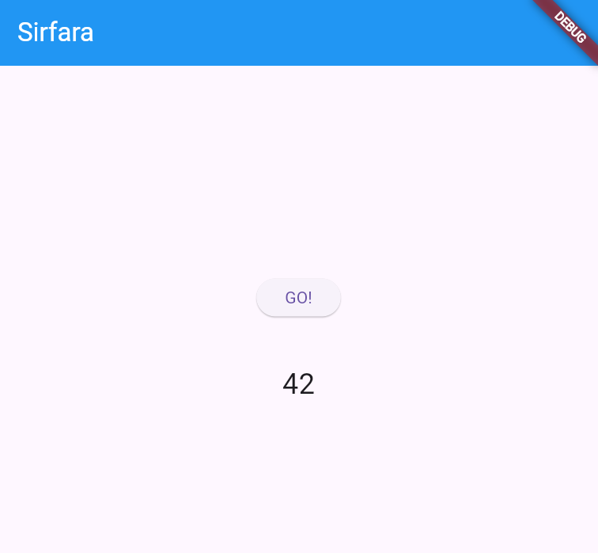

## Praktikum 4: Memanggil Future secara paralel

### Langkah 1: Buka file main.dart
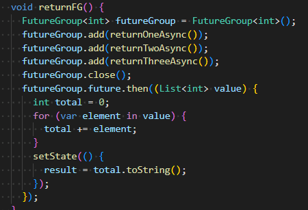
### Langkah 2: Edit onPressed()
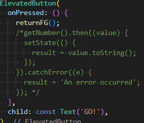

### Langkah 3: Run
#### Soal 7 
1. Capture hasil praktikum Anda berupa GIF dan lampirkan di README. Lalu lakukan commit dengan pesan "W11: Soal 7". <br> 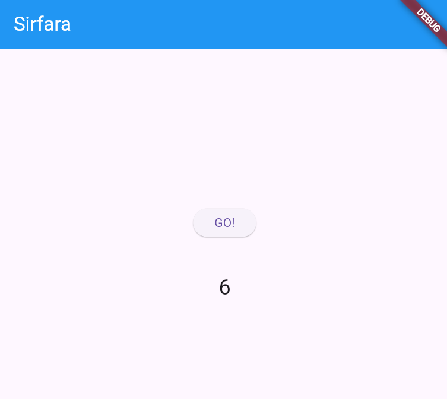
### Langkah 4: Ganti variabel futureGroup
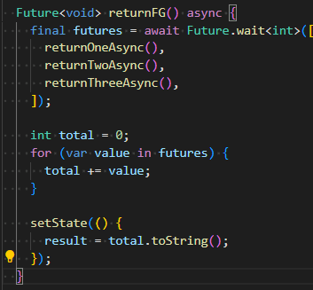

#### Soal 8
1. Jelaskan maksud perbedaan kode langkah 1 dan 4! <br> Langkah 1 menggunakan FutureGroup dari package async yang menambahkan Future satu per satu dengan method .add() dan harus ditutup dengan .close() sebelum diproses. Langkah 4 menggunakan Future.wait() yang merupakan method bawaan Dart, lebih ringkas karena langsung mendefinisikan semua Future dalam bentuk List tanpa perlu memanggil .close()

## Praktikum 5: Menangani Respon Error pada Async Code

### Langkah 1: Buka file main.dart
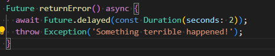
### Langkah 2: ElevatedButton
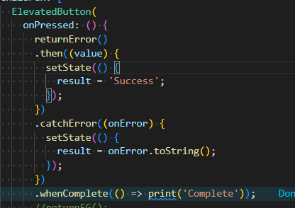
### Langkah 3: Run
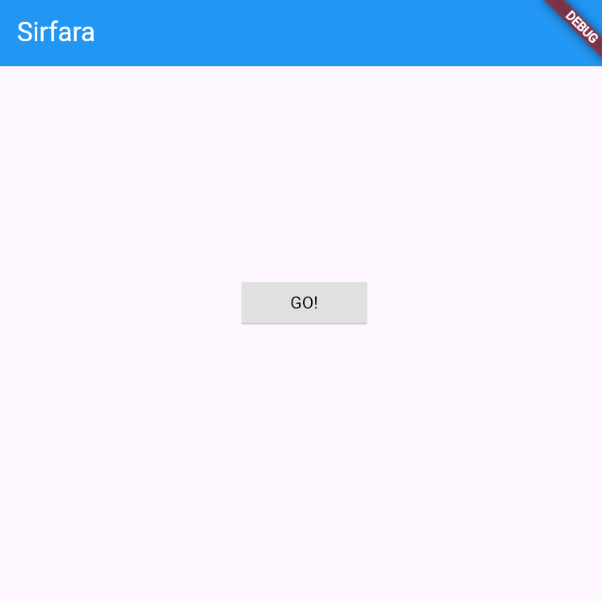

#### Soal 9 
1. Capture hasil praktikum Anda berupa GIF dan lampirkan di README. Lalu lakukan commit dengan pesan "W11: Soal 9". <bt> 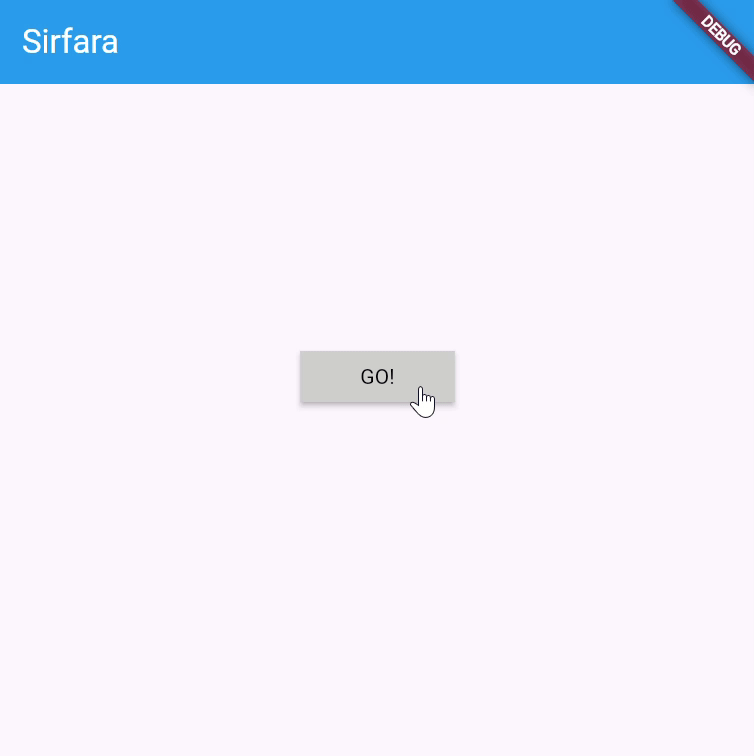
### Langkah 4: Tambah method handleError()

## Praktikum 6: Menggunakan Future dengan StatefulWidget

### Langkah 1: install plugin geolocator
### Langkah 2: Tambah permission GPS
### Langkah 3: Buat file geolocation.dart
### Langkah 4: Buat StatefulWidget
### Langkah 5: Isi kode geolocation.dart
### Langkah 6: Edit main.dart
### Langkah 7: Run
### Langkah 8: Tambahkan animasi loading

## Praktikum 7: Manajemen Future dengan FutureBuilder

### Langkah 1: Modifikasi method getPosition()
### Langkah 2: Tambah variabel
### Langkah 3: Tambah initState()
### Langkah 4: Edit method build()
### Langkah 5: Tambah handling error

## Praktikum 8: Navigation route dengan Future Function

### Langkah 1: Buat file baru navigation_first.dart
### Langkah 2: Isi kode navigation_first.dart
### Langkah 3: Tambah method di class _NavigationFirstState
### Langkah 4: Buat file baru navigation_second.dart
### Langkah 5: Buat class NavigationSecond dengan StatefulWidget
### Langkah 6: Edit main.dart
### Langkah 7: Run

## Praktikum 9: Memanfaatkan async/await dengan Widget Dialog

### Langkah 1: Buat file baru navigation_dialog.dart
### Langkah 2: Isi kode navigation_dialog.dart
### Langkah 3: Tambah method async
### Langkah 4: Panggil method di ElevatedButton
### Langkah 5: Edit main.dart
### Langkah 6: Run

