# PERTEMUAN 11 Pemrograman Asynchronous 

## PRAKTIKUM 1:Mengunduh Data dari Web Service (API)

### Langkah 1: Buat Project Baru
Buatlah sebuah project flutter baru dengan nama books di folder src week-11 repository GitHub Anda.
Tambahkan dependensi http 
"flutter pub add http" <br>

### Langkah 2: Cek file pubspec.yaml

### Langkah 3: Buka file main.dart
#### Soal 1 
Tambahkan nama panggilan Anda pada title app sebagai identitas hasil pekerjaan Anda. <br>


```dart
import 'dart:async';
import 'package:flutter/material.dart';
import 'package:http/http.dart' as http;

void main() {
  runApp(const MyApp());
}

class MyApp extends StatelessWidget {
  const MyApp({super.key});

  @override
  Widget build(BuildContext context) {
    return MaterialApp(
      title: 'Future Demo',
      theme: ThemeData(
        primarySwatch: Colors.blue,
        visualDensity: VisualDensity.adaptivePlatformDensity,
      ),
      home: const FuturePage(),
    );
  }
}

class FuturePage extends StatefulWidget {
  const FuturePage({super.key});

  @override
  State<FuturePage> createState() => _FuturePageState();
}

class _FuturePageState extends State<FuturePage> {
  String result = '';

  @override
  Widget build(BuildContext context) {
    return Scaffold(
      appBar: AppBar(
        title: const Text('Sirfara'),
      ),
      body: Center(
        child: Column(
          children: [
            const Spacer(),
            ElevatedButton(
              child: const Text('GO!'),
              onPressed: () {},
            ),
            const Spacer(),
            Text(result),
            const Spacer(),
            const CircularProgressIndicator(),
            const Spacer(),
          ],
        ),
      ),
    );
  }
}
```

### Langkah 4: Tambah method getData()
Tambah method ini ke dalam class _FuturePageState yang berguna untuk mengambil data dari API Google Books.


#### Soal 2 
1. Carilah judul buku favorit Anda di Google Books, lalu ganti ID buku pada variabel path di kode tersebut. Caranya ambil di URL browser Anda seperti gambar berikut ini. <br>
2. Kemudian cobalah akses di browser URI tersebut dengan lengkap seperti ini. Jika menampilkan data JSON, maka Anda telah berhasil. Lakukan capture milik Anda dan tulis di README pada laporan praktikum. Lalu lakukan commit dengan pesan "W11: Soal 2" <br>


### Langkah 5: Tambah kode di ElevatedButton
Tambahkan kode  pada onPressed di ElevatedButton. <br>

#### Soal 3
1. Jelaskan maksud kode langkah 5 tersebut terkait substring dan catchError! <br> jawaban: substring(0,300) membatasi tampilan hasil JSON agar tidak terlalu panjang, sedangkan catchError menangkap kesalahan agar program tidak crash dan bisa menampilkan pesan error dengan aman.
2. Capture hasil praktikum Anda berupa GIF dan lampirkan di README. Lalu lakukan commit dengan pesan "W11: Soal 3". <br>


## Praktikum 2: Menggunakan await/async untuk menghindari callbacks
### Langkah 1: Buka file main.dart
menambahkan tiga method berisi kode seperti berikut di dalam class _FuturePageState.

```dart
Future<int> returnOneAsync() async {
  await Future.delayed(const Duration(seconds: 3));
  return 1;
}

Future<int> returnTwoAsync() async {
  await Future.delayed(const Duration(seconds: 3));
  return 2;
}

Future<int> returnThreeAsync() async {
  await Future.delayed(const Duration(seconds: 3));
  return 3;
}
```

### Langkah 2: Tambah method count()
```dart
Future count() async {
    int total = 0;
    total = await returnOneAsync();
    total += await returnTwoAsync();
    total += await returnThreeAsync();

    setState(() {
      result = total.toString();
    });
  }
```
### Langkah 3: Panggil count()
```dart
onPressed: () {
  count();
},
```
### Langkah 4: Run

#### Soal 4
1. Jelaskan maksud kode langkah 1 dan 2 tersebut! <br> Jawaban: Langkah 1 membuat tiga fungsi asynchronous yang menunggu tiga detik sebelum mengembalikan nilai 1, 2, dan 3. Langkah 2 menggunakan fungsi count() untuk memanggil ketiganya secara berurutan, menjumlahkan hasilnya menjadi 6, lalu menampilkannya di layar dengan setState().
2. Capture hasil praktikum Anda berupa GIF dan lampirkan di README. Lalu lakukan commit dengan pesan "W11: Soal 4" <br> 

## Praktikum 3: Menggunakan Completer di Future

### Langkah 1: Buka file main.dart

### Langkah 2: Tambahkan variabel dan method

### Langkah 3: Ganti isi kode onPressed()

### Langkah 4: Run
 Run, Setelah 5 detik, maka angka 42 akan tampil.
#### Soal 5 
1. Jelaskan maksud kode langkah 2 tersebut! <br> Jawaban : Variabel late Completer completer digunakan untuk mengontrol Future secara manual. Method getNumber() membuat Completer baru, memanggil calculate(), dan mengembalikan Future yang belum selesai. Method calculate() menunggu 5 detik dengan Future.delayed(), kemudian menyelesaikan Completer menggunakan completer.complete(42) yang memberikan nilai 42.

2. Capture hasil praktikum Anda berupa GIF dan lampirkan di README. Lalu lakukan commit dengan pesan "W11: Soal 5". <br> 
### Langkah 5: Ganti method calculate()
Gantilah isi code method calculate() <br> 
### Langkah 6: Pindah ke onPressed()

#### Soal 6
1. Jelaskan maksud perbedaan kode langkah 2 dengan langkah 5-6 tersebut!
<br> Langkah 2 menggunakan method calculate() tanpa penanganan error, sehingga jika terjadi kesalahan aplikasi akan crash. Langkah 5 menambahkan try-catch untuk menangkap error dan mengirimnya melalui completer.completeError({}). Langkah 6 menambahkan .catchError() pada UI untuk menampilkan pesan "An error occurred" kepada user. Dengan penambahan error handling ini, aplikasi menjadi lebih stabil dan user-friendly. <br>
Kesimpulan perbedaan: <br>
| Aspek | Langkah 2 | Langkah 5-6 |
|-------|-----------|-------------|
| **Error Handling** | Tidak ada | Ada (try-catch + catchError) |
| **Jika Error** | Crash/unhandled | Tampil pesan error |
| **User Experience** | Tdak baik (app bisa crash) | Baik (user diberi feedback) |
| **Production Ready** | Tidak | Ya | 

2. Capture hasil praktikum Anda berupa GIF dan lampirkan di README. Lalu lakukan commit dengan pesan "W11: Soal 6". <br> 

## Praktikum 4: Memanggil Future secara paralel

### Langkah 1: Buka file main.dart

### Langkah 2: Edit onPressed()


### Langkah 3: Run
#### Soal 7 
1. Capture hasil praktikum Anda berupa GIF dan lampirkan di README. Lalu lakukan commit dengan pesan "W11: Soal 7". <br> 
### Langkah 4: Ganti variabel futureGroup


#### Soal 8
1. Jelaskan maksud perbedaan kode langkah 1 dan 4! <br> Langkah 1 menggunakan FutureGroup dari package async yang menambahkan Future satu per satu dengan method .add() dan harus ditutup dengan .close() sebelum diproses. Langkah 4 menggunakan Future.wait() yang merupakan method bawaan Dart, lebih ringkas karena langsung mendefinisikan semua Future dalam bentuk List tanpa perlu memanggil .close()

## Praktikum 5: Menangani Respon Error pada Async Code

### Langkah 1: Buka file main.dart

### Langkah 2: ElevatedButton

### Langkah 3: Run


#### Soal 9 
1. Capture hasil praktikum Anda berupa GIF dan lampirkan di README. Lalu lakukan commit dengan pesan "W11: Soal 9". <bt> 
### Langkah 4: Tambah method handleError()
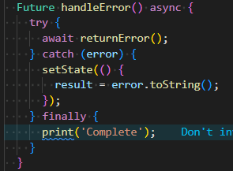
#### Soal 10
1. Panggil method handleError() tersebut di ElevatedButton, lalu run. Apa hasilnya? Jelaskan perbedaan kode langkah 1 dan 4! <br> 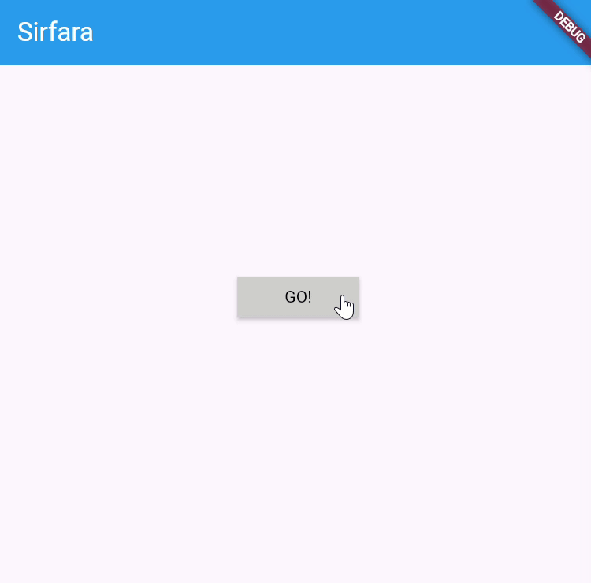 <br> 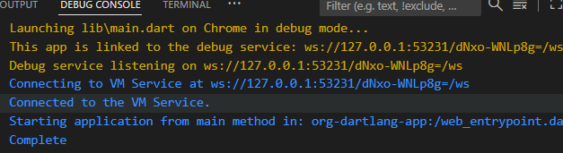 <br> Pada langkah 1 (callback pattern), error ditangani di luar method menggunakan .catchError() dan .whenComplete(), sehingga struktur kodenya berupa rantai callback yang kurang intuitif dan memisahkan logika utama dari penanganan error. Sedangkan pada langkah 4 (try-catch pattern), error ditangani langsung di dalam method menggunakan blok try-catch-finally, sehingga lebih terpusat, mudah dibaca, dan mirip dengan kode sinkron.


## Praktikum 6: Menggunakan Future dengan StatefulWidget

### Langkah 1: install plugin geolocator
Tambahkan plugin geolocator dengan mengetik perintah berikut di terminal.
```dart
flutter pub add geolocator
```
### Langkah 2: Tambah permission GPS
```dart
<uses-permission android:name="android.permission.ACCESS_FINE_LOCATION"/>
<uses-permission android:name="android.permission.ACCESS_COARSE_LOCATION"/>
```

### Langkah 3: Buat file geolocation.dart
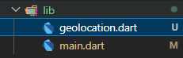
### Langkah 4: Buat StatefulWidget

### Langkah 5: Isi kode geolocation.dart
```dart
import 'package:flutter/material.dart';
import 'package:geolocator/geolocator.dart';

class LocationScreen extends StatefulWidget {
  const LocationScreen({super.key});

  @override
  State<LocationScreen> createState() => _LocationScreenState();
}

class _LocationScreenState extends State<LocationScreen> {
  String myPosition = '';
  
  @override
  void initState() {
    super.initState();
    getPosition().then((Position myPos) {
      myPosition =
          'Latitude: ${myPos.latitude.toString()} - Longitude: ${myPos.longitude.toString()}';
      setState(() {
        myPosition = myPosition;
      });
    });
  }

  @override
  Widget build(BuildContext context) {
    return Scaffold(
      appBar: AppBar(title: const Text('Sirfara - Current Location')),
      body: Center(child: Text(myPosition)),
    );
  }

  Future<Position> getPosition() async {
    await Geolocator.requestPermission();
    await Geolocator.isLocationServiceEnabled();
    Position? position = await Geolocator.getCurrentPosition();
    return position;
  }
}
```
#### Soal 11 
1. Tambahkan nama panggilan Anda pada tiap properti title sebagai identitas pekerjaan Anda. <br> 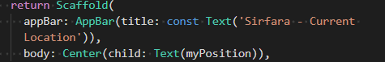
### Langkah 6: Edit main.dart
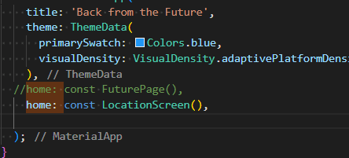
### Langkah 7: Run
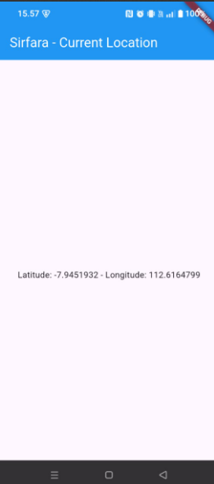
### Langkah 8: Tambahkan animasi loading
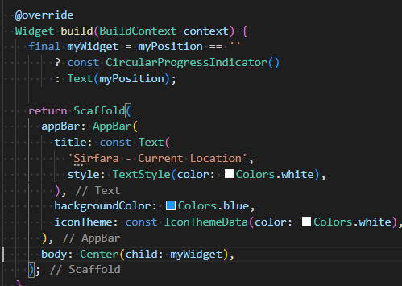

#### Soal 12
1. Jika Anda tidak melihat animasi loading tampil, kemungkinan itu berjalan sangat cepat. Tambahkan delay pada method getPosition() dengan kode await Future.delayed(const Duration(seconds: 3)); <br>
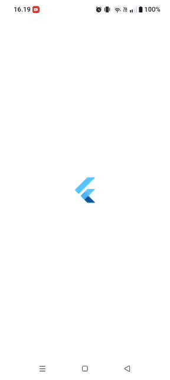
2. Apakah Anda mendapatkan koordinat GPS ketika run di browser? Mengapa demikian? <br> Ya, saya mendapatkan koordinat GPS ketika aplikasi dijalankan di HP (perangkat fisik). Hal ini karena perangkat mobile memiliki sensor GPS bawaan yang dapat diakses oleh plugin Geolocator untuk mengambil data lokasi secara akurat.
3. Capture hasil praktikum Anda berupa GIF dan lampirkan di README. Lalu lakukan commit dengan pesan "W11: Soal 12". <br>


## Praktikum 7: Manajemen Future dengan FutureBuilder

### Langkah 1: Modifikasi method getPosition()
```dart
 Future<Position> getPosition() async {
    await Future.delayed(const Duration(seconds: 3));
    await Geolocator.requestPermission();
    await Geolocator.isLocationServiceEnabled();
    Position? position = await Geolocator.getCurrentPosition();
    return position;
  }
}
```
### Langkah 2: Tambah variabel
tambah method dan set variabel position
```dart
Future<Position>? position;
```

### Langkah 3: Tambah initState()
Tambah method ini dan set variabel position
```dart
@override
  void initState() {
    super.initState();
    position = getPosition();
    position!.then((Position myPos) {
      myPosition =
          'Latitude: ${myPos.latitude.toString()} - Longitude: ${myPos.longitude.toString()}';
      setState(() {
        myPosition = myPosition;
      });
    });
  }
```
### Langkah 4: Edit method build()
Ketik kode berikut dan sesuaikan. Kode lama bisa Anda comment atau hapus.
```dart

@override
  Widget build(BuildContext context) {
    return Scaffold(
      appBar: AppBar(
        title: const Text(
          'Sirfara - Current Location',
          style: TextStyle(color: Colors.white),
        ),
        backgroundColor: Colors.blue,
        iconTheme: const IconThemeData(color: Colors.white),
      ),
      body: Center(
        child: FutureBuilder<Position>(
          future: position,
          builder: (BuildContext context, AsyncSnapshot<Position> snapshot) {
            if (snapshot.connectionState == ConnectionState.waiting) {
              return const CircularProgressIndicator();
            } else if (snapshot.connectionState == ConnectionState.done) {
              if (snapshot.hasError) {
                return Text('Error: ${snapshot.error}');
              } else if (snapshot.hasData) {
                return Text(
                  'Latitude: ${snapshot.data!.latitude}\nLongitude: ${snapshot.data!.longitude}',
                  textAlign: TextAlign.center,
                  style: const TextStyle(fontSize: 16),
                );
              }
            }
            return const Text('Tidak ada data lokasi');
          },
        ),
      ),
    );
  }
```

#### Soal 5
1. Apakah ada perbedaan UI dengan praktikum sebelumnya? Mengapa demikian? <br> ada perbedaan UI yang signifikan di bagian tengah layar (body), Praktikum Sebelumnya (Menggunakan setState) Praktikum ini Menggunakan FutureBuilder.
2. Capture hasil praktikum Anda berupa GIF dan lampirkan di README. Lalu lakukan commit dengan pesan "W11: Soal 13". <br> 
3. Seperti yang Anda lihat, menggunakan FutureBuilder lebih efisien, clean, dan reactive dengan Future bersama UI.

### Langkah 5: Tambah handling error
Tambahkan kode berikut untuk menangani ketika terjadi error. Kemudian hot restart.
```dart
else if (snapshot.connectionState == ConnectionState.done) {
  if (snapshot.hasError) {
     return Text('Something terrible happened!');
  }
  return Text(snapshot.data.toString());
}
```
#### Soal 14
1. Apakah ada perbedaan UI dengan langkah sebelumnya? Mengapa demikian? Tidak ada perbedaan 
2. Capture hasil praktikum Anda berupa GIF dan lampirkan di README. La0lu lakukan commit dengan pesan "W11: Soal 14".  <br> 

## Praktikum 8: Navigation route dengan Future Function

### Langkah 1: Buat file baru navigation_first.dart
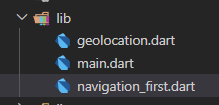
### Langkah 2: Isi kode navigation_first.dart
isi file navigation_firts.dart
```dart
import 'package:flutter/material.dart';

class NavigationFirst extends StatefulWidget {
  const NavigationFirst({super.key});

  @override
  State<NavigationFirst> createState() => _NavigationFirstState();
}

class _NavigationFirstState extends State<NavigationFirst> {
  Color color = Colors.blue.shade700;

  @override
  Widget build(BuildContext context) {
    return Scaffold(
      backgroundColor: color,
      appBar: AppBar(
        title: const Text('Sirfara - Navigation First Screen'),
      ),
      body: Center(
        child: ElevatedButton(
          child: const Text('Change Color'),
          onPressed: () {
            _navigateAndSetColor(context);
          },
        ),
      ),
    );
  }
}
```
#### Soal 15 
1. Tambahkan nama panggilan Anda pada tiap properti title sebagai identitas pekerjaan Anda. <br> 
```dart 
title: const Text('Sirfara - Navigation First Screen'),
```
2. Silakan ganti dengan warna tema favorit Anda.
```dart
Color color = Colors.blue.shade700;
 ```

### Langkah 3: Tambah method di class _NavigationFirstState

```dart
Future _navigateAndGetColor(BuildContext context) async {
   color = await Navigator.push(context,
        MaterialPageRoute(builder: (context) => const NavigationSecond()),) ?? Colors.blue;
   setState(() {});
   });
}
```
### Langkah 4: Buat file baru navigation_second.dart
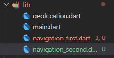
### Langkah 5: Buat class NavigationSecond dengan StatefulWidget
```dart
import 'package:flutter/material.dart';

class NavigationSecond extends StatefulWidget {
  const NavigationSecond({super.key});

  @override
  State<NavigationSecond> createState() => _NavigationSecondState();
}

class _NavigationSecondState extends State<NavigationSecond> {
  Color color = Colors.transparent; // Variabel ini sebenarnya tidak terlalu digunakan di sini, tapi ada di gambar.

  @override
  Widget build(BuildContext context) {
    return Scaffold(
      appBar: AppBar(
        title: const Text('Navigation Second Screen'),
      ),
      body: Center(
        child: Column(
          mainAxisAlignment: MainAxisAlignment.spaceEvenly,
          children: [
            ElevatedButton(
              child: const Text('Red'),
              onPressed: () {
                Color color = Colors.red.shade700;
                Navigator.pop(context, color);
              },
            ),
            ElevatedButton(
              child: const Text('Green'),
              onPressed: () {
                Color color = Colors.green.shade700;
                Navigator.pop(context, color);
              },
            ),
            ElevatedButton(
              child: const Text('Blue'),
              onPressed: () {
                Color color = Colors.blue.shade700;
                Navigator.pop(context, color);
              },
            ),
          ],
        ),
      ),
    );
  }
}
```
### Langkah 6: Edit main.dart
Lakukan edit properti home.
```dart
home: const NavigationFirst(),
```
### Langkah 7: Run
Lakukan run, jika terjadi error silakan diperbaiki.

#### Soal 16Soal 16
1. Cobalah klik setiap button, apa yang terjadi ? Mengapa demikian ?<br> jika klik setiap buton warna akan ganti sesuai dengan nama button yang di klik.
2. Gantilah 3 warna pada langkah 5 dengan warna favorit Anda!
```dart
ElevatedButton(
  child: const Text('pink'),
  onPressed: () {
    Color color = const Color.fromARGB(255, 216, 39, 181);
    Navigator.pop(context, color);
  },
),
ElevatedButton(
  child: const Text('hijau'),
  onPressed: () {
    Color color = const Color.fromARGB(255, 97, 188, 36);
    Navigator.pop(context, color);
  },
),
ElevatedButton(
  child: const Text('kuning'),
  onPressed: () {
    Color color = const Color.fromARGB(255, 173, 210, 25);
    Navigator.pop(context, color);
  },
),
```
3. Capture hasil praktikum Anda berupa GIF dan lampirkan di README. Lalu lakukan commit dengan pesan "W11: Soal 16". <br> 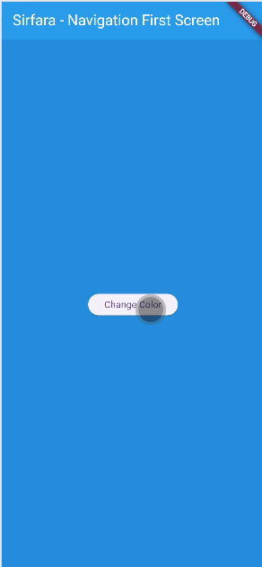

## Praktikum 9: Memanfaatkan async/await dengan Widget Dialog

### Langkah 1: Buat file baru navigation_dialog.dart
### Langkah 2: Isi kode navigation_dialog.dart
### Langkah 3: Tambah method async
### Langkah 4: Panggil method di ElevatedButton
### Langkah 5: Edit main.dart
### Langkah 6: Run

