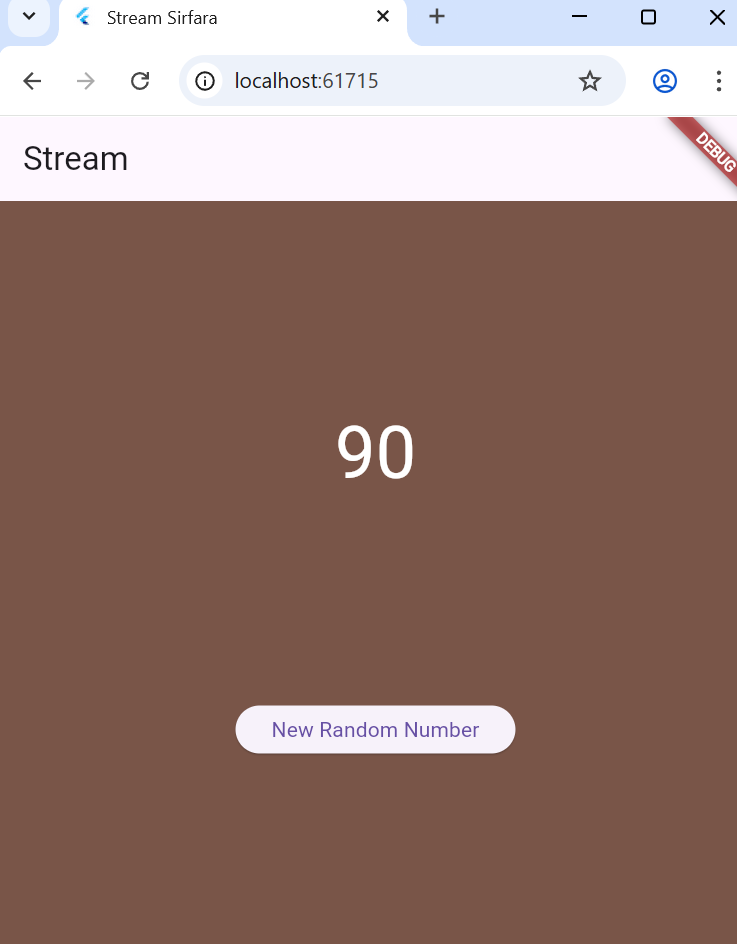
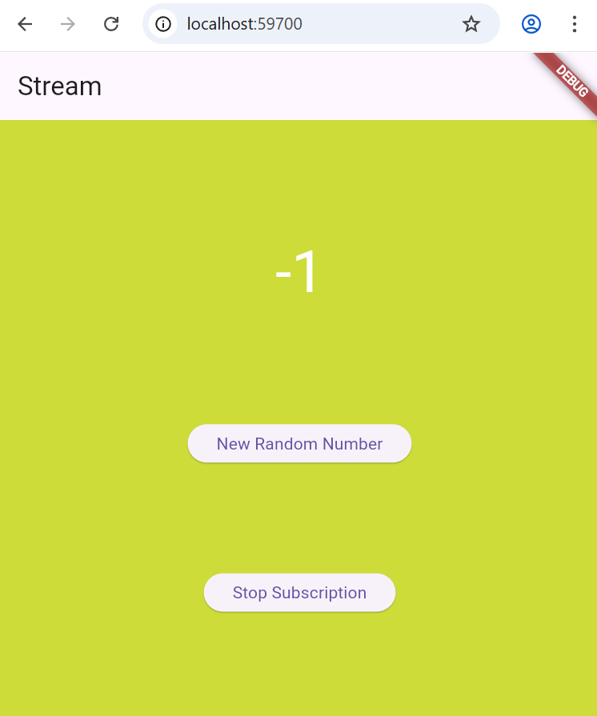
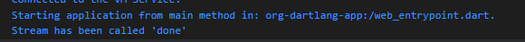
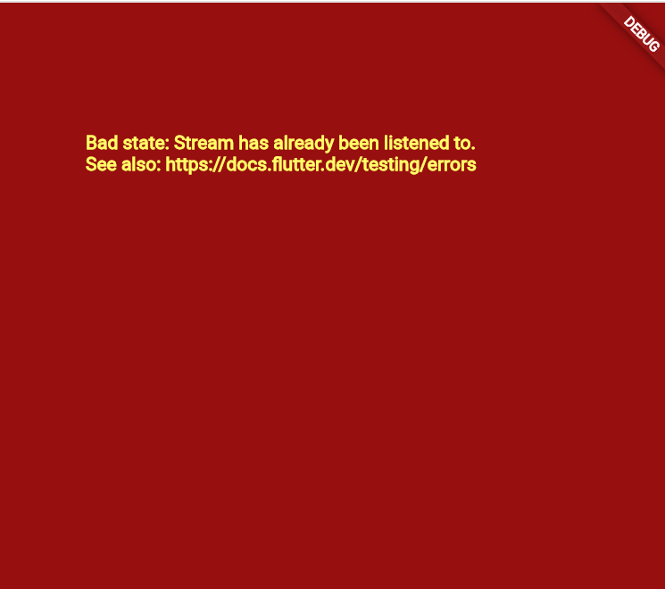
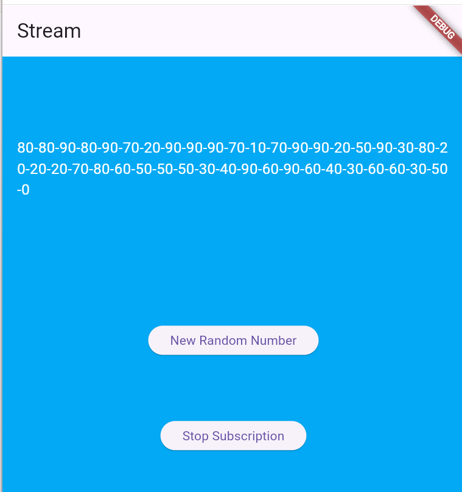
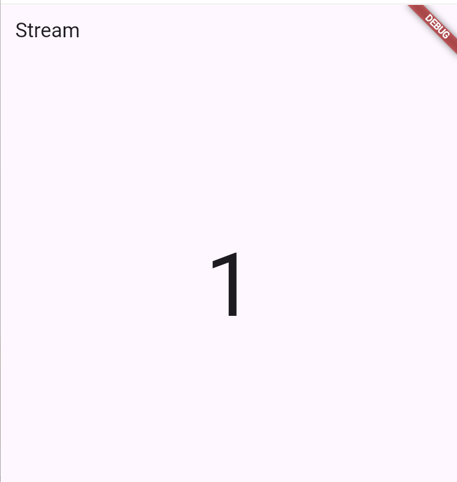

# PERTEMUAN 12 Lanjutan State Management dengan Streams

## PRAKTIKUM 1: Dart Streams

### Langkah 1: Buat Project Baru
Buatlah sebuah project flutter baru dengan nama stream_nama (beri nama panggilan Anda) di folder week-12/src/ repository GitHub Anda.

### Langkah 2: Buka file main.dart
```dart
import 'package:flutter/material.dart';

void main() {
  runApp(const MyApp());
}

class MyApp extends StatelessWidget {
  const MyApp({super.key});

  @override
  Widget build(BuildContext context) {
    return MaterialApp(
      title: 'Stream',
      theme: ThemeData(
        primarySwatch: Colors.deepPurple,
      ),
      home: const StreamHomePage(),
    );
  }
}

class StreamHomePage extends StatefulWidget {
  const StreamHomePage({super.key});

  @override
  State<StreamHomePage> createState() => _StreamHomePageState();
}

class _StreamHomePageState extends State<StreamHomePage> {
  @override
  Widget build(BuildContext context) {
    return Container();
  }
}
```

#### Soal 1
1. Tambahkan nama panggilan Anda pada title app sebagai identitas hasil pekerjaan Anda.
```dart
Widget build(BuildContext context) {
    return MaterialApp(
      title: 'Stream-Sirfara',
      theme: ThemeData(
        primarySwatch: Colors.pink,
      ),
      home: const StreamHomePage(),
    );
  }
```
2. Gantilah warna tema aplikasi sesuai kesukaan Anda.
```dart
Widget build(BuildContext context) {
    return MaterialApp(
      title: 'Stream-Sirfara',
      theme: ThemeData(
        primarySwatch: Colors.pink,
      ),
      home: const StreamHomePage(),
    );
  }
```

3. Lakukan commit hasil jawaban Soal 1 dengan pesan "W12: Jawaban Soal 1"

### Langkah 3: Buat file baru stream.dart
Buat file baru di folder lib project Anda. Lalu isi dengan kode berikut.
```dart
import 'package:flutter/material.dart';

class ColorStream{
  
}
```

### Langkah 4: Tambah variabel colors
Tambahkan variabel di dalam class ColorStream seperti berikut.
```dart
final List<Color> colors = [
  // 5 Warna Awal
  Colors.blueGrey,
  Colors.amber,
  Colors.deepPurple,
  Colors.lightBlue,
  Colors.teal,
];
```
#### Soal 2
1. Tambahkan 5 warna lainnya sesuai keinginan Anda pada variabel colors tersebut.
```dart
import 'package:flutter/material.dart';

class ColorStream {
  final List<Color> colors = [
    Colors.blueGrey,
    Colors.amber,
    Colors.deepPurple,
    Colors.lightBlue,
    Colors.teal,

    Colors.pinkAccent,   
    Colors.lime,        
    Colors.cyan,       
    Colors.brown,   
    Colors.deepOrange, 
  ];
}
```
2. Lakukan commit hasil jawaban Soal 2 dengan pesan "W12: Jawaban Soal 2"

### Langkah 5: Tambah method getColors()
Di dalam class ColorStream ketik method seperti kode berikut. Perhatikan tanda bintang di akhir keyword async* (ini digunakan untuk melakukan Stream data)
```dart
Stream<Color> getColors() async* {
    
  }
```

### Langkah 6: Tambah perintah yield*
Tambahkan kode berikut ini.
```dart
yield* Stream.periodic(
  const Duration(seconds: 1), (int t) {
    int index = t % colors.length;
    return colors[index];
});
```
#### Soal 3
1. Jelaskan fungsi keyword yield* pada kode tersebut!
<br> Fungsi utama dari keyword yield* (dibaca: yield star) dalam konteks fungsi generator asinkron (async*) adalah untuk mendelegasikan yield ke Stream lain.
2. Apa maksud isi perintah kode tersebut?
<br> Isi perintah kode ini bertujuan untuk membuat dan mengembalikan aliran (Stream) warna yang berulang secara periodik, mengubah warna setiap satu detik.

3. Lakukan commit hasil jawaban Soal 3 dengan pesan "W12: Jawaban Soal 3"

### Langkah 7: Buka main.dart
Ketik kode impor file ini pada file main.dart
```dart
import 'stream.dart';
```
Color bgColor = Colors.blueGrey;
late ColorStream colorStream;
### Langkah 8: Tambah variabel
Ketik dua properti ini di dalam class _StreamHomePageState
```dart
Color bgColor = Colors.blueGrey;
late ColorStream colorStream;
```

### Langkah 9 - Tambah method changeColor()
```dart
  void changeColor() async {
    await for (var eventColor in colorStream.getColors()) {
      setState(() {
        bgColor = eventColor;
      });
    }
  }
```

### Langkah 10 - Lakukan override initState()
```dart
  @override
  void initState() {
    super.initState();
    colorStream = ColorStream();
    changeColor();
  }
```
### Langkah 11 - Ubah isi Scaffold()
```dart
@override
Widget build(BuildContext context) {
  return Scaffold(
    appBar: AppBar(
      title: const Text('Stream'),
    ),
    body: Container(
      decoration: BoxDecoration(color: bgColor),
    ),
  );
}
```

### Langkah 12: Run
Lakukan running pada aplikasi Flutter Anda, maka akan terlihat berubah warna background setiap detik.

#### Soal 4
1. Capture hasil praktikum Anda berupa GIF dan lampirkan di README.
 

2. Lakukan commit hasil jawaban Soal 4 dengan pesan "W12: Jawaban Soal 4

### Langkah 13: Ganti isi method changeColor()
```dart
void changeColor() {
    colorStream.getColors().listen((eventColor) {
      setState(() {
        bgColor = eventColor;
      });
    });
  }
```

#### Soal 5
1. Jelaskan perbedaan menggunakan listen dan await for (langkah 9) ! <br>
- await for (Seperti pada Langkah 9)
Fungsi Eksekusi (Bloking/Jeda): Ketika menggunakan await for, eksekusi kode di dalam fungsi async tersebut akan menjeda atau berhenti melanjutkan ke baris kode berikutnya di dalam fungsi yang sama, sampai stream mengeluarkan data. await for akan memproses semua event dari stream secara berurutan. <br>
- listen()
Fungsi Eksekusi (Non-Bloking): Ketika  memanggil listen(), Anda hanya mendaftarkan sebuah fungsi (callback) yang akan dipanggil setiap kali stream mengeluarkan data baru. Setelah pendaftaran ini, eksekusi kode di fungsi akan langsung dilanjutkan tanpa harus menunggu data dari stream.
<br> jadi await for membuat fungsi menunggu data secara berurutan sedangkan listen mendaftarkan callback dan membiarkan fungsi berjalan tanpa menunggu.

2. Lakukan commit hasil jawaban Soal 5 dengan pesan "W12: Jawaban Soal 5"

## Praktikum 2: Stream controllers dan sinks

### Langkah 1: Buka file stream.dart
Lakukan impor dengan mengetik kode ini.
```dart
import 'dart:async';
```

### Langkah 2: Tambah class NumberStream
Tetap di file stream.dart tambah class baru seperti berikut.
```dart
class NumberStream{

}
```

### Langkah 3: Tambah StreamController
Di dalam class NumberStream buatlah variabel seperti berikut.
```dart
final StreamController<int> controller = StreamController<int>();
```

### Langkah 4: Tambah method addNumberToSink
Tetap di class NumberStream buatlah method ini
```dart
void addNumberToSink(int newNumbur) {
  controller.sink.add(newNumber);
}
```
### Langkah 5: Tambah method close()
```dart
void close() {
    controller.close();
  }
```

### Langkah 6: Buka main.dart
Ketik kode import seperti berikut
```dart
import 'dart:async';
import 'dart:math';
```
### Langkah 7: Tambah variabel
Di dalam class _StreamHomePageState ketik variabel berikut
```dart
 int lastNumber = 0;
  late StreamController numberStreamController;
  late NumberStream numberStream;
```
### Langkah 8: Edit initState()
```dart
  @override
  void initState() {
    super.initState();
      colorStream = ColorStream();
    _colorSubscription = colorStream.getColors().listen((eventColor) {
      setState(() {
        bgColor = eventColor;
      });
    });

    numberStream = NumberStream();
    numberStreamController = numberStream.controller;
    Stream stream = numberStreamController.stream;
    stream.listen((event) {
      setState(() {
        lastNumber = event;
      });
    });

    super.initState();
  }
```

### Langkah 9: Edit dispose()
```dart
  @override
  void dispose() {
    numberStreamController.close();
    _colorSubscription.cancel();
    
    super.dispose();
  }
```
### Langkah 10: Tambah method addRandomNumber()
```dart 
void addRandomNumber() {
  Random random = Random();
  int myNum = random.nextInt(10);
  numberStream.addNumberToSink(myNum);
}
```
### Langkah 11: Edit method build()
```dart
body: Container(
        decoration: BoxDecoration(color: bgColor),
        child: SizedBox(
          width: double.infinity,
          child: Column(
            mainAxisAlignment: MainAxisAlignment.spaceEvenly,
            crossAxisAlignment: CrossAxisAlignment.center,
            children: <Widget>[
              Text(
                lastNumber.toString(),
                style: const TextStyle(fontSize: 48, color: Colors.white),
              ),
              
              ElevatedButton(
                onPressed: addRandomNumber,
                child: const Text('New Random Number'),
              ),
            ],
          ),
        ),
```
### Langkah 12: Run
Lakukan running pada aplikasi Flutter Anda, maka akan terlihat seperti gambar berikut.

#### Soal 6
1. Jelaskan maksud kode langkah 8 dan 10 tersebut! <br> Langkah 8 untuk menyiapkan NumberStream agar aplikasi siap menerima dan mendengarkan data sebelum UI ditampilkan dengan tujuan Mengaitkan UI dengan stream data. Memanggil .listen() pada stream. Ini mendaftarkan sebuah callback yang akan dijalankan secara otomatis setiap kali ada angka baru yang dikirimkan ke stream. Di dalam callback tersebut, setState() dipanggil untuk memperbarui variabel lastNumber di UI. <br> Langkah 10 method yang berfungsi sebagai pemicu untuk menghasilkan data baru dan mengirimkannya ke NumberStream dengan tujuan Menerima aksi pengguna (misalnya klik tombol) dan menghasilkan data. Memanggil numberStream.addNumberToSink(myNum). Method ini mengirimkan angka acak tersebut ke StreamController.sink.

2. Capture hasil praktikum Anda berupa GIF dan lampirkan di README.


3. Lalu lakukan commit dengan pesan "W12: Jawaban Soal 6"

### Langkah 13: Buka stream.dart
Tambahkan method berikut ini.
```dart
 addError() {
    controller.sink.addError('error');
  }
```

### Langkah 14: Buka main.dart
Tambahkan method onError di dalam class StreamHomePageState pada method listen di fungsi initState() seperti berikut ini.
```dart
Stream stream = numberStreamController.stream;
    stream.listen(
    (event) {
      setState(() {
        lastNumber = event;
      });
    },
    onError: (error) {
      setState(() {
        lastNumber = -1;
      });
    }
  );
```
### Langkah 15: Edit method addRandomNumber()
Lakukan comment pada dua baris kode berikut, lalu ketik kode seperti berikut ini.
```dart
  void addRandomNumber() {
    Random random = Random();
    //int myNum = random.nextInt(10);
    //numberStream.addNumberToSink(myNum);
    numberStream.addError();
  }
```
#### Soal 7
1. Jelaskan maksud kode langkah 13 sampai 15 tersebut!
- Langkah 13 Stream.dart Menambahkan method addError() ke NumberStream. Method ini memungkinkan kita mengirimkan event berupa kesalahan ke dalam stream menggunakan controller.sink.addError('error'). <br>
- Langkah 14	main.dart	Menambahkan callback .onError(error) pada stream.listen(). Ini adalah mekanisme penanganan kesalahan. Ketika event error diterima, callback ini dijalankan, dan lastNumber disetel menjadi -1, memberitahu pengguna bahwa terjadi kesalahan. <br>
- Langkah 15	main.dart	Mengubah fungsionalitas tombol addRandomNumber() dari mengirim angka acak menjadi memicu error (numberStream.addError()). Ini adalah cara kita menguji mekanisme penanganan error yang telah disiapkan di Langkah 14.

2. Kembalikan kode seperti semula pada Langkah 15, comment addError() agar Anda dapat melanjutkan ke praktikum 3 berikutnya.
```dart
  void addRandomNumber() {
    Random random = Random();
    int myNum = random.nextInt(10);
    numberStream.addNumberToSink(myNum);
    //numberStream.addError();
  }
```
3. Lalu lakukan commit dengan pesan "W12: Jawaban Soal 7".

##  Praktikum 3: Injeksi data ke streams

### Langkah 1: Buka main.dart
Tambahkan variabel baru di dalam class _StreamHomePageState
```dart
  late StreamTransformer transformer;
```

### Langkah 2: Tambahkan kode ini di initState
```dart
 transformer = StreamTransformer<int, int>.fromHandlers(
      handleData: (value, sink) {
        sink.add(value * 10);
      },
      handleError: (error, trace, sink) {
        sink.add(-1);
      },
      handleDone: (sink) => sink.close(),
    );
```
### Langkah 3: Tetap di initState
Lakukan edit seperti kode berikut.
```dart
    stream
        .transform(transformer)
        .listen(
          (event) {
            setState(() {
              lastNumber = event;
            });
          },
          onError: (error) {
            setState(() {
              lastNumber = -1;
            });
          },
        );

    super.initState();
  }
```

### Langkah 4: Run
Terakhir, run atau tekan F5 untuk melihat hasilnya jika memang belum running. Bisa juga lakukan hot restart jika aplikasi sudah running. Maka hasilnya akan seperti gambar berikut ini. Anda akan melihat tampilan angka dari 0 hingga 90.

#### Soal 8
1. Jelaskan maksud kode langkah 1-3 tersebut!
- Langkah 1 menambhakan variabel transformer, variabel late StreamTransformer transformer; sebuah variabel yang akan menyimpan objek StreamTransformer. Objek ini bertanggung jawab untuk mengambil data berjenis int (<int, int>) dari stream dan mengeluarkan data berjenis int yang sudah dimodifikasi.
- Langkah 2: Inisialisasi StreamTransformer
handleData: (value, sink) { sink.add(value * 10); }: Ini adalah aturan utamanya. Setiap kali angka acak (value) dikirimkan ke stream (misalnya 5), transformer segera mengalikan nilai tersebut dengan 10 (menjadi 50) dan mengirimkannya ke langkah berikutnya (sink.add(50)).
handleError: (error, trace, sink) { sink.add(-1); }: Ini adalah penanganan error di tingkat transformasi. Jika stream mengirimkan error, transformer akan mengubah error tersebut menjadi data normal (-1) dan mengirimkannya ke listener. Ini mencegah error mematikan stream secara langsung.

- Langkah 3: Menggunakan transform(), stream.transform(transformer).listen(...): Baris ini menggantikan stream.listen(...) yang lama. Event apa pun yang keluar dari numberStreamController.stream wajib melalui transformer terlebih dahulu. Hanya data yang sudah diproses oleh transformer (yaitu, dikali 10 atau diubah menjadi -1) yang akan sampai ke listener UI (event) dan ditampilkan sebagai lastNumber.

2. Capture hasil praktikum Anda berupa GIF dan lampirkan di README.

3. Lalu lakukan commit dengan pesan "W12: Jawaban Soal 8".


## Praktikum 4: Subscribe ke stream events

### Langkah 1: Tambah variabel
Tambahkan variabel berikut di class _StreamHomePageState
```dart
late StreamSubscription subscription;
```
### Langkah 2: Edit initState()
Edit kode seperti berikut ini.
```dart
subscription = stream
      .transform(transformer)
      .listen(
        (event) {
          setState(() {
            lastNumber = event;
          });
        },
```

### Langkah 3: Tetap di initState()
Tambahkan kode berikut ini.
```dart
    subscription.onError((error) {
      setState(() {
        lastNumber = -1;
      });
    });
```
### Langkah 4: Tambah properti onDone()
Tambahkan dibawahnya kode ini setelah onError
```dart
subscription.onDone(() {
      print("Stream has been called 'done'");
    });
```

### Langkah 5: Tambah method baru
Ketik method ini di dalam class _StreamHomePageState
```dart
  void stopStream() {
    numberStreamController.close();
  }
```

### Langkah 6: Pindah ke method dispose()
Jika method dispose() belum ada, Anda dapat mengetiknya dan dibuat override. Ketik kode ini didalamnya.
```dart
  @override
  void dispose() {
    numberStreamController.close();
    _colorSubscription.cancel();
    subscription.cancel(); 
```

### Langkah 7: Pindah ke method build()
Tambahkan button kedua dengan isi kode seperti berikut ini.
```dart
ElevatedButton(
                onPressed: stopStream,
                child: const Text('Stop Subscription'),
              ),
```

### Langkah 8: Edit method addRandomNumber()
Edit kode seperti berikut ini. 
```dart
 void addRandomNumber() {
    Random random = Random();
    int myNum = random.nextInt(10);
    if (!numberStreamController.isClosed) { 
      numberStream.addNumberToSink(myNum);
    } else {
      setState(() {
        lastNumber = -1;
      });
    }
  }
```
### Langkah 9: Run
Anda akan melihat dua button seperti gambar berikut.

### Langkah 10: Tekan button ‘Stop Subscription'
Anda akan melihat pesan di Debug Console seperti berikut.


#### Soal 9
1. Jelaskan maksud kode langkah 2, 6 dan 8 tersebut!
- Langkah 2 (initState)
Mendaftarkan listener pada stream untuk menerima data secara real-time dan memperbarui UI, serta menyimpan subscription untuk kontrol penuh terhadap stream.
- Langkah 6 (dispose)
Membatalkan subscription saat widget dihancurkan untuk mencegah memory leak dan menghentikan listener.
- Langkah 8 (addRandomNumber)
Memeriksa keaktifan stream sebelum mengirim data; jika stream sudah ditutup, data tidak dikirim dan UI diperbarui untuk mencegah error.

2. Capture hasil praktikum Anda berupa GIF dan lampirkan di README.


3. Lalu lakukan commit dengan pesan "W12: Jawaban Soal 9".

## Praktikum 5: Multiple stream subscriptions

### Langkah 1: Buka file main.dart
Ketik variabel berikut di class _StreamHomePageState
```dart
  late StreamSubscription subscription2;
  String values = '';
```
### Langkah 2: Edit initState()
Ketik kode seperti berikut.
```dart
subscription2 = stream.listen((event) {
      setState(() {
        values += ' Second: $event';
      });
    });
```

### Langkah 3: Run
Lakukan run maka akan tampil error seperti gambar berikut.


#### Soal 10
Jelaskan mengapa error itu bisa terjadi ? <br> Error tersebut terjadi karena melakukan Multiple Subscriptions (dua kali pemanggilan .listen()) pada sebuah Stream yang secara default adalah Single-Subscription Stream (non-broadcast).

### Langkah 4: Set broadcast stream
Ketik kode seperti berikut di method initState()
```dart
  numberStream = NumberStream();
    numberStreamController = numberStream.controller;
    Stream stream = numberStreamController.stream.asBroadcastStream();
```

### Langkah 5: Edit method build()
Tambahkan text seperti berikut
```dart
child: Column(
            mainAxisAlignment: MainAxisAlignment.spaceEvenly,
            crossAxisAlignment: CrossAxisAlignment.center,
            
            children: <Widget>[
              Text(
                lastNumber.toString(),
                style: const TextStyle(fontSize: 48, color: Colors.white),
              ),
              Text(
                values,
                style: const TextStyle(fontSize: 20, color: Colors.red),
              ),

              ElevatedButton(
                onPressed: addRandomNumber,
                child: const Text('New Random Number'),
              ),

              ElevatedButton(
                onPressed: stopStream,
                child: const Text('Stop Subscription'),
              ),
            ],
          ),
```
### Langkah 6: Run
Tekan button ‘New Random Number' beberapa kali, maka akan tampil teks angka terus bertambah sebanyak dua kali.


#### Soal 11
1. Jelaskan mengapa hal itu bisa terjadi ?
<br> Riwayat angka muncul karena di dalam setState() diubah dari menimpa nilai tunggal menjadi menyimpan (akumulasi) setiap nilai baru ke dalam sebuah daftar riwayat.

2. Capture hasil praktikum Anda berupa GIF dan lampirkan di README.


3. Lalu lakukan commit dengan pesan "W12: Jawaban Soal 10,11".


##  Praktikum 6: StreamBuilder

### Langkah 1: Buat Project Baru
Buatlah sebuah project flutter baru dengan nama streambuilder_nama (beri nama panggilan Anda) di folder week-12/src/ repository GitHub Anda.

### Langkah 2: Buat file baru stream.dart
Ketik kode ini
```dart
class NumberStream {}
```
### Langkah 3: Tetap di file stream.dart
Ketik kode seperti berikut.
```dart
import 'dart:math';

class NumberStream {
  Stream<int> getNumbers() async* {
    yield* Stream.periodic(const Duration(seconds: 1), (int t) {
      Random random = Random();
      int myNum = random.nextInt(10);
      return myNum;
    });
  }
}
```
### Langkah 4: Edit main.dart
Ketik kode seperti berikut ini.
```dart
import 'package:flutter/material.dart';
import 'stream.dart';
import 'dart:async';

void main() {
  runApp(const MyApp());
}

class MyApp extends StatelessWidget {
  const MyApp({super.key});

  @override
  Widget build(BuildContext context) {
    return MaterialApp(
      title: 'Stream',
      theme: ThemeData(
        primarySwatch: Colors.deepPurple,
      ),
      home: const StreamHomePage(),
    );
  }
}

class StreamHomePage extends StatefulWidget {
  const StreamHomePage({super.key});

  @override
  State<StreamHomePage> createState() => _StreamHomePageState();
}

class _StreamHomePageState extends State<StreamHomePage> {
  @override
  Widget build(BuildContext context) {
    return Scaffold(
      appBar: AppBar(
        title: const Text('Stream'),
      ),
      body: Container(
      ),
    );
  }
}
```

### Langkah 5: Tambah variabel
Di dalam class _StreamHomePageState, ketika variabel ini.
```dart
  late Stream<int> numberStream;
```
### Langkah 6: Edit initState()
Ketik kode seperti berikut.
```dart
  @override
  void initState() {
    numberStream = NumberStream().getNumbers();
    super.initState();
  }
```
### Langkah 7: Edit method build()
```dart
 Widget build(BuildContext context) {
    return Scaffold(
      appBar: AppBar(
        title: const Text('Stream'),
      ),
      body: StreamBuilder<int>(
        stream: numberStream,
        initialData: 0,
        builder: (context, snapshot) {
          if (snapshot.hasError) {
            print('Error!');
            return const Center(child: Text('Terjadi Kesalahan'));
          }

          if (snapshot.connectionState == ConnectionState.waiting) {
            return const Center(child: CircularProgressIndicator());
          }

          if (snapshot.hasData) {
            return Center(
              child: Text(
                snapshot.data.toString(),
                style: const TextStyle(fontSize: 96),
              ),
            );
          } else {
            return const SizedBox.shrink();
          }
        },
      ),
    );
  }
}
```
### Langkah 8: Run
Hasilnya, setiap detik akan tampil angka baru seperti berikut.

#### Soal 12
1. Jelaskan maksud kode pada langkah 3 dan 7 !
2. Capture hasil praktikum Anda berupa GIF dan lampirkan di README.


3. Lalu lakukan commit dengan pesan "W12: Jawaban Soal 12".

### Langkah 2: Buka file main.dart
### Langkah 2: Buka file main.dart
### Langkah 2: Buka file main.dart
### Langkah 2: Buka file main.dart
### Langkah 2: Buka file main.dart
### Langkah 2: Buka file main.dart


