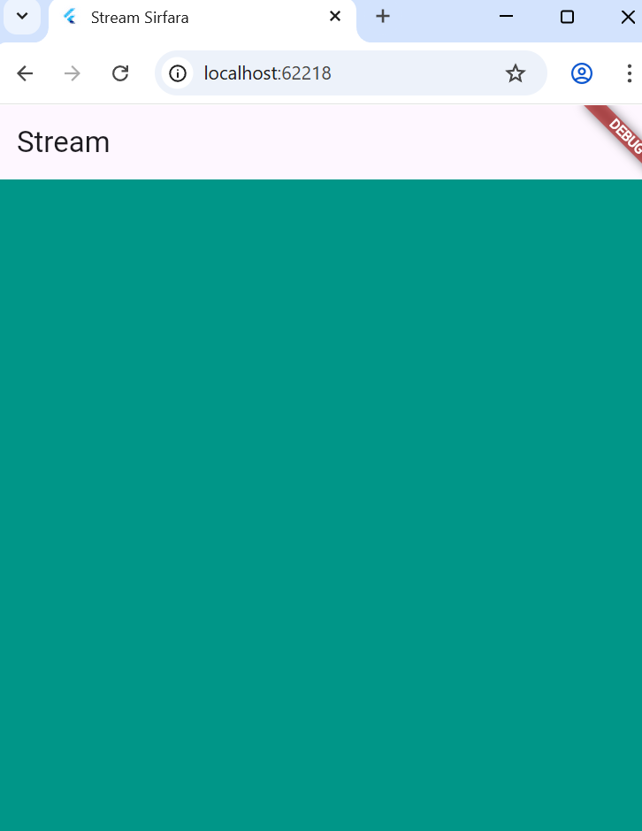

# PERTEMUAN 12 Lanjutan State Management dengan Streams

## PRAKTIKUM 1: Dart Streams

### Langkah 1: Buat Project Baru
Buatlah sebuah project flutter baru dengan nama stream_nama (beri nama panggilan Anda) di folder week-12/src/ repository GitHub Anda.

### Langkah 2: Buka file main.dart
```dart
import 'package:flutter/material.dart';

void main() {
  runApp(const MyApp());
}

class MyApp extends StatelessWidget {
  const MyApp({super.key});

  @override
  Widget build(BuildContext context) {
    return MaterialApp(
      title: 'Stream',
      theme: ThemeData(
        primarySwatch: Colors.deepPurple,
      ),
      home: const StreamHomePage(),
    );
  }
}

class StreamHomePage extends StatefulWidget {
  const StreamHomePage({super.key});

  @override
  State<StreamHomePage> createState() => _StreamHomePageState();
}

class _StreamHomePageState extends State<StreamHomePage> {
  @override
  Widget build(BuildContext context) {
    return Container();
  }
}
```

#### Soal 1
1. Tambahkan nama panggilan Anda pada title app sebagai identitas hasil pekerjaan Anda.
```dart
Widget build(BuildContext context) {
    return MaterialApp(
      title: 'Stream-Sirfara',
      theme: ThemeData(
        primarySwatch: Colors.pink,
      ),
      home: const StreamHomePage(),
    );
  }
```
2. Gantilah warna tema aplikasi sesuai kesukaan Anda.
```dart
Widget build(BuildContext context) {
    return MaterialApp(
      title: 'Stream-Sirfara',
      theme: ThemeData(
        primarySwatch: Colors.pink,
      ),
      home: const StreamHomePage(),
    );
  }
```

3. Lakukan commit hasil jawaban Soal 1 dengan pesan "W12: Jawaban Soal 1"

### Langkah 3: Buat file baru stream.dart
Buat file baru di folder lib project Anda. Lalu isi dengan kode berikut.
```dart
import 'package:flutter/material.dart';

class ColorStream{
  
}
```

### Langkah 4: Tambah variabel colors
Tambahkan variabel di dalam class ColorStream seperti berikut.
```dart
final List<Color> colors = [
  // 5 Warna Awal
  Colors.blueGrey,
  Colors.amber,
  Colors.deepPurple,
  Colors.lightBlue,
  Colors.teal,
];
```
#### Soal 2
1. Tambahkan 5 warna lainnya sesuai keinginan Anda pada variabel colors tersebut.
```dart
import 'package:flutter/material.dart';

class ColorStream {
  // Daftar 10 warna, 5 warna awal + 5 warna tambahan (pilihan bebas)
  final List<Color> colors = [
    // 5 Warna Awal
    Colors.blueGrey,
    Colors.amber,
    Colors.deepPurple,
    Colors.lightBlue,
    Colors.teal,

    // 5 Warna Tambahan (Pilihan Baru)
    Colors.pinkAccent,   // Warna pink yang lebih cerah
    Colors.lime,         // Hijau kekuningan
    Colors.cyan,         // Biru kehijauan
    Colors.brown,        // Cokelat
    Colors.deepOrange,   // Oranye tua
  ];
}
```
2. Lakukan commit hasil jawaban Soal 2 dengan pesan "W12: Jawaban Soal 2"

### Langkah 5: Tambah method getColors()
Di dalam class ColorStream ketik method seperti kode berikut. Perhatikan tanda bintang di akhir keyword async* (ini digunakan untuk melakukan Stream data)
```dart
Stream<Color> getColors() async* {
    
  }
```

### Langkah 6: Tambah perintah yield*
Tambahkan kode berikut ini.
```dart
yield* Stream.periodic(
  const Duration(seconds: 1), (int t) {
    int index = t % colors.length;
    return colors[index];
});
```
#### Soal 3
1. Jelaskan fungsi keyword yield* pada kode tersebut!
<br> Fungsi utama dari keyword yield* (dibaca: yield star) dalam konteks fungsi generator asinkron (async*) adalah untuk mendelegasikan yield ke Stream lain.
2. Apa maksud isi perintah kode tersebut?
<br> Isi perintah kode ini bertujuan untuk membuat dan mengembalikan aliran (Stream) warna yang berulang secara periodik, mengubah warna setiap satu detik.

3. Lakukan commit hasil jawaban Soal 3 dengan pesan "W12: Jawaban Soal 3"

### Langkah 7: Buka main.dart
Ketik kode impor file ini pada file main.dart
```dart
import 'stream.dart';
```
Color bgColor = Colors.blueGrey;
late ColorStream colorStream;
### Langkah 8: Tambah variabel
Ketik dua properti ini di dalam class _StreamHomePageState
```dart
Color bgColor = Colors.blueGrey;
late ColorStream colorStream;
```

### Langkah 9 - Tambah method changeColor()
```dart
  void changeColor() async {
    await for (var eventColor in colorStream.getColors()) {
      setState(() {
        bgColor = eventColor;
      });
    }
  }
```

### Langkah 10 - Lakukan override initState()
```dart
  @override
  void initState() {
    super.initState();
    colorStream = ColorStream();
    changeColor();
  }
```
### Langkah 11 - Ubah isi Scaffold()
```dart
@override
Widget build(BuildContext context) {
  return Scaffold(
    appBar: AppBar(
      title: const Text('Stream'),
    ),
    body: Container(
      decoration: BoxDecoration(color: bgColor),
    ),
  );
}
```

### Langkah 12: Run
Lakukan running pada aplikasi Flutter Anda, maka akan terlihat berubah warna background setiap detik.

#### Soal 4
1. Capture hasil praktikum Anda berupa GIF dan lampirkan di README.
 

2. Lakukan commit hasil jawaban Soal 4 dengan pesan "W12: Jawaban Soal 4

### Langkah 13: Ganti isi method changeColor()
```dart
void changeColor() {
    colorStream.getColors().listen((eventColor) {
      setState(() {
        bgColor = eventColor;
      });
    });
  }
```

#### Soal 5
1. Jelaskan perbedaan menggunakan listen dan await for (langkah 9) ! <br>
- await for (Seperti pada Langkah 9)
Fungsi Eksekusi (Bloking/Jeda): Ketika Anda menggunakan await for, eksekusi kode di dalam fungsi async tersebut akan menjeda atau berhenti melanjutkan ke baris kode berikutnya di dalam fungsi yang sama, sampai stream mengeluarkan data. await for akan memproses semua event dari stream secara berurutan. <br>
- listen()
Fungsi Eksekusi (Non-Bloking): Ketika Anda memanggil listen(), Anda hanya mendaftarkan sebuah fungsi (callback) yang akan dipanggil setiap kali stream mengeluarkan data baru. Setelah pendaftaran ini, eksekusi kode di fungsi Anda akan langsung dilanjutkan tanpa harus menunggu data dari stream.
<br> jadi await for membuat fungsi menunggu data secara berurutan sedangkan listen mendaftarkan callback dan membiarkan fungsi berjalan tanpa menunggu.

2. Lakukan commit hasil jawaban Soal 5 dengan pesan "W12: Jawaban Soal 5"

### Langkah 2: Buka file main.dart
### Langkah 2: Buka file main.dart
### Langkah 2: Buka file main.dart
### Langkah 2: Buka file main.dart
### Langkah 2: Buka file main.dart
### Langkah 2: Buka file main.dart
### Langkah 2: Buka file main.dart
### Langkah 2: Buka file main.dart
### Langkah 2: Buka file main.dart
### Langkah 2: Buka file main.dart
### Langkah 2: Buka file main.dart
### Langkah 2: Buka file main.dart
### Langkah 2: Buka file main.dart
### Langkah 2: Buka file main.dart
### Langkah 2: Buka file main.dart
### Langkah 2: Buka file main.dart
### Langkah 2: Buka file main.dart


