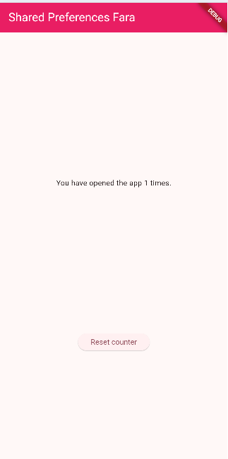
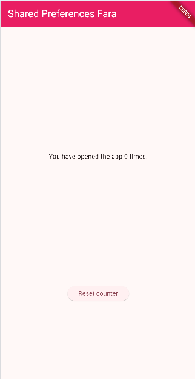
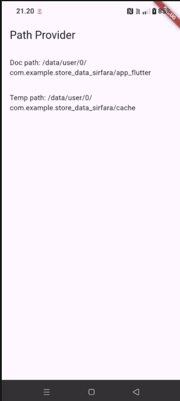
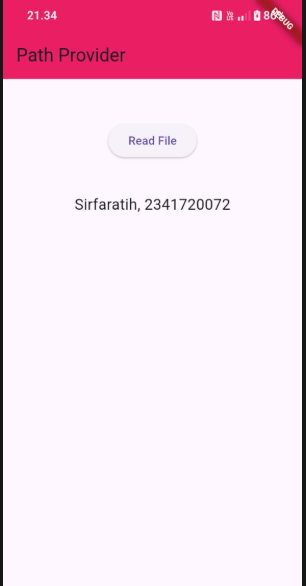
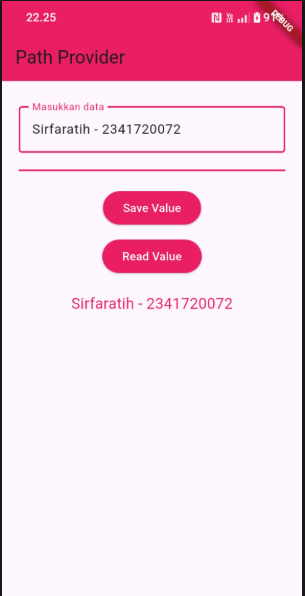

# PERTEMUAN 12 Persistensi Data

## Praktikum 1: Konversi Dart model ke JSON

### Langkah 1: Buat Project Baru
Buatlah sebuah project flutter baru dengan nama store_data_nama (beri nama panggilan Anda) di folder week-13/src/ repository GitHub Anda.

### Langkah 2: Buka file main.dart
Ketiklah kode seperti berikut ini.
```dart
import 'package:flutter/material.dart';

void main() {
  runApp(const MyApp());
}

class MyApp extends StatelessWidget {
  const MyApp({super.key});

  @override
  Widget build(BuildContext context) {
    return MaterialApp(
      title: 'Flutter JSON Demo',
      theme: ThemeData(
        primarySwatch: Colors.blue,
      ),
      home: const MyHomePage(),
    );
  }
}

class MyHomePage extends StatefulWidget {
  const MyHomePage({super.key});

  @override
  State<MyHomePage> createState() => _MyHomePageState();
}

class _MyHomePageState extends State<MyHomePage> {
  @override
  Widget build(BuildContext context) {
    return Scaffold(
      appBar: AppBar(title: const Text('JSON')),
      body: Container(),
    );
  }
}
```
#### Soal 1
1. Tambahkan nama panggilan Anda pada title app sebagai identitas hasil pekerjaan Anda.
```dart
return MaterialApp(
      title: 'Flutter JSON Demo Sirfara',
      theme: ThemeData(
        primarySwatch: Colors.blue,
      ),
    )   
```
2. Gantilah warna tema aplikasi sesuai kesukaan Anda.
```dart
 theme: ThemeData(
        primarySwatch: Colors.pink,
      ),
```
3. Lakukan commit hasil jawaban Soal 1 dengan pesan "W13: Jawaban Soal 1"

### Langkah 3: Buat folder baru assets
Buat folder baru assets di root project Anda

### Langkah 4: Buat file baru pizzalist.json
Letakkan file ini di dalam folder assets, lalu salin data JSON berikut ke file tersebut.
```dart
[ 
    { 
      "id": 1, 
      "pizzaName": "Margherita", 
      "description": "Pizza with tomato, fresh mozzarella and basil",
      "price": 8.75, 
      "imageUrl": "images/margherita.png" 
    }, 
    { 
      "id": 2, 
      "pizzaName": "Marinara", 
      "description": "Pizza with tomato, garlic and oregano",
      "price": 7.50, 
      "imageUrl": "images/marinara.png"  
    }, 
    { 
      "id": 3, 
      "pizzaName": "Napoli", 
      "description": "Pizza with tomato, garlic and anchovies",
      "price": 9.50, 
      "imageUrl": "images/marinara.png"  
    }, 
    { 
      "id": 4, 
      "pizzaName": "Carciofi", 
      "description": "Pizza with tomato, fresh mozzarella and artichokes",
      "price": 8.80, 
      "imageUrl": "images/marinara.png"  
    }, 
    { 
      "id": 5, 
      "pizzaName": "Bufala", 
      "description": "Pizza with tomato, buffalo mozzarella and basil",
      "price": 12.50, 
      "imageUrl": "images/marinara.png"  
    }
]
```

### Langkah 5: Edit pubspec.yaml
Tambahkan referensi folder assets ke file pubspec.yaml seperti berikut ini.
```dart
  assets:
     - assets/pizzalist.json
```

### Langkah 6: Edit maint.dart
Buatlah variabel seperti berikut ini class _MyHomePageState.
```dart
String pizzaString = ''; 
```

### Langkah 7: Tetap di main.dart
Untuk membaca isi dari file pizzalist.json di dalam class _MyHomePageState, tambahkan method readJsonFile seperti kode berikut untuk membaca file json.
```dart
Future readJsonFile() async {
    String myString = await rootBundle.loadString('assets/pizzalist.json');
    setState(() {
      pizzaString = myString;
    });
  }
```

### Langkah 8: Panggil method readJsonFile
Panggil method readJsonFile di initState
```dart
@override
  void initState() {
    super.initState();
    readJsonFile();
  }
```

### Langkah 9: Tampilkan hasil JSON
Kemudian tampilkan hasil JSON di body scaffold.
```dart
 body: Center(
        child: SingleChildScrollView(
          padding: const EdgeInsets.all(16.0),
          child: Text(
            pizzaString,
            style: const TextStyle(fontFamily: 'monospace'),
          ),
        ),
      ),
```
### Langkah 10: Run
Jika kode sudah benar, seharusnya tampil seperti gambar berikut ini.

#### Soal 2
1. Masukkan hasil capture layar ke laporan praktikum Anda.

2. Lakukan commit hasil jawaban Soal 2 dengan pesan "W13: Jawaban Soal 2"

### Langkah 11: Buat file baru pizza.dart
Kita ingin mengubah data json tersebut dari String menjadi objek List. Maka perlu membuat file class baru di folder lib/model dengan nama file pizza.dart.

### Langkah 12: Model pizza.dart
Ketik kode berikut pada file pizza.dart
```dart
class Pizza {
  final int id;
  final String pizzaName;
  final String description;
  final double price;
  final String imageUrl;
```

### Langkah 13: Buat constructor()
Di dalam class Pizza definisikan constructor fromJson, yang mana akan mengambil data berupa Map sebagai parameter dan mengubah Map ke objek Pizza seperti kode berikut:
```dart
factory Pizza.fromJson(Map<String, dynamic> json) {
    return Pizza(
      id: json['id'],
      pizzaName: json['pizzaName'],
      description: json['description'],
      price: json['price'].toDouble(),
      imageUrl: json['imageUrl'],
    );
  }
```
### Langkah 14: Pindah ke class _MyHomePageState
Tambahkan kode jsonDecode seperti berikut.
```dart
Future<void> readJsonFile() async {
    String jsonString = await rootBundle.loadString('assets/pizzalist.json');
    List<dynamic> rawList = jsonDecode(jsonString);

    setState(() {
      pizzaList = rawList.map((item) => Pizza.fromJson(item)).toList();
    });
  }
```
### Langkah 15: Pastikan impor class
Perhatikan pada bagian atas file bahwa telah berhasil impor kedua file berikut.
```dart
import 'dart:convert';
import 'pizza.dart';
```

### Langkah 16: Konversi List Map ke List Objek Dart
Di dalam method readJsonFile(), setelah baris List pizzaMapList = jsonDecode(myString);, tambahkan kode berikut untuk mengonversi setiap Map di pizzaMapList menjadi objek Pizza dan menyimpannya ke myPizzas.
```dart
List<Pizza> myPizzas = [];
for (var pizza in pizzaMapList) {
  Pizza myPizza = Pizza.fromJson(pizza);
  myPizzas.add(myPizza);
}
```

### Langkah 17: return myPizzas
Hapus atau komentari setState yang menampilkan pizzaString dari Langkah 7. Kemudian, kembalikan myPizzas.
```dart
return myPizza;
```

### Langkah 18: Perbarui Signature Method
Perbarui signature method readJsonFile() untuk secara eksplisit menunjukkan bahwa ia mengembalikan Future yang berisi List.
```dart
Future<list<Pizza>> readJsonFile() async {
```
### Langkah 19: Deklarasikan Variabel State
Di dalam class _MyHomePageState, deklarasikan variabel state baru untuk menampung List objek Pizza.
```dart
List<Pizza> myPizza = [];
```

### Langkah 20: Panggil di initState dan Perbarui State
Perbarui method initState() di _MyHomePageState untuk memanggil readJsonFile(). Karena readJsonFile() mengembalikan Future, gunakan .then() untuk mendapatkan hasilnya, dan perbarui state myPizzas.
```dart
@override
  void initState() {
    super.initState();
    readJsonFile().then((value) {
      setState(() {
        myPizzas = value;
      });
    });
  }
```

### Langkah 21: Tampilkan Data di ListView
Perbarui body dari Scaffold untuk menggunakan ListView.builder yang menampilkan pizzaName sebagai judul dan description sebagai subjudul dari setiap objek Pizza.
```dart
body: ListView.builder(
  itemCount: myPizzas.length,
  itemBuilder: (context, index) {
    return ListTile(
      title: Text(myPizzas[index].pizzaName),
      subtitle: Text(myPizzas[index].description),
    );
  },
 ));
}
```
### Langkah 22: Run
Jalankan aplikasi. Sekarang, Anda akan melihat data pizza ditampilkan dalam daftar yang lebih terstruktur sebagai objek List Dart.
#### Soal 3
1. Masukkan hasil capture layar ke laporan praktikum Anda.


2. Lakukan commit hasil jawaban Soal 2 dengan pesan "W13: Jawaban Soal 3"

### Langkah 23: Tambahkan Method toJson() (Serialization)
Di file pizza.dart, tambahkan method toJson() ke class Pizza. Method ini berfungsi untuk mengonversi objek Dart kembali menjadi Map (langkah pertama menuju JSON String).
```dart
Map<String, dynamic> toJson() {
  return {
    'id': id,
    'pizzaName': pizzaName,
    'description': description,
    'price': price,
    'imageUrl': imageUrl,
  };
}

```
### Langkah 24: Buat Fungsi Konversi JSON String
Di main.dart, tambahkan fungsi convertToJSON di dalam _MyHomePageState untuk menggunakan jsonEncode (dari dart:convert) yang mengubah List objek Dart menjadi JSON String.
```dart
String convertToJSON(List<Pizza> pizzas) {
  return jsonEncode(pizzas.map((pizza) => pizza.toJson()).toList());
}

```

### Langkah 25: Tampilkan Output JSON di Konsol
Di method readJsonFile(), tambahkan kode untuk memanggil convertToJSON dan mencetak hasilnya ke Debug Console sebelum mengembalikan myPizzas.
```dart
String json = convertToJSON(myPizzas);
print(json);
return myPizzas;
```

### Langkah 26: Cek Output Konsol
Jalankan aplikasi. Periksa Debug Console untuk melihat List objek Pizza telah berhasil dikonversi kembali menjadi JSON String.


###  Praktikum 2: Handle kompatibilitas data JSON

### Langkah 1: Simulasikan Error
Anggaplah Anda telah mengganti file pizzalist.json dengan data yang tidak konsisten.

### Langkah 2: Lihat Error Tipe Data String ke Int
Jika ID pizza di JSON dikirim sebagai String (misalnya "id": "1" di JSON) sementara model Dart mengharapkan int, Anda akan melihat runtime error.
### Langkah 3: Terapkan tryParse dan Null Coalescing pada ID
Di Pizza.fromJson (file pizza.dart), ganti cara mendapatkan nilai id menggunakan int.tryParse dan null coalescing operator (??) untuk memberikan nilai default 0 jika parsing gagal atau nilainya null. Tujuannya adalah memastikan nilai id selalu integer.
```dart
    id: int.tryParse(json['id'].toString()) ?? 0, 
```
### Langkah 4: Simulasikan Error Null pada String
Jika Anda menjalankan ulang dan ada bidang yang hilang (misalnya imageUrl hilang), Anda mungkin mendapatkan error Null.

### Langkah 5: Terapkan Null Coalescing pada String
Tambahkan null coalescing operator (??) pada imageUrl untuk memberikan string kosong ('') jika nilai yang diterima adalah null. Lakukan hal yang sama untuk bidang String lainnya seperti pizzaName dan description jika perlu.
```dart
    pizzaName: json['pizzaName'] ?? '', 
    description: json['description'] ?? '', 
    price: json['price'].toDouble(), 
    imageUrl: json['imageUrl'] ?? '', 
```

### Langkah 6: Gunakan toString() untuk Field String
Untuk memastikan semua nilai yang digunakan sebagai String benar-benar String (bahkan jika mereka mungkin dikirim sebagai int atau tipe lain), gunakan toString().
```dart
 pizzaName: (json['pizzaName']?.toString() ?? ''), 
 description: (json['description']?.toString() ?? ''),
```

### Langkah 7: Simulasikan Error Tipe Data String ke Double
Jika Anda menjalankan ulang, Anda mungkin menemukan error saat mengonversi String ke Double untuk bidang price.

### Langkah 8: Terapkan double.tryParse
Terapkan double.tryParse dengan null coalescing (?? 0) untuk bidang price, sama seperti yang Anda lakukan pada id.
```dart
id: int.tryParse(json['id'].toString()) ?? 0, 
pizzaName: (json['pizzaName']?.toString() ?? ''), 
description: (json['description']?.toString() ?? ''),
price: double.tryParse(json['price'].toString()) ?? 0.0,
imageUrl: (json['imageUrl']?.toString() ?? ''),
```
### Langkah 9: Run dan Perhatikan Output Null
Setelah mengimplementasikan semua perbaikan tipe data, aplikasi akan berjalan, tetapi mungkin menampilkan "null" di UI jika ada bidang yang hilang atau gagal diparsing (seperti pizzaName atau description).


### Langkah 10: Tambahkan Operator Ternary untuk Output User-Friendly
Perbaiki masalah tampilan "null" dengan menambahkan operator ternary yang memeriksa apakah nilai null sebelum mengubahnya menjadi String. Jika null, berikan nilai pengganti yang ramah pengguna seperti 'No name' atau string kosong ('').
```dart
 factory Pizza.fromJson(Map<String, dynamic> json) {
    return Pizza(
      id: int.tryParse(json['id'].toString()) ?? 0,
      pizzaName: json['pizzaName']?.toString() ?? '',
      description: json['description']?.toString() ?? '',
      price: double.tryParse(json['price'].toString()) ?? 0.0,
      imageUrl: json['imageUrl']?.toString() ?? '',
    );
 }
```

### Langkah 11: Run
Jalankan aplikasi. Sekarang data yang tidak konsisten telah ditangani dengan baik, dan UI tidak menampilkan nilai null.

#### Soal 4
1. Capture hasil running aplikasi Anda, kemudian impor ke laporan praktikum Anda!


2. Lalu lakukan commit dengan pesan "W13: Jawaban Soal 4".


## Praktikum 3: Menangani error JSON

### Langkah 1: Buka pizza.dart dan Buat Konstanta
```dart
static const keyId = 'id';
  static const keyName = 'pizzaName';
  static const keyDescription = 'description';
  static const keyPrice = 'price';
  static const keyImageUrl = 'imageUrl';
```
### Langkah 2: Perbarui fromJson() menggunakan Konstanta
Di constructor Pizza.fromJson, ganti semua string literal kunci JSON (misalnya 'id') dengan konstanta yang sesuai (keyId).
```dart
factory Pizza.fromJson(Map<String, dynamic> json) {
    return Pizza(
      id: int.tryParse(json[keyId].toString()) ?? 0,
      pizzaName: json[keyName]?.toString() ?? 'No name',
      description: json[keyDescription]?.toString() ?? '',
      price: double.tryParse(json[keyPrice].toString()) ?? 0.0,
      imageUrl: json[keyImageUrl]?.toString() ?? '',
    );
  }
```

### Langkah 3: Perbarui toJson() menggunakan Konstanta
Perbarui juga method toJson() agar menggunakan konstanta yang sama.
```dart
 Map<String, dynamic> toJson() {
    return {
      keyId: id,
      keyName: pizzaName,
      keyDescription: description,
      keyPrice: price,
      keyImageUrl: imageUrl,
    };
  }
```
### Langkah 4: Run
Jalankan aplikasi. Tidak akan ada perubahan visual, tetapi kode Anda kini lebih safe dan maintainable.

#### Soal 5
1. Jelaskan maksud kode lebih safe dan maintainable! <br> Safe :
Kode lebih aman karena dapat menangani data JSON yang tidak konsisten menggunakan tryParse(), menghindari error akibat nilai null dengan ?. dan ??, serta mencegah salah penulisan key dengan penggunaan konstanta. <br>

Maintainable:
Kode lebih mudah dikelola karena semua key JSON tersentralisasi dalam bentuk konstanta, sehingga perubahan cukup dilakukan di satu tempat. Selain itu, struktur kode lebih rapi, konsisten, dan mengurangi duplikasi sehingga meminimalkan kesalahan.

2. Capture hasil praktikum Anda dan lampirkan di README.

3. Lalu lakukan commit dengan pesan "W13: Jawaban Soal 5".


##  Praktikum 4: SharedPreferences

### Langkah 1: Tambahkan Dependensi
Di Terminal, tambahkan package shared_preferences.
```dart
flutter pub add shared_preferences
```
### Langkah 2: Install Dependensi
Jalankan flutter pub get jika editor Anda tidak melakukannya secara otomatis.

### Langkah 3: Lakukan Import
Di file main.dart, tambahkan import untuk shared_preferences.
```dart
import 'package:shared_preferences/shared_preferences.dart';
```
### Langkah 4: Tambahkan Variabel appCounter
Di dalam class _MyHomePageState (atau State class yang Anda gunakan), deklarasikan variabel appCounter.
```dart
 int appCounter = 0;
```


### Langkah 5: Buat Method readAndWritePreference
Buat method asinkron readAndWritePreference().
```dart
Future readAndWritePrefrence() async{}
```

### Langkah 6: Dapatkan Instance SharedPreferences
Di dalam method tersebut, dapatkan instance SharedPreferences. Perlu diingat bahwa ini adalah operasi asinkron, jadi gunakan await.
```dart
    SharedPreferences prefs = await SharedPreferences.getInstance();

```


### Langkah 7: Baca, Cek Null, dan Increment Counter
Baca nilai appCounter dari storage. Gunakan null coalescing (?? 0) untuk memastikan nilai default 0 jika data belum ada. Kemudian increment nilai tersebut.
```dart
appCounter = prefs.getInt('appCounter') ??0;
appCounter++;
```


### Langkah 8: Simpan Nilai Baru
Simpan nilai appCounter yang sudah di-increment kembali ke storage menggunakan prefs.setInt().
```dart
    await prefs.setInt('appCounter', appCounter);

```


### Langkah 9: Perbarui State
Panggil setState() untuk memperbarui UI dengan nilai baru appCounter.
```dart

        readAndWritePrefrence();

```


### Langkah 10: Panggil di initState()
Panggil readAndWritePreference() di initState() agar penghitung dibaca saat aplikasi pertama kali dibuka.
```dart
 @override
  void initState() {
    super.initState();
    readAndWritePreference();
    readJsonFile().then((value) {
      setState(() {
        myPizzas = value;
      });
    });
  }

```


### Langkah 11: Perbarui Tampilan (body)
Ganti body Scaffold Anda dengan tata letak yang menampilkan hitungan dan tombol 'Reset counter'.
```dart
body: Center(
      child: Column(
        mainAxisAlignment: MainAxisAlignment.spaceEvenly,
        children: [
          Text(
            'You have opened the app $appCounter times.',
          ),
          ElevatedButton(
            onPressed: () async { 
              SharedPreferences prefs = await SharedPreferences.getInstance();
              await prefs.setInt('appCounter', 0);

              setState(() {
                appCounter = 0;
              });
            },
            child: Text('Reset counter'),
          ),
        ],
      ),
```


### Langkah 12: Run
Aplikasi sekarang akan menampilkan "You have opened the app 1 times" (jika ini pembukaan pertama).



### Langkah 13: Buat Method deletePreference()
Tambahkan method asinkron deletePreference() yang berfungsi untuk menghapus data menggunakan prefs.clear().
```dart
Future deletePreference() async {
    SharedPreferences prefs = await SharedPreferences.getInstance();
    await prefs.clear();
    setState(() {
      appCounter = 0;
    });
  }
```


### Langkah 14: Panggil deletePreference()
Hubungkan deletePreference() ke tombol 'Reset counter'.
```dart
ElevatedButton(
    onPressed: () {
        deletePreference();
    },
    child: Text('Reset counter'),
),
```


### Langkah 15: Run
Jalankan aplikasi. Tombol reset sekarang akan berfungsi, menghapus semua pasangan kunci-nilai dan mereset hitungan.

#### Soal 6
1. Capture hasil praktikum Anda berupa GIF dan lampirkan di README.


2. Lalu lakukan commit dengan pesan "W13: Jawaban Soal 6".


## Praktikum 5: Akses filesystem dengan path_provider

### Langkah 1: Tambahkan Dependensi
Tambahkan package path_provider melalui Terminal.

### Langkah 2: Lakukan Import
Di file main.dart, tambahkan import untuk path_provider.
```dart
import 'package:path_provider/path_provider.dart';

```
### Langkah 3: Tambahkan Variabel Path State
Di State class Anda, tambahkan variabel untuk menyimpan jalur direktori dokumen dan temporer.
```dart
String documentsPath = '';
  String tempPath = '';
```

### Langkah 4: Buat Method getPaths()
Buat method asinkron getPaths() yang menggunakan getApplicationDocumentsDirectory() dan getTemporaryDirectory() untuk mengambil jalur sistem file yang tepat, lalu perbarui state.
```dart
Future getPaths() async {
    final docDir = await getApplicationDocumentsDirectory();
    final tempDir = await getTemporaryDirectory();

    setState(() {
      documentsPath = docDir.path;
      tempPath = tempDir.path;
    });
  }
```
### Langkah 5: Panggil getPaths() di initState()
Panggil getPaths() di initState().
```dart
@override
void initState() {
  super.initState();
  getPaths();
}
```

### Langkah 6: Perbarui Tampilan
Perbarui body Scaffold untuk menampilkan kedua jalur yang telah diambil.
```dart
body: Column( 
        mainAxisAlignment: MainAxisAlignment.spaceEvenly,
        children: [
          Text(
            'You have opened the app $appCounter times.',
          ),
          ElevatedButton(
            onPressed: () {
              deletePreference();
            },
            child: const Text('Reset counter'),
          ),
          
          const Divider(), 
          Text('Doc path: $documentsPath'),
          Text('Temp path: $tempPath'),
        ],
      ),
```


### Langkah 7: Run
Jalankan aplikasi. Anda akan melihat path absolut ke direktori dokumen dan cache aplikasi di perangkat Anda.

#### Soal 7
1. Capture hasil praktikum Anda dan lampirkan di README.


2. Lalu lakukan commit dengan pesan "W13: Jawaban Soal 7".


##  Praktikum 6: Akses filesystem dengan direktori
### Langkah 1: Lakukan Import dart:io
Di file main.dart, tambahkan import untuk pustaka dart:io.

### Langkah 2: Tambahkan Variabel File dan Text
Di State class, tambahkan variabel myFile (dengan modifier late) dan fileText untuk menyimpan konten yang akan dibaca.
```dart
late File myFile;
String fileText='';
```

### Langkah 3: Buat Method writeFile()
Buat method asinkron writeFile() yang menggunakan myFile.writeAsString() untuk menulis konten ke file. Kata ‘Margherita, Capricciosa, Napoli' silakan Anda ganti dengan Nama Lengkap dan NIM Anda.
```dart
Future<bool> writeFile() async {
  try {
    await myFile.writeAsString('Margherita, Capricciosa, Napoli');
    return true;
  } catch (e) {
    return false;
  }
}
```
### Langkah 4: Inisialisasi File dan Panggil writeFile() di initState()
Perbarui initState(): setelah getPaths() selesai, inisialisasi myFile dengan jalur lengkap di direktori dokumen, dan panggil writeFile().
```dart
  @override
  void initState() {
    super.initState();

    readAndWritePreference();

    readJsonFile().then((value) {
      setState(() {
        myPizzas = value;
      });
    });

    getPaths().then((_) {
      myFile = File("$documentsPath/pizza.txt");
      writeFile();
    });
  }
```


### Langkah 5: Buat Method readFile()
Buat method asinkron readFile() yang menggunakan myFile.readAsString() untuk membaca konten file dan memperbarui fileText melalui setState().
```dart
  Future<bool> readFile() async {
    try {
      String text = await myFile.readAsString();
      setState(() {
        fileText = text;
      });
      return true;
    } catch (e) {
      return false;
    }
  }
```


### Langkah 6: Edit build() dan Tambahkan Tombol Baca
Di method build(), tambahkan ElevatedButton yang memanggil readFile() dan Text yang menampilkan fileText di bawahnya.
```dart
 Text('Doc path: $documentsPath'),
            Text('Temp path: $tempPath'),

            const SizedBox(height: 20),
            ElevatedButton(
              onPressed: () {
                readFile();
              },
              child: const Text("Baca File"),
            ),

            const SizedBox(height: 10),
            Text("Isi File:", style: TextStyle(fontWeight: FontWeight.bold)),
            Text(fileText),
          ],
```


### Langkah 7: Run
Jalankan aplikasi. Setelah menekan tombol 'Read File', konten yang ditulis (Margherita, Capricciosa, Napoli) akan ditampilkan atau sesuai nama dan NIM Anda.

#### Soal 8
1. Jelaskan maksud kode pada langkah 3 dan 7 ! <br> 
- Langkah 3 membuat method writeFile() untuk menuliskan data ke dalam file pada direktori aplikasi. Penulisan dilakukan secara asynchronous menggunakan writeAsString(). Method mengembalikan true jika berhasil dan false jika terjadi kesalahan. Fungsinya adalah memastikan data dapat disimpan dengan aman ke dalam file.
- Langkah 7 menjalankan aplikasi untuk menguji fungsi penulisan dan pembacaan file. Saat aplikasi aktif, initState() memanggil writeFile() untuk membuat dan menyimpan file, kemudian data dapat dibaca kembali melalui tombol yang memanggil readFile(). Langkah ini memverifikasi bahwa seluruh proses bekerja dengan benar. 

2. Capture hasil praktikum Anda berupa GIF dan lampirkan di README.

3. Lalu lakukan commit dengan pesan "W13: Jawaban Soal 8".


## Praktikum 7: Menyimpan data dengan enkripsi/dekripsi

### Langkah 1: Tambahkan Dependensi
Tambahkan package flutter_secure_storage melalui Terminal.

### Langkah 2: Lakukan Import
Di main.dart, impor package yang diperlukan.
```dart
import 'package:flutter_secure_storage/flutter_secure_storage.dart';
```

### Langkah 3: Tambahkan Variabel dan Controller
Di State class (_MyHomePageState), tambahkan TextEditingController dan variabel untuk menyimpan kata sandi yang dibaca.
```dart
final pwdController = TextEditingController();
String myPass = '';
```
### Langkah 4: Inisialisasi Secure Storage
Di State class, inisialisasi FlutterSecureStorage dan tentukan kuncinya.
```dart
 final storage = const FlutterSecureStorage();
  final myKey = 'myPass';
```


### Langkah 5: Buat Method writeToSecureStorage()
Buat method asinkron untuk menulis data dari pwdController ke secure storage.
```dart
Future<void> writeToSecureStorage() async {
    await storage.write(
      key: "myKey",
      value: dataController.text,
    );
  }
```


### Langkah 6: Buat Method readFromSecureStorage()
Buat method asinkron untuk membaca data dari secure storage.
```dart
Future<void> readFromSecureStorage() async {
    String? value = await storage.read(key: "myKey");
    setState(() {
      savedValue = value ?? "Belum ada data";
    });
  }
```


### Langkah 7: Edit build() untuk UI dan Logic
Perbarui method build() untuk menyertakan TextField dan dua ElevatedButton (Save Value dan Read Value). Hubungkan method save ke tombol Save Value.
```dart
TextField(
  controller: pwdController,
),
ElevatedButton(child: const Text('Save Value'), onPressed: () {
  writeToSecureStorage();
}),
```
### Langkah 8: Hubungkan Read ke Tombol
Hubungkan method read ke tombol Read Value, perbarui myPass dan UI melalui setState().
```dart
ElevatedButton(
                  onPressed: () {
                    readFromSecureStorage();
                  },
                  child: Text("Read Value"),
                ),
```

### Langkah 9: Run
Jalankan aplikasi. Masukkan teks, simpan, lalu baca kembali. Teks tersebut seharusnya ditampilkan, menandakan data telah disimpan dan diambil dengan aman.

#### Soal 9
1. Capture hasil praktikum Anda berupa GIF dan lampirkan di README.


2. Lalu lakukan commit dengan pesan "W13: Jawaban Soal 9".

