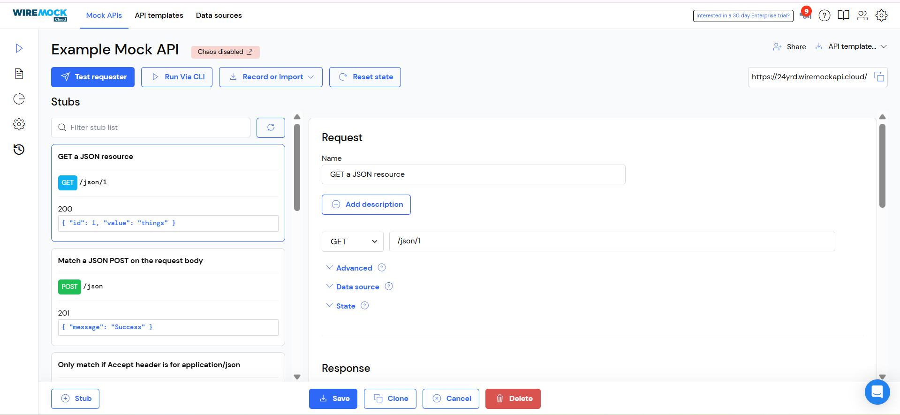
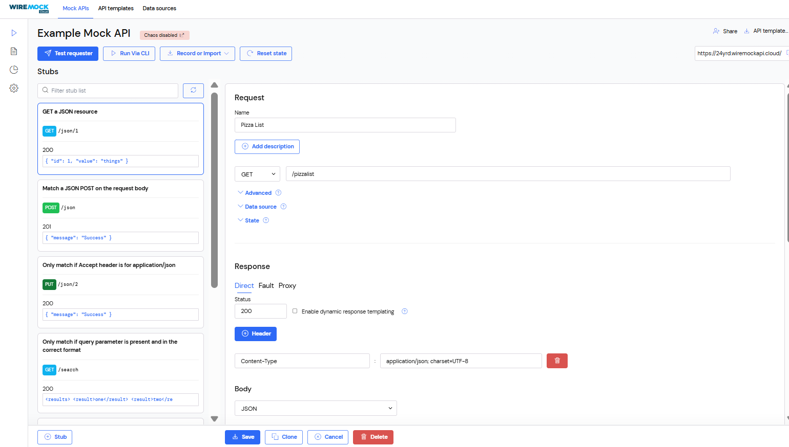
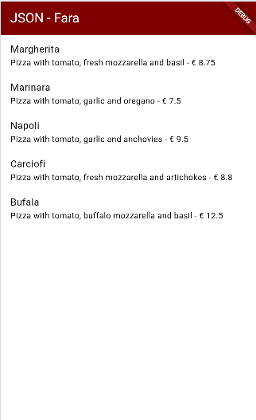
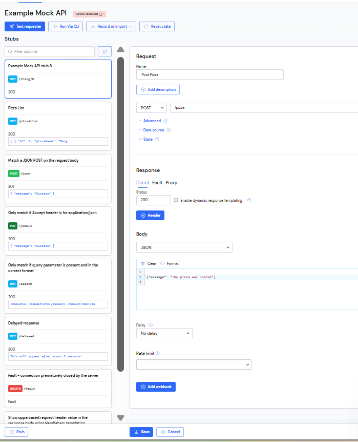

# RESTful API di Flutter

## Praktikum 1: Membuat layanan Mock API


1. Daftar untuk layanan Mock Lab dihttps://app.wiremock.cloud/ dan daftar ke situs tersebut, buat nama pengguna dan kata sandi Anda.

2. Masuk ke layanan tersebut, buka "Example Mock API", dan klik pada bagian Stubs dari API contoh. Kemudian, klik pada entri pertama—yaitu, Get a JSON resource. Anda harus melihat layar yang mirip dengan berikut ini: <br>



3. Klik pada tombol New. Untuk Namanya, ketik Pizza List, biarkan GET sebagai verb, dan di kotak teks di dekat verb GET, ketik /pizzalist. Kemudian, di bagian Response, untuk status 200, pilih JSON sebagai format dan tempel konten JSON yang tersedia dihttps://bit.ly/pizzalist.

4. Tekan tombol Save di bagian bawah halaman untuk menyimpan stub. Ini menyelesaikan pengaturan untuk layanan mock backend. <br>


5. Kembali ke proyek Flutter Anda, tambahkan dependensi http dengan mengetik di Terminal Anda:
```dart
flutter pub add http
```

6. Di folder lib dalam proyek Anda, tambahkan file baru bernama httphelper.dart.
7. Di file httphelper.dart, tambahkan kode berikut:
```dart
import 'dart:io'; 
import 'package:http/http.dart' as http; 
import 'dart:convert'; 
import 'pizza.dart'; 

class HttpHelper {
  final String authority = '02z2g.mocklab.io';
  final String path = 'pizzalist';
  Future<List<Pizza>> getPizzaList() async {
    final Uri url = Uri.https(authority, path);
    final http.Response result = await http.get(url);
    if (result.statusCode == HttpStatus.ok) {
      final jsonResponse = json.decode(result.body);
      //provide a type argument to the map method to avoid type 
      //error
      List<Pizza> pizzas =
          jsonResponse.map<Pizza>((i) => 
            Pizza.fromJson(i)).toList();
      return pizzas;
    } else {
      return [];
    }
  }
}
```

8. Di file main.dart, di kelas _MyHomePageState, tambahkan metode bernama callPizzas. Ini mengembalikan Future dari List objek Pizza dengan memanggil metode getPizzaList dari kelas HttpHelper, sebagai berikut:
```dart
Future<List<Pizza>> callPizzas() async {
  HttpHelper helper = HttpHelper(); 
  List<Pizza> pizzas = await helper.getPizzaList(); 
  return pizzas; 
} 
```

9. Di metode build dari kelas _MyHomePageState, di body Scaffold, tambahkan FutureBuilder yang membangun ListView dari widget ListTile yang berisi objek Pizza:
```dart
Widget build(BuildContext context) { 
    return Scaffold(
      appBar: AppBar(title: const Text('JSON')),
      body: FutureBuilder(
          future: callPizzas(),
          builder: (BuildContext context, AsyncSnapshot<List<Pizza>> 
snapshot) {
          if (snapshot.hasError) {
            return const Text('Something went wrong');
          }
          if (!snapshot.hasData) {
            return const CircularProgressIndicator();
          }
            return ListView.builder(
                itemCount: (snapshot.data == null) ? 0 : snapshot.
data!.length,
                itemBuilder: (BuildContext context, int position) {
                  return ListTile(
                    title: Text(snapshot.data![position].pizzaName),
                    subtitle: Text(snapshot.data![position].
description +
                        ' - € ' +
                        snapshot.data![position].price.toString()),
                  );
                });
          }),
    );  
}
```

10. Jalankan aplikasi. Anda harus melihat layar yang mirip dengan berikut ini: <br>

#### Soal 1
1. Tambahkan nama panggilan Anda pada title app sebagai identitas hasil pekerjaan Anda.
2. Gantilah warna tema aplikasi sesuai kesukaan Anda.
3. Capture hasil aplikasi Anda, lalu masukkan ke laporan di README dan lakukan commit hasil jawaban Soal 1 dengan pesan "W14: Jawaban Soal 1"
<br> 


Di file httphelper.dart, tambahkan kode berikut ke kelas HttpHelper, tepat di bawah deklarasi:
```dart
static final HttpHelper _httpHelper = HttpHelper._internal();
HttpHelper._internal();
factory HttpHelper() {
    return _httpHelper;
}
```


## Praktikum 2: Mengirim Data ke Web Service (POST)

Untuk melakukan aksi POST pada layanan web, ikuti langkah-langkah berikut:

1. Masuk ke layanan Mock Lab dihttps://app.wiremock.cloud/ dan klik pada bagian Stubs dari API contoh. Kemudian, buat stub baru.
2. Lengkapi permintaan sebagai berikut:
Nama: Post Pizza
Verb: POST
Alamat: /pizza
Status: 201
Tipe Body: json
Body: {"message": "The pizza was posted"}

3. Tekan tombol Save. <br>


4. Di proyek Flutter, di file httphelper.dart, di kelas HttpHelper, buat metode baru bernama postPizza, sebagai berikut:
```dart
Future<String> postPizza(Pizza pizza) async {
    const postPath = '/pizza';
  String post = json.encode(pizza.toJson());
  Uri url = Uri.https(authority, postPath);
  http.Response r = await http.post(
    url,
    body: post,
  );
  return r.body;
}
```

5. Di proyek, buat file baru bernama pizza_detail.dart.
6. Di bagian atas file baru, tambahkan impor yang diperlukan:
```dart
import 'package:flutter/material.dart';
import 'pizza.dart';
import 'httphelper.dart';
Buat StatefulWidget bernama PizzaDetailScreen:
class PizzaDetailScreen extends StatefulWidget {
  const PizzaDetailScreen({super.key});
  @override
  State<PizzaDetailScreen> createState() => _PizzaDetailScreenState();
}

class _PizzaDetailScreenState extends State<PizzaDetailScreen> {
  @override
  Widget build(BuildContext context) {
    return Placeholder();
  }
}
```


8. Di bagian atas kelas _PizzaDetailScreenState, tambahkan lima TextEditingController. Ini akan berisi data untuk objek Pizza yang akan diposting nanti. Juga, tambahkan String yang akan berisi hasil dari permintaan POST:
```dart
final TextEditingController txtId = TextEditingController();
final TextEditingController txtName = TextEditingController();
final TextEditingController txtDescription = TextEditingController();
final TextEditingController txtPrice = TextEditingController();
final TextEditingController txtImageUrl = TextEditingController();
String operationResult = '';
```

8. Override metode dispose() untuk membuang controller:
```dart
@override
void dispose() {
  txtId.dispose();
  txtName.dispose();
  txtDescription.dispose();
  txtPrice.dispose();
  txtImageUrl.dispose();
  super.dispose();
}
```


10. Di metode build() dari kelas, kembalikan Scaffold, yang AppBar-nya berisi Text "Pizza Detail" dan body-nya berisi Padding dan SingleChildScrollView yang berisi Column:

```dart
return Scaffold(
  appBar: AppBar(
    title: const Text('Pizza Detail'),
  ),
  body: Padding(
      padding: const EdgeInsets.all(12),
      child: SingleChildScrollView(
        child: Column(children: []),
      )));
```

11. Untuk properti children dari Column, tambahkan beberapa Text yang akan berisi hasil dari post, lima TextField, masing-masing terikat ke TextEditingController mereka sendiri, dan ElevatedButton untuk menyelesaikan aksi POST (metode postPizza akan dibuat selanjutnya). Juga, tambahkan SizedBox untuk menjauhkan widget di layar:
```dart
Text(
  operationResult,
  style: TextStyle(
      backgroundColor: Colors.green[200],
      color: Colors.black),
),
const SizedBox(
  height: 24,
),
TextField(
  controller: txtId,
  decoration: const InputDecoration(hintText: 'Insert ID'),
),
const SizedBox(
  height: 24,
),
TextField(
  controller: txtName,
  decoration: const InputDecoration(hintText: 'Insert Pizza Name'),
),
const SizedBox(
  height: 24,
),
TextField(
  controller: txtDescription,
  decoration: const InputDecoration(hintText: 'Insert Description'),
),
const SizedBox(
  height: 24,
),
TextField(
  controller: txtPrice,
  decoration: const InputDecoration(hintText: 'Insert Price'),
),
const SizedBox(
  height: 24,
),
TextField(
  controller: txtImageUrl,
  decoration: const InputDecoration(hintText: 'Insert Image Url'),
),
const SizedBox(
  height: 48,
),
ElevatedButton(
    child: const Text('Send Post'),
    onPressed: () {
      postPizza();
    })       
```
12. Di bagian bawah kelas _PizzaDetailScreenState, tambahkan metode postPizza:
```dart
Future postPizza() async {
  HttpHelper helper = HttpHelper();
  Pizza pizza = Pizza();
  pizza.id = int.tryParse(txtId.text);
  pizza.pizzaName = txtName.text;
  pizza.description = txtDescription.text;
  pizza.price = double.tryParse(txtPrice.text);
  pizza.imageUrl = txtImageUrl.text;
  String result = await helper.postPizza(pizza);
  setState(() {
    operationResult = result;
  });
}
```


13. Di file main.dart, impor file pizza_detail.dart
14. Di Scaffold dari metode build() kelas _MyHomePageState, tambahkan 
```dart
FloatingActionButton yang akan navigasi ke rute PizzaDetail:
floatingActionButton: FloatingActionButton(
  child: const Icon(Icons.add),
  onPressed: () {
    Navigator.push(
      context,
      MaterialPageRoute(
          builder: (context) => const PizzaDetailScreen()),
    );
  }),
```

15. Jalankan aplikasi. Di layar utama, tekan FloatingActionButton untuk navigasi ke rute PizzaDetail.
14. Tambahkan detail pizza di field teks dan tekan tombol Send Post. Anda seharusnya melihat hasil yang sukses, seperti yang ditunjukkan pada Gambar berikut ini:

Soal 2
1. Tambahkan field baru dalam JSON maupun POST ke Wiremock!
2. Capture hasil aplikasi Anda berupa GIF di README dan lakukan commit hasil jawaban Soal 2 dengan pesan "W14: Jawaban Soal 2" <br>


