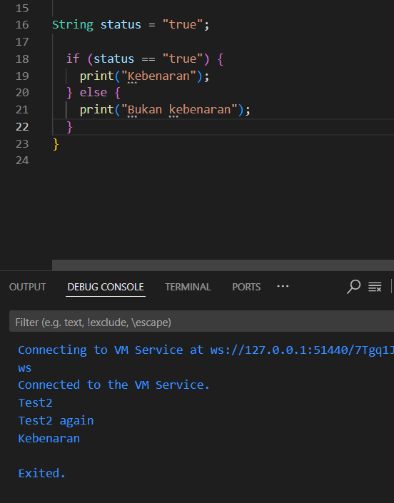

# PERTEMUAN 2 PEMOGRAMAN DASAR DART - Bag.2 (Percabangan dan Perulangan)

## Praktikum 1
### Langkah 1
Ketik atau salin kode program berikut ke dalam fungsi `main()`:

```dart
void main() {
  String test = "test2";
  if (test == "test1") {
    print("Test1");
  } else if (test == "test2") {
    print("Test2");
  } else {
    print("Something else");
  }

  if (test == "test2") print("Test2 again");
}
```
### Langkah 2

Silakan coba eksekusi (Run) kode pada langkah 1 tersebut. Apa yang terjadi? Jelaskan!
**Jawaban:**
Error muncul karena If dan Else dengan huruf besar.

### Output Kode Perbaikan:


### Langkah 3

Tambahkan kode program berikut, lalu coba eksekusi (Run) kode Anda.

```dart
String test = "true";
if (test) {
   print("Kebenaran");
}
```
Apa yang terjadi ? Jika terjadi error, silakan perbaiki namun tetap menggunakan if/else.
**Jawaban:**
Terjadi Error karena tidak ada nilai dalam variabel if.

### Output Kode Perbaikan:


## Praktikum 2 
### Langkah 1

Ketik atau salin kode program berikut ke dalam fungsi `main()`:

```dart
while (counter < 33) {
  print(counter);
  counter++;
}
```
### Langkah 2

Silakan coba eksekusi (Run) kode pada langkah 1 tersebut. Apa yang terjadi? Jelaskan! Lalu
perbaiki jika terjadi error.
**Jawaban:**
Terjadi Error karena variabel counter belum dideklarasikan.

### Output Kode Perbaikan:


### Langkah 3
Tambahkan kode program berikut, lalu coba eksekusi (Run) kode Anda.
```dart
do {
  print(counter);
  counter++;
} while (counter < 77);
```
Apa yang terjadi ? Jika terjadi error, silakan perbaiki namun tetap menggunakan do-while.
**Jawaban:**
Terjadi Error karena variabel counter belum dideklarasikan. memperbaikinya dengan mendeklarasikan
variabel counter sbeelumnya.

### Output Kode Perbaikan: 


## Praktikum 3 
### Langkah 1
Ketik atau salin kode program berikut ke dalam fungsi main().
```dart
for (Index = 10; index < 27; index) {
  print(Index);
}
```

### Langkah 2
Silakan coba eksekusi (Run) kode pada langkah 1 tersebut. Apa yang terjadi? Jelaskan! Lalu
perbaiki jika terjadi error.
**Jawaban:**
Terjadi eror karena tidak ada jenis variabel int yang dideklarasikan sebekum variabel index.

### Output Kode Perbaikan:


### Langkah 3
Tambahkan kode program berikut di dalam for-loop, lalu coba eksekusi (Run) kode Anda.
```dart
If (Index == 21) break;
Else If (index > 1 || index < 7) continue;
print(index);
```
Apa yang terjadi ? Jika terjadi error, silakan perbaiki namun tetap menggunakan for dan break-continue.
**Jawaban:** 
Terjadi eror dikarenakan variabel index belum didefinisikan.

### Output Kode Perbaikan:


### Tugas Praktikum
 Buatlah sebuah program yang dapat menampilkan bilangan prima dari angka 0 sampai 201 menggunakan Dart.
 Ketika bilangan prima ditemukan, maka tampilkan nama lengkap dan NIM Anda.

**Jawaban**
### Output Program


Menampilkan bilangan prima dari 0 sampai 201. Setiap angka dicek menggunakan fungsi isPrima().
Jika angka adalah bilangan prima, maka program mencetak angka tersebut beserta nama lengkap dan NIM.
Hasil eksekusi menunjukkan bilangan prima berhasil ditampilkan sesuai instruksi tugas.

