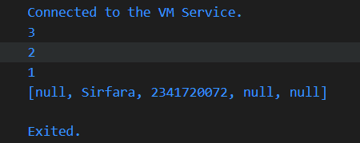

# PERTEMUAN 4 PEMOGRAMAN DASAR DART - BAGIAN 3

## Praktikum 1 Eksperimen Tipe Data List
### Langkah 1
Ketik atau salin kode program berikut ke dalam void main().
``` dart
void main() {
var list = [1, 2, 3];
assert(list.length == 3);
assert(list[1] == 2);
print(list.length);
print(list[1]);

list[1] = 1;
assert(list[1] == 1);
print(list[1]);
}
```

### Langkah 2
Silakan coba eksekusi (Run) kode pada langkah 1 tersebut. Apa yang terjadi? Jelaskan!<br> 
**Jawaban:**
Pada saat di eksekusi program akan menmapilkan output 3,2,1 secara berurutan. Angka 3 berasal dari list panjang list yang berisi tiga elemen, angka 2 berasal dari nilai elemen pada indeks ke 1 sebelum diubah, angka 1 muncul setelah elemen diganti dari 2 menjadi 1.

### Output Kode:


### Langkah 3
Ubah kode pada langkah 1 menjadi variabel final yang mempunyai index = 5 dengan default value = null. Isilah nama dan NIM Anda pada elemen index ke-1 dan ke-2. Lalu print dan capture hasilnya. <br> 
Apa yang terjadi ? Jika terjadi error, silakan perbaiki.

```dart
void main() {
  
var list = [1, 2, 3];
assert(list.length == 3);
assert(list[1] == 2);
print(list.length);
print(list[1]);

list[1] = 1;
assert(list[1] == 1);
print(list[1]);

// Langkah 3
final List<String?> myList = List.filled(5, null);

myList[1] = "Sirfara";
myList[2] = "2341720072";

print(myList);
}
```

### Output Kode:


## Praktikum 2 Eksperimen Tipe Data Set
### Langkah 1
Ketik atau salin kode program berikut ke dalam fungsi main().
```dart
void main() {
  var halogens = {'fluorine', 'chlorine', 'bromine', 'iodine', 'astatine'};
  print(halogens);
}
```

### Langkah 2
Silakan coba eksekusi (Run) kode pada langkah 1 tersebut. Apa yang terjadi? Jelaskan! Lalu perbaiki jika terjadi error. <br>
**Jawaban:**
Tidak terjadi eror, karena set literal dengan tanda kurung kurawal {} dan variabel halogens berisi set<string> yang anggotanya berupa {fluorine, chlorine, bromine, iodine, astatine}

### Output kode:


### Langkah 3
Tambahkan kode program berikut, lalu coba eksekusi (Run) kode Anda.
```dart
var names1 = <String>{};
Set<String> names2 = {}; // This works, too.
var names3 = {}; // Creates a map, not a set.

print(names1);
print(names2);
print(names3);
```

Apa yang terjadi ? Jika terjadi error, silakan perbaiki namun tetap menggunakan ketiga variabel tersebut. Tambahkan elemen nama dan NIM Anda pada kedua variabel Set tersebut dengan dua fungsi berbeda yaitu .add() dan .addAll(). Untuk variabel Map dihapus, nanti kita coba di praktikum selanjutnya.

```dart
void main() {
  var halogens = {'fluorine', 'chlorine', 'bromine', 'iodine', 'astatine'};
  print(halogens);

  var names1 = <String>{};
  names1.add("Sirfara");
  names1.add("2341720072");
  print(names1);

  Set<String> names2 = {};
  names2.addAll({"Sirfara", "2341720072"});
  print(names2);
}
```
### Output kode:


## Praktikum 3 Eksperimen Tipe Data Maps
### Langkah 1 
Ketik atau salin kode program berikut ke dalam fungsi main().
```dart
var gifts = {
  // Key:    Value
  'first': 'partridge',
  'second': 'turtledoves',
  'fifth': 1
};

var nobleGases = {
  2: 'helium',
  10: 'neon',
  18: 2,
};

print(gifts);
print(nobleGases);
```

### Langkah 2
Silakan coba eksekusi (Run) kode pada langkah 1 tersebut. Apa yang terjadi? Jelaskan! Lalu perbaiki jika terjadi error.
```dart
void main() {
  var gifts = {
  // Key:    Value
  'first': 'partridge',
  'second': 'turtledoves',
  'fifth': 1
};

var nobleGases = {
  2: 'helium',
  10: 'neon',
  18: 2,
};

print(gifts);
print(nobleGases);
}
```
### Output:

Kode Map yang berisi pasangan key value, variabel gifts menggunkana key bertipe string dengan value string dan int, noblegases menggunkan key bertipe int dengan variabel string dan int.

### Langkah 3
Tambahkan kode program berikut, lalu coba eksekusi (Run) kode Anda.
```dart 
var mhs1 = Map<String, String>();
gifts['first'] = 'partridge';
gifts['second'] = 'turtledoves';
gifts['fifth'] = 'golden rings';

var mhs2 = Map<int, String>();
nobleGases[2] = 'helium';
nobleGases[10] = 'neon';
nobleGases[18] = 'argon';
```
Apa yang terjadi ? Jika terjadi error, silakan perbaiki. <br>
**Jawaban:*
Output program sama dengan langkah 1 karena tidak ada tambahan print.<br>

Tambahkan elemen nama dan NIM Anda pada tiap variabel di atas (gifts, nobleGases, mhs1, dan mhs2).
```dart
void main() {
  var gifts = {
  // Key:    Value
  'first': 'partridge',
  'second': 'turtledoves',
  'fifth': 1
  };

  var nobleGases = {
    2: 'helium',
    10: 'neon',
    18: 2,
  };

  print(gifts);
  print(nobleGases);
  var mhs1 = Map<String, String>();
  gifts['first'] = 'partridge';
  gifts['second'] = 'turtledoves';
  gifts['fifth'] = 'golden rings';

  var mhs2 = Map<int, String>();
  nobleGases[2] = 'helium';
  nobleGases[10] = 'neon';
  nobleGases[18] = 'argon';

  nobleGases[20] = 'Sirfara';
  nobleGases[21] = '2341720072';

    mhs1['nama'] = 'Sirfara';
    mhs1['nim'] = '2341720072';

    mhs2[1] = 'Sirfara';
    mhs2[2] = '2341720072';

    print(gifts);
    print(nobleGases);
    print(mhs1);
    print(mhs2);
}
```
### Output Kode:


## Praktikum 4 Eksperimen Tipe Data List: Spread dan Control-flow Operators

### Langkah 1
Ketik atau salin kode program berikut ke dalam fungsi main().
```dart
var list = [1, 2, 3];
var list2 = [0, ...list];
print(list1);
print(list2);
print(list2.length);
```

### Langkah 2
Silakan coba eksekusi (Run) kode pada langkah 1 tersebut. Apa yang terjadi? Jelaskan! Lalu perbaiki jika terjadi error. <br>
**Jawaban:** Terdapat eror karena yang dideklarasikan hanya list dan list2.

### Kode perbaikan
```dart
void main() {
  var list = [1, 2, 3];
  var list2 = [0, ...list];
  print(list);
  print(list2);
  print(list2.length);
}
```

### Output:


### Langkah 3
Tambahkan kode program berikut, lalu coba eksekusi (Run) kode Anda.
```dart
list1 = [1, 2, null];
print(list1);
var list3 = [0, ...?list1];
print(list3.length);
```
Apa yang terjadi ? Jika terjadi error, silakan perbaiki. <br>
**Jawaban:** Tidak ada eror, karena list1 berisi null sebagai salah satu elemennya.

### Output kode:


Tambahkan variabel list berisi NIM Anda menggunakan Spread Operators. Dokumentasikan hasilnya dan buat laporannya!
```dart
var nim = ['2341720072'];
  var listNIM = [...list, ...nim];
  print(listNIM);
  print(listNIM.length);
```

### Output :


### Langkah 4
Tambahkan kode program berikut, lalu coba eksekusi (Run) kode Anda.
```dart
var nav = ['Home', 'Furniture', 'Plants', if (promoActive) 'Outlet'];
print(nav);
```

Apa yang terjadi ? Jika terjadi error, silakan perbaiki. Tunjukkan hasilnya jika variabel promoActive ketika true dan false. <br>
**Jawaban:** Terjadi eror karena promoActive belum didefinisikan.

### Perbaikan kode
```dart
void main() {
  var list = [1, 2, 3];
  var list2 = [0, ...list];
  print(list);
  print(list2);
  print(list2.length);

  var list1 = [1, 2, null];
  print(list1);
  var list3 = [0, ...?list1];
  print(list3.length);

  var nim = ['2341720072'];
  var listNIM = [...list, ...nim];
  print(listNIM);
  print(listNIM.length);

  var promoActive = true;
  var nav = ['Home', 'Furniture', 'Plants', if (promoActive) 'Outlet'];
  print(nav);
}
```

### Output kode jika True:

### Output kode jika False:


### Langkah 5
Tambahkan kode program berikut, lalu coba eksekusi (Run) kode Anda.
```dart
var nav2 = ['Home', 'Furniture', 'Plants', if (login case 'Manager') 'Inventory'];
print(nav2);
```
Apa yang terjadi ? Jika terjadi error, silakan perbaiki. Tunjukkan hasilnya jika variabel login mempunyai kondisi lain. <br>

**Jawaban:** Terdapat eror dikarenakan variabel login blum didefinisikan dan sintaks case hanya bisa digunakan dalam switch case bukan di dalam list comprehension.

### Output perbaikan
[prak4langkah5](img/p4l5.png)

### Langkah 6
Tambahkan kode program berikut, lalu coba eksekusi (Run) kode Anda.
```dart
var listOfInts = [1, 2, 3];
var listOfStrings = ['#0', for (var i in listOfInts) '#$i'];
assert(listOfStrings[1] == '#1');
print(listOfStrings);
```

Apa yang terjadi ? Jika terjadi error, silakan perbaiki. Jelaskan manfaat Collection For dan dokumentasikan hasilnya. <br>
**Jawaban:** Tidak terjadi eror. Manfaat Collection for Membuat kode lebih ringkas dan mudah dibaca, Memudahkan membuat list dinamis dari data lain, Bisa dikombinasikan dengan if untuk seleksi kondisi,Efisien karena tidak perlu loop terpisah dan .add() manual.

## Praktikum 6 Eksperimen Tipe Data Records

### Langkah 1
Ketik atau salin kode program berikut ke dalam fungsi main().
```dart
var record = ('first', a: 2, b: true, 'last');
print(record)
```

### Langkah 2
Silakan coba eksekusi (Run) kode pada langkah 1 tersebut. Apa yang terjadi? Jelaskan! Lalu perbaiki jika terjadi error. <br>
**Jawaban:** Tidak terjadi eror. Record digunakan untuk mengelompokkan beberapa nilai menjadi satu. output program Positional field ditampilkan dulu (first, last),Named field ditampilkan setelah positional field (a: 2, b: true)

### Langkah 3
Tambahkan kode program berikut di luar scope void main(), lalu coba eksekusi (Run) kode Anda.

```dart
(int, int) tukar((int, int) record) {
  var (a, b) = record;
  return (b, a);
}
```

Apa yang terjadi ? Jika terjadi error, silakan perbaiki. Gunakan fungsi tukar() di dalam main() sehingga tampak jelas proses pertukaran value field di dalam Records. <br>
**Jawaban:** Fungsi tukar menerima record, lalu membalik urutannya.
### Kode perbaikan:
```dart
 (int, int) tukar((int, int) record) {
  var (a, b) = record;
  return (b, a);
  }
void main() {
   var angka = (10, 20);
  print('Sebelum tukar: $angka');

  var hasil = tukar(angka);
  print('Sesudah tukar: $hasil');
}
```

### Output :
[prak5langkah3](img/p5l3.png)

### Langkah 4
Tambahkan kode program berikut di dalam scope void main(), lalu coba eksekusi (Run) kode Anda.
```dart
// Record type annotation in a variable declaration:
(String, int) mahasiswa;
print(mahasiswa);
```

Apa yang terjadi ? Jika terjadi error, silakan perbaiki. Inisialisasi field nama dan NIM Anda pada variabel record mahasiswa di atas. Dokumentasikan hasilnya dan buat laporannya! <br>
**Jawaban:** Terjadi erro dikarenakan variabel mahasiswa belum diinisialisasikan.

### Kode Perbaikan
```dart
 (int, int) tukar((int, int) record) {
  var (a, b) = record;
  return (b, a);
  }
void main() {
   var angka = (10, 20);
  print('Sebelum tukar: $angka');

  var hasil = tukar(angka);
  print('Sesudah tukar: $hasil');

  (String, int) mahasiswa = ('Sirfaratih', 2341720072);
  print(mahasiswa);
}
```

### Output:
[prak5langkah4](img/p5l4.png)

### Langkah 5
Tambahkan kode program berikut di dalam scope void main(), lalu coba eksekusi (Run) kode Anda.
```dart
var mahasiswa2 = ('first', a: 2, b: true, 'last');

print(mahasiswa2.$1); // Prints 'first'
print(mahasiswa2.a); // Prints 2
print(mahasiswa2.b); // Prints true
print(mahasiswa2.$2); // Prints 'last'
```
<br>Apa yang terjadi ? Jika terjadi error, silakan perbaiki. Gantilah salah satu isi record dengan nama dan NIM Anda. <br>
**Jawaban:** Tidak terdapat eror. Record bisa diakses melalui $1, $2, dan seterusnya untuk positional, dan .a,.b untuk named.
### Output:
[prak5langkah5](img/p5l5.png)

## TUGAS PRAKTIKUM
1. Silakan selesaikan Praktikum 1 sampai 5, lalu dokumentasikan berupa screenshot hasil pekerjaan Anda beserta penjelasannya!

2. Jelaskan yang dimaksud Functions dalam bahasa Dart!
**Jawaban:** blok kode yang bisa melakukan tugas tertentu dapat dipanggil beberapa kali, mempunyai parameter, bisa mengembalikan nilai(atau tidak).

3. Jelaskan jenis-jenis parameter di Functions beserta contoh sintaksnya!
**Jawaban:** 
## Jenis-jenis Parameter di Functions (Dart)

| Jenis Parameter                  | Deskripsi                                                                 | Contoh Sintaks |
|----------------------------------|---------------------------------------------------------------------------|----------------|
| **Positional Required**          | Parameter wajib, urutan harus sesuai.                                     | ```dart<br>int add(int x, int y) {<br>  return x + y;<br>}<br>var result = add(3, 4);``` |
| **Optional Positional**          | Parameter opsional, ditulis dalam `[ ]`. Bisa diberi nilai default.       | ```dart<br>String say(String from, String msg, [String? device]) {<br>  return '$from says $msg with $device';<br>}<br>say('Alice', 'Hello');<br>say('Alice', 'Hello', 'phone');``` |
| **Named Parameters**             | Parameter ditulis dalam `{ }`, bisa dipanggil berdasarkan nama.           | ```dart<br>void enableFlags({ bool? bold, bool? hidden }) {}<br>enableFlags(bold: true, hidden: false);``` |
| **Named Parameters + Default**   | Named parameter yang diberi nilai default.                                | ```dart<br>void enableFlags({ bool bold = false, bool hidden = false }) {<br>  print('bold: $bold, hidden: $hidden');<br>}<br>enableFlags();<br>enableFlags(hidden: true);``` |
| **Required Named Parameters**    | Named parameter yang wajib diisi, pakai keyword `required`.               | ```dart<br>void createUser({ required String name, int age = 0 }) {<br>  print('Name: $name, Age: $age');<br>}<br>createUser(name: 'Budi');``` |
 
4. Jelaskan maksud Functions sebagai first-class objects beserta contoh sintaknya!
**Jawaban:** 
Functions adalah first-class objects di Dart, artinya function bisa disimpan di variabel, dijadikan parameter, atau dikembalikan dari function lain.
```dart
void greet(String name) => print('Hello $name');

void main() {
  var sayHello = greet; // function disimpan ke variabel
  sayHello('Budi');     // output: Hello Budi
}
```
6. Apa itu Anonymous Functions? Jelaskan dan berikan contohnya!
**Jawaban:** 
Anonymous function (fungsi anonim) adalah fungsi yang tidak mempunyai nama, biasanya didefinisikan inline, sering digunakan sekali, atau sebagai argumen ke fungsi lain.
```dart void main() {
  List<int> nums = [1,2,3];

  // menggunakan anonymous function untuk forEach
  nums.forEach((int n) {
    print(n * 2);
  });

  // dengan arrow syntax
  var squares = nums.map((n) => n * n);
  print(squares.toList()); // [1,4,9]
}
```

6. Jelaskan perbedaan Lexical scope dan Lexical closures! Berikan contohnya!
**Jawaban:** 
- Lexical scope (ruang lingkup leksikal): variabel-variabel yang didefinisikan dalam konteks suatu fungsi hanya bisa diakses dari dalam fungsi itu atau fungsi‐yang‐tertanam di dalamnya secara leksikal.
- Closure (Lexical closure): ketika sebuah fungsi (biasanya anonim atau fungsi dalam) “menangkap” variabel dari lingkungan luar (lexical scope), dan tetap dapat mengakses variabel tersebut bahkan ketika fungsi luar sudah selesai dieksekusi.
contoh:
```dart Function makeCounter() {
  int count = 0;  // variabel di lexical scope luar
  Function counter = () {
    count++;
    return count;
  };
  return counter;  // mengembalikan fungsi dalam
}

void main() {
  var myCounter = makeCounter(); 
  print(myCounter()); // 1
  print(myCounter()); // 2
  print(myCounter()); // 3
}
```

7. Jelaskan dengan contoh cara membuat return multiple value di Functions!
**Jawaban:** 
## Return Multiple Value di Functions (Dart)

| Cara                        | Deskripsi                                      | Contoh Sintaks |
|-----------------------------|------------------------------------------------|----------------|
| **List / Map**              | Nilai dikembalikan dalam bentuk list atau map. | ```dart<br>List<Object> foo() => [42, "foobar"];<br>var result = foo();<br>print(result[0]); // 42<br>print(result[1]); // foobar``` |
| **Class / Object**          | Membuat class sederhana untuk membungkus data. | ```dart<br>class Pair {<br>  final int a;<br>  final String b;<br>  Pair(this.a, this.b);<br>}<br>Pair foo() => Pair(42, "foobar");``` |
| **Record (Dart 3)**         | Menggunakan fitur record, mirip tuple.         | ```dart<br>(int, String) foo() => (42, "foobar");<br>void main() {<br>  var (a, b) = foo();<br>  print('$a, $b');<br>}``` |
