## MEMBUAT PROJECT
### Pertanyaan Umum(FAQ)
1. Bagaimana cara saya menemukan jalur Flutter SDK?
Jalur Flutter SDK bisa dilihat di folder tempat Flutter diekstrak, contohnya di Windows ada di C:\src\flutter sedangkan di Mac/Linux biasanya ~/flutter. Cara lain untuk memastikan bisa pakai perintah flutter doctor -v, nanti di bagian awal akan muncul lokasi Flutter SDK.

2. Apa yang harus saya lakukan saat perintah Flutter tidak ditemukan?
muncul error perintah Flutter tidak ditemukan, berarti Flutter belum ditambahkan ke PATH. Di Windows bisa lewat Environment Variables lalu  C:\src\flutter\bin. Kalau di Mac/Linux, tinggal  export PATH="$PATH:$HOME/flutter/bin" ke file ~/.bashrc.

3. Bagaimana cara memperbaiki masalah "Menunggu perintah flutter lainnya untuk melepaskan kunci startup"?
Masalah ini terjadi karena ada proses Flutter yang masih jalan dan nge-lock project. Cara ngatasinya bisa jalankan flutter clean lalu flutter pub get. jika masih sama, hapus file lock di folder project, namanya flutter_build.lock yang ada di dalam .dart_tool

4. Bagaimana cara memberi tahu Flutter letak penginstalan Android SDK berada?
Supaya Flutter tahu lokasi Android SDK, harus diset variabel ANDROID_HOME atau ANDROID_SDK_ROOT. Kalau di Windows, diatur lewat Environment Variables dengan isi C:\Users\<nama_kamu>\AppData\Local\Android\sdk. Kalau di Mac/Linux  tambahin ke ~/.bashrc.

5. Bagaimana cara menangani kesalahan Java saat menjalankan flutter doctor --android-licenses?
Error ini karena versi JDK yang dipakai nggak cocok. Flutter lebih stabil pakai JDK 11 atau JDK 17. Jadi solusinya install JDK versi, lalu set JAVA_HOME ke lokasi JDK yang benar.

6. Bagaimana cara menangani masalah alat sdkmanager Android tidak ditemukan?
Jika alat sdkmanager tidak ditemukan, hal ini menandakan bahwa Android SDK Command-line Tools belum terinstal. Penyelesaiannya adalah dengan membuka Android Studio, kemudian memilih SDK Manager → SDK Tools, dan mengaktifkan pilihan Android SDK Command-line Tools (latest), lalu melakukan instalasi. Setelah selesai, perintah sdkmanager dapat dijalankan kembali.

7. Bagaimana cara menangani kesalahan "komponen cmdline-tools tidak ditemukan"?
Kesalahan ini menunjukkan bahwa komponen cmdline-tools dari Android SDK belum tersedia. Untuk mengatasinya, buka Android Studio, kemudian masuk ke SDK Manager → SDK Tools, setelah itu aktifkan opsi Android SDK Command-line Tools (latest).

8. Bagaimana cara menjalankan CocoaPods pada Apple Silicon (M1)?
Pada perangkat Mac dengan prosesor Apple Silicon (M1), CocoaPods terkadang mengalami kendala kompatibilitas. Solusi yang dapat dilakukan adalah menjalankan perintah sudo arch -x86_64 gem install ffi kemudian arch -x86_64 pod install.

9. Bagaimana cara menonaktifkan pemformatan otomatis pada file yang disimpan di VS Code?
Untuk menonaktifkan pemformatan otomatis saat menyimpan file di Visual Studio Code, buka menu pengaturan kemudian cari opsi format on save dan nonaktifkan tanda centangnya.


### Menyalin & Menempelkan aplikasi awal
Pada panel sebelah kiri VS Code, pastikan bahwa Penjelajah dipilih lalu buka file pubspec.yaml.
```dart
name: namer_app
description: A new Flutter project.

publish_to: 'none' # Remove this line if you wish to publish to pub.dev

version: 0.0.1+1

environment:
  sdk: '>=2.19.4 <4.0.0'

dependencies:
  flutter:
    sdk: flutter

  english_words: ^4.0.0
  provider: ^6.0.0

dev_dependencies:
  flutter_test:
    sdk: flutter

  flutter_lints: ^2.0.0

flutter:
  uses-material-design: true
```
File pubspec.yaml menentukan informasi dasar tentang aplikasi Anda, seperti versi aplikasi saat ini, dependensi aplikasi, dan aset yang digunakan oleh aplikasi untuk pengiriman.

Berikutnya, buka file konfigurasi lainnya dalam proyek tersebut, analysis_options.yaml.
Ganti konten file tersebut dengan kode berikut:
```dart
include: package:flutter_lints/flutter.yaml

linter:
  rules:
    prefer_const_constructors: false
    prefer_final_fields: false
    use_key_in_widget_constructors: false
    prefer_const_literals_to_create_immutables: false
    prefer_const_constructors_in_immutables: false
    avoid_print: false
```
Terakhir, buka file main.dart pada direktori lib/.
```dart
import 'package:english_words/english_words.dart';
import 'package:flutter/material.dart';
import 'package:provider/provider.dart';

void main() {
  runApp(MyApp());
}

class MyApp extends StatelessWidget {
  const MyApp({super.key});

  @override
  Widget build(BuildContext context) {
    return ChangeNotifierProvider(
      create: (context) => MyAppState(),
      child: MaterialApp(
        title: 'Namer App',
        theme: ThemeData(
          useMaterial3: true,
          colorScheme: ColorScheme.fromSeed(seedColor: Colors.deepOrange),
        ),
        home: MyHomePage(),
      ),
    );
  }
}

class MyAppState extends ChangeNotifier {
  var current = WordPair.random();
}

class MyHomePage extends StatelessWidget {
  @override
  Widget build(BuildContext context) {
    var appState = context.watch<MyAppState>();

    return Scaffold(
      body: Column(
        children: [
          Text('A random idea:'),
          Text(appState.current.asLowerCase),
        ],
      ),
    );
  }
}
```
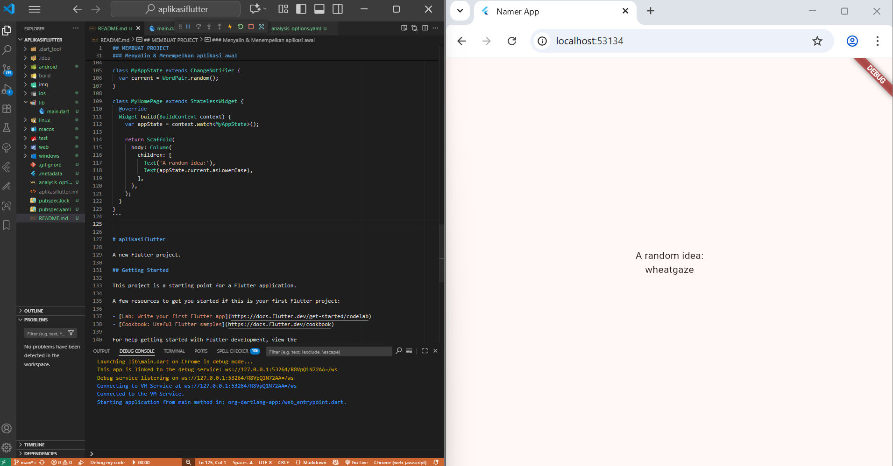

### 4. Menambahkan Tombol
Langkah ini menambahkan tombol Next untuk menghasilkan pasangan kata baru.

### Meluncurkan aplikasi
Pertama, buka lib/main.dart dan pastikan Anda memilih perangkat target. Di bagian pojok kanan bawah VS Code, Anda akan menemukan tombol yang menampilkan perangkat target saat ini. Klik tombol untuk mengubahnya.
Selagi lib/main.dart terbuka, temukan tombol "play" di pojok kanan atas jendela VS Code lalu klik tombol tersebut.
Setelah beberapa saat, aplikasi Anda diluncurkan dalam mode debug. Tampilannya masih terlihat biasa saja.


#### Hot Reload pertama 
Di bagian bawah lib/main.dart, tambahkan sesuatu pada string di objek Text pertama, dan simpan file tersebut (dengan Ctrl+S atau Cmd+S). Misalnya:
```dart
// ...

    return Scaffold(
      body: Column(
        children: [
          Text('A random AWESOME idea:'),  // ← Example change.
          Text(appState.current.asLowerCase),
        ],
      ),
    );
```
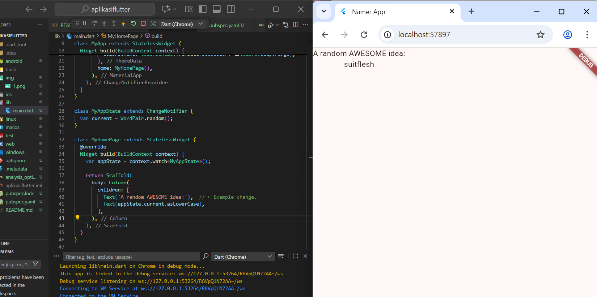

### Pertanyaan Umum (FAQ)
1. Bagaimana jika Hot Reload tidak berfungsi pada VS Code?
Pastikan perangkat atau emulator aktif, Flutter terdeteksi, dan extension Flutter di VS Code terpasang. Jika perlu, jalankan ulang aplikasi dengan flutter run.

2. Apakah saya harus menekan ‘r' untuk Hot Reload di VS Code?
Tidak. VS Code menyediakan tombol Hot Reload di toolbar, tetapi menekan ‘r’ di terminal juga berfungsi sama.

3. Apakah Hot Reload berfungsi untuk web?
Ya, Hot Reload berfungsi untuk web, tetapi perubahan pada HTML, JavaScript, atau asset tertentu mungkin memerlukan Hot Restart atau refresh browser.

4. Bagaimana cara menghapus banner "Debug"?
Tambahkan properti debugShowCheckedModeBanner: false pada widget MaterialApp.

###  Menambahkan tombol
Berikutnya, tambahkan tombol di bagian bawah Column, tepat di bawah instance Text kedua.
```dart
// ...

    return Scaffold(
      body: Column(
        children: [
          Text('A random AWESOME idea:'),
          Text(appState.current.asLowerCase),

          // ↓ Add this.
          ElevatedButton(
            onPressed: () {
              print('button pressed!');
            },
            child: Text('Next'),
          ),

        ],
      ),
    );

// ...
```

Saat Anda menyimpan perubahan, aplikasi diperbarui kembali: Sebuah tombol muncul dan, saat Anda mengklik tombol tersebut, Konsol Debug di VS Code menampilkan pesan button pressed!.
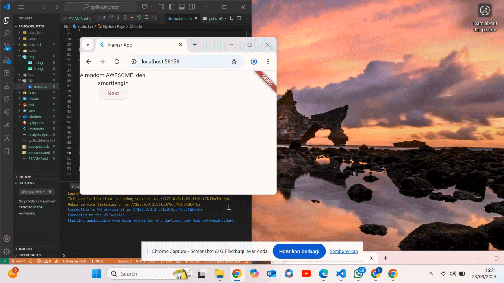

### Kursus singkat Flutter 5 menit
Meskipun menyenangkan melihat Konsol Debug, Anda ingin tombol tersebut melakukan sesuatu yang lebih berguna. Namun, sebelum mencapai ke sana, perhatikan kode pada lib/main.dart lebih dekat, untuk memahami cara kerjanya.

lib/main.dart
```dart
// ...

void main() {
  runApp(MyApp());
}

// ...
```

Di bagian paling atas file tersebut, Anda akan menemukan fungsi main(). Dalam wujudnya saat ini, fungsi ini hanya memberi tahu Flutter untuk menjalankan aplikasi yang ditentukan pada MyApp.
```dart
// ...

class MyApp extends StatelessWidget {
  const MyApp({super.key});

  @override
  Widget build(BuildContext context) {
    return ChangeNotifierProvider(
      create: (context) => MyAppState(),
      child: MaterialApp(
        title: 'Namer App',
        theme: ThemeData(
          useMaterial3: true,
          colorScheme: ColorScheme.fromSeed(seedColor: Colors.deepOrange),
        ),
        home: MyHomePage(),
      ),
    );
  }
}

// ...
```
Class MyApp memperluas StatelessWidget. Widget adalah elemen tempat Anda membangun setiap aplikasi Flutter. Seperti yang dapat Anda lihat, bahkan aplikasi itu sendiri adalah widget.

Catatan: Kita akan mencapai penjelasan StatelessWidget (dibandingkan StatefulWidget) kemudian.

Kode pada MyApp menyusun keseluruhan aplikasi. Kode ini membuat status seluruh aplikasi (Anda akan mempelajari hal ini lebih lanjut nanti), memberi nama aplikasi, menentukan tema visual, dan mengatur widget "home"—titik awal aplikasi Anda.
```dart
// ...

class MyAppState extends ChangeNotifier {
  var current = WordPair.random();
}

// ...
```

Berikutnya, class MyAppState menentukan...yah...status aplikasi. Percobaan ini adalah percobaan pertama Anda menggunakan Flutter, jadi codelab ini akan menjaga status aplikasi tetap sederhana dan terpusat. Ada banyak cara ampuh untuk mengelola status aplikasi di Flutter. Salah satu yang paling mudah untuk dijelaskan adalah ChangeNotifier, pendekatan yang diambil oleh aplikasi ini.

MyAppState menjelaskan data yang diperlukan oleh aplikasi ini agar berjalan dengan baik. Saat ini, kode ini hanya berisi variabel tunggal dengan pasangan kata acak saat ini. Anda akan menambahkannya nanti.
Class status memperluas ChangeNotifier, yang artinya kode ini dapat memberi tahu kode lain tentang perubahannya sendiri. Misalnya, jika pasangan kata saat ini berubah, beberapa widget dalam aplikasi perlu mengetahuinya.
Status dibuat dan disediakan untuk seluruh aplikasi menggunakan ChangeNotifierProvider (lihat kode di atas pada MyApp). Hal ini memungkinkan widget mana pun pada aplikasi untuk mendapatkan status.

```dart 
// ...

class MyHomePage extends StatelessWidget {
  @override
  Widget build(BuildContext context) {           // ← 1
    var appState = context.watch<MyAppState>();  // ← 2

    return Scaffold(                             // ← 3
      body: Column(                              // ← 4
        children: [
          Text('A random AWESOME idea:'),        // ← 5
          Text(appState.current.asLowerCase),    // ← 6
          ElevatedButton(
            onPressed: () {
              print('button pressed!');
            },
            child: Text('Next'),
          ),
        ],                                       // ← 7
      ),
    );
  }
}

// ...
```


Terakhir, ada MyHomePage, widget yang telah Anda modifikasi. Setiap baris bernomor di bawah memetakan ke komentar nomor baris pada kode di atas:

Setiap widget menentukan metode build() yang dipanggil secara otomatis setiap kali kondisi widget berubah agar widget selalu dalam kondisi terbaru.
MyHomePage melacak perubahan terhadap status aplikasi saat ini menggunakan metode watch.
Setiap metode build harus menampilkan widget atau (yang lebih umum) pohon widget bertingkat. Dalam hal ini, widget tingkat tertinggi adalah Scaffold. Anda tidak akan bekerja dengan Scaffold dalam codelab ini, tetapi ini adalah widget yang berguna dan dapat ditemukan di sebagian besar aplikasi Flutter di dunia nyata.
Column adalah salah satu widget tata letak paling dasar pada Flutter. Widget tata letak ini mengambil sejumlah turunan dan menempatkannya pada kolom dari atas ke bawah. Secara default, kolom menempatkan turunan-turunannya secara visual di bagian atas. Anda akan segera mengubah ini agar kolom terpusat di tengah.
Anda mengubah widget Text ini pada langkah pertama.
Widget Text kedua ini mengambil appState, dan mengakses satu-satunya anggota dari class tersebut, current (yang merupakan WordPair). WordPair menyediakan beberapa pengambil yang berguna, seperti asPascalCase atau asSnakeCase. Di sini, kita menggunakan asLowerCase, tetapi Anda dapat mengubah ini sekarang jika Anda lebih menyukai salah satu alternatif yang ada.
Perhatikan bagaimana kode Flutter banyak menggunakan koma di akhir. Koma ini tidak harus ada, karena children adalah anggota terakhir (dan juga satu-satunya) dari daftar parameter Column ini. Namun, menggunakan koma di akhir umumnya adalah ide yang bagus: koma di akhir membuat penambahan anggota menjadi mudah, dan koma di akhir juga berfungsi sebagai petunjuk bagi pemformat otomatis Dart untuk meletakkan baris baru. Untuk informasi lebih lanjut, lihat panduan Pemformatan kode.
Berikutnya, Anda akan menghubungkan tombol dengan status.

### Perilaku pertama Anda
Scroll ke MyAppState lalu tambahkan metode getNext.

lib/main.dart
```dart
// ...

class MyAppState extends ChangeNotifier {
  var current = WordPair.random();

  // ↓ Add this.
  void getNext() {
    current = WordPair.random();
    notifyListeners();
  }
}

// ...
```
Metode getNext() baru menetapkan ulang current dengan WordPair acak baru. Metode ini juga memanggil notifyListeners()(metode ChangeNotifier) yang memastikan bahwa semua orang yang melihat MyAppState diberi tahu.

Tindakan terakhir adalah memanggil metode getNext dari callback tombol tersebut.

lib/main.dart
```dart
// ...

    ElevatedButton(
      onPressed: () {
        appState.getNext();  // ← This instead of print().
      },
      child: Text('Next'),
    ),

// ...
```


Simpan dan uji coba aplikasi sekarang. Aplikasi akan menghasilkan pasangan kata acak baru setiap kali Anda menekan tombol Next.

Pada bagian berikutnya, Anda akan memperindah tampilan antarmuka pengguna.

### 5. Memperindah tampilan aplikasi
Tidak bagus. Bagian utama aplikasi—pasangan kata yang dihasilkan secara acak—harus lebih terlihat. Lagipula, bagian ini adalah alasan utama pengguna kita menggunakan aplikasi ini! Selain itu, konten aplikasi terlihat melenceng sekaligus aneh, dan tampilan hitam & putih aplikasi terkesan membosankan.

Bagian ini membahas masalah ini melalui pengerjaan desain aplikasi. Tujuan akhir bagian ini adalah sesuatu seperti berikut:

### Mengekstrak widget
Baris yang bertanggung jawab untuk menampilkan pasangan kata saat ini kini tampak seperti berikut: Text(appState.current.asLowerCase). Untuk mengubahnya menjadi sesuatu yang lebih kompleks, disarankan untuk mengekstrak baris ini ke widget terpisah. Memiliki beberapa widget untuk beberapa bagian logis dari UI Anda adalah cara penting dalam mengelola kompleksitas pada Flutter.

Flutter menyediakan pembantu pemfaktoran ulang untuk mengekstrak widget, tetapi sebelum Anda menggunakannya, pastikan bahwa baris yang akan diekstrak hanya mengakses yang diperlukan. Sekarang baris tersebut mengakses appState, tetapi sebenarnya baris tersebut hanya perlu mengetahui apa pasangan kata saat ini.

Oleh karena itu, tulis ulang widget MyHomePage sebagai berikut:
```dart
// ...

class MyHomePage extends StatelessWidget {
  @override
  Widget build(BuildContext context) {
    var appState = context.watch<MyAppState>();
    var pair = appState.current;                 // ← Add this.

    return Scaffold(
      body: Column(
        children: [
          Text('A random AWESOME idea:'),
          Text(pair.asLowerCase),                // ← Change to this.
          ElevatedButton(
            onPressed: () {
              appState.getNext();
            },
            child: Text('Next'),
          ),
        ],
      ),
    );
  }
}

// ...
```


Bagus. Widget Text tidak lagi merujuk kepada keseluruhan appState.

Sekarang, panggil menu Refactor. Pada VS Code, Anda melakukan ini melalui salah satu dari dua cara:

Klik kanan potongan kode yang ingin Anda faktorkan ulang (dalam hal ini Text) dan pilih Refactor... dari menu drop-down,
ATAU

Pindahkan kursor Anda ke potongan kode yang ingin Anda faktorkan ulang (dalam hal ini, Text), lalu tekan Ctrl+. (Win/Linux) atau Cmd+. (Mac).
Pada menu Refactor, pilih Extract Widget. Tetapkan nama, seperti BigCard, lalu klik Enter.

Tindakan ini secara otomatis membuat class baru, BigCard, di akhir file saat ini. Class tersebut akan terlihat seperti berikut:
```dart
// ...

class BigCard extends StatelessWidget {
  const BigCard({
    super.key,
    required this.pair,
  });

  final WordPair pair;

  @override
  Widget build(BuildContext context) {
    return Text(pair.asLowerCase);
  }
}

// ...
``` 

Semua tetap berjalan normal dan sama, hanya beda di struktur kode saja.
Perhatikan bagaimana aplikasi tetap berjalan meskipun pemfaktoran ulang sedang berlangsung.

### Menambahkan Kartu
Sekarang saatnya membuat widget baru ini menjadi UI tebal yang kita bayangkan di awal bagian ini.

Temukan class BigCard dan metode build() yang berada di dalamnya. Sama seperti sebelumnya, panggil menu Refactor pada widget Text. Namun, kali ini Anda tidak akan mengekstrak widget.

Sebagai gantinya, pilih Wrap with Padding. Tindakan ini menciptakan widget induk baru di sekitar widget Text bernama Padding. Setelah menyimpannya, Anda akan melihat bahwa kata acak tersebut telah memiliki ruang yang lebih luas.

Tingkatkan padding dari nilai default 8.0. Misalnya, gunakan 20 untuk padding yang lebih luas.


Berikutnya, mari kita naik satu tingkat lebih tinggi. Tempatkan kursor Anda pada widget Padding, buka menu Refactor, lalu pilih Wrap with widget....

Tindakan ini memungkinkan Anda untuk menentukan widget induk. Ketik "Card" dan tekan Enter.
Kode ini menggabungkan widget Padding, dan juga Text, dengan widget Card.


### Tema dan gaya
Untuk membuat kartu menjadi lebih menarik, beri warna yang lebih kaya pada kartu tersebut. Karena ada baiknya untuk menjaga skema warna yang konsisten, gunakan Theme aplikasi untuk memilih warna.

Buat perubahan berikut untuk metode build() BigCard.

lib/main.dart
```dart
// ...

  @override
  Widget build(BuildContext context) {
    final theme = Theme.of(context);       // ← Add this.

    return Card(
      color: theme.colorScheme.primary,    // ← And also this.
      child: Padding(
        padding: const EdgeInsets.all(20),
        child: Text(pair.asLowerCase),
      ),
    );
  }

// ...
```

Kedua baris baru ini melakukan banyak hal:

- Pertama, kode ini meminta tema aplikasi saat ini dengan Theme.of(context).
- Kemudian, kode ini menentukan warna kartu agar sama dengan properti colorScheme dari tema. Skema warna menampung banyak warna, dan primary adalah warna aplikasi yang paling terlihat dan mencolok.


Anda dapat mengubah warna ini serta skema warna keseluruhan aplikasi dengan men-scroll ke atas ke MyApp dan mengubah warna seed untuk ColorScheme di sana.

Tips: Class Colors Flutter memberikan akses mudah ke palet warna pilihan kepada Anda, seperti Colors.deepOrange atau Colors.red. Namun, pastinya Anda dapat memilih warna apa saja. Misalnya, untuk menentukan warna hijau murni dengan opasitas penuh, gunakan Color.fromRGBO(0, 255, 0, 1.0). Jika Anda adalah penggemar angka heksadesimal, selalu ada Color(0xFF00FF00).
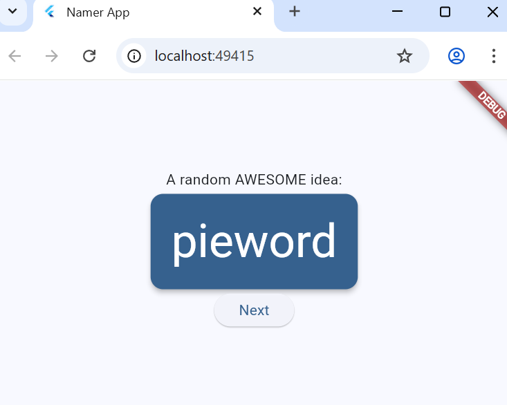

Perhatikan bagaimana warna berubah dengan halus. Perubahan ini disebut animasi implisit. Banyak widget Flutter akan berinterpolasi antarnilai dengan lancar agar UI tidak hanya "berpindah" antarstatus.

Tombol timbul di bawah kartu juga berubah warna. Itulah kelebihan dalam menggunakan Theme seluruh aplikasi dibandingkan dengan nilai hard-code.

### TextTheme
Kartu tersebut masih memiliki masalah: ukuran teks terlalu kecil dan warnanya membuat teks sulit dibaca. Untuk memperbaiki masalah ini, buat perubahan berikut pada metode build() BigCard.

lib/main.dart
```dart
// ...

  @override
  Widget build(BuildContext context) {
    final theme = Theme.of(context);
    // ↓ Add this.
    final style = theme.textTheme.displayMedium!.copyWith(
      color: theme.colorScheme.onPrimary,
    );

    return Card(
      color: theme.colorScheme.primary,
      child: Padding(
        padding: const EdgeInsets.all(20),
        // ↓ Change this line.
        child: Text(pair.asLowerCase, style: style),
      ),
    );
  }

// ...
```

Yang ada di balik perubahan ini:
-Dengan menggunakan theme.textTheme,, Anda mengakses tema font aplikasi. Class ini mencakup anggota seperti bodyMedium (untuk teks standar ukuran medium), caption (untuk teks dari gambar), atau headlineLarge (untuk judul berukuran besar).
-Properti displayMedium adalah gaya font besar yang dimaksudkan untuk teks tampilan. Kata tampilan digunakan dalam artian tipografi di sini, seperti pada jenis huruf tampilan. Dokumentasi untuk displayMedium menyatakan bahwa, "gaya tampilan ditujukan untuk teks yang penting dan singkat"—tepat dengan kasus penggunaan kita.
-Properti displayMedium tema secara teori dapat berupa null. Dart, bahasa pemrograman yang Anda gunakan untuk menulis aplikasi ini, aman dari null, sehingga bahasa pemrograman ini tidak akan mengizinkan Anda memanggil metode objek yang berpotensi null. Namun, dalam hal ini, Anda dapat menggunakan operator ! ("bang operator") untuk meyakinkan Dart bahwa Anda memahami tindakan Anda. (displayMedium pasti tidak null dalam kasus ini. Namun, alasan kami mengetahui hal ini berada di luar cakupan codelab ini.)
-Memanggil copyWith() pada displayMedium menampilkan salinan gaya teks dengan perubahan yang Anda tentukan. Dalam hal ini, Anda hanya mengubah warna teks.
-Untuk mendapatkan warna baru, Anda mengakses tema aplikasi sekali lagi. Properti onPrimary skema warna menentukan warna yang cocok digunakan untuk warna primer aplikasi.

Jika Anda mau, ubah kartu lebih jauh. Berikut beberapa idenya:

- copyWith() memungkinkan Anda mengubah lebih banyak tentang gaya teks daripada hanya warna. Untuk mendapatkan daftar lengkap properti yang dapat Anda ubah, letakkan kursor di dalam tanda kurung copyWith(), lalu tekan Ctrl+Shift+Space (Win/Linux) atau Cmd+Shift+Space (Mac).
- Anda juga dapat mengubah lebih banyak tentang widget Card. Misalnya, Anda dapat memperbesar bayangan kartu dengan meningkatkan nilai parameter elevation.
- Coba bereksperimen dengan warna. Selain theme.colorScheme.primary, ada juga .secondary, .surface, dan berbagai pilihan lainnya. Semua warna ini memiliki onPrimary padanannya masing-masing.
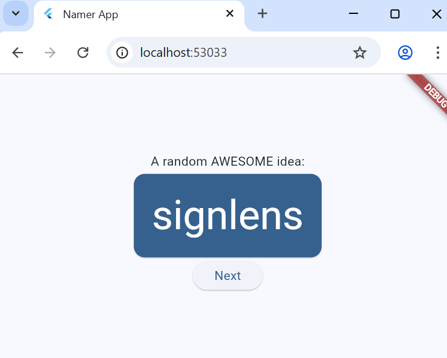

### Meningkatkan aksesibilitas
Flutter membuat aplikasi dapat diakses secara default. Misalnya, setiap aplikasi Flutter menampilkan semua teks dan elemen interaktif di aplikasi dengan tepat untuk pembaca layar, seperti TalkBack dan VoiceOver.

Namun, terkadang diperlukan pengerjaan tambahan. Dalam kasus aplikasi ini, pembaca layar mungkin mengalami masalah dalam melafalkan beberapa pasangan kata yang dihasilkan. Meskipun manusia tidak mengalami masalah dalam mengidentifikasi kedua kata pada pasangan kata cheaphead, pembaca layar dapat melafalkan ph di tengah kata sebagai f.

Solusi sederhananya adalah dengan mengganti pair.asLowerCase dengan "${pair.first} ${pair.second}". Kode kedua menggunakan jenis interpolasi string untuk membuat string (seperti "cheap head") dari kedua kata yang tercakup dalam pair. Menggunakan dua kata terpisah sebagai ganti kata majemuk memastikan bahwa pembaca layar mengidentifikasi setiap kata dengan tepat, dan menyediakan pengalaman yang lebih baik untuk pengguna penyandang gangguan penglihatan.

Namun, Anda mungkin ingin mempertahankan kesederhanaan visual pair.asLowerCase. Gunakan properti semanticsLabel Text untuk mengganti konten visual widget teks dengan konten semantik yang lebih sesuai untuk pembaca layar:

lib/main.dart
```dart
// ...

  @override
  Widget build(BuildContext context) {
    final theme = Theme.of(context);
    final style = theme.textTheme.displayMedium!.copyWith(
      color: theme.colorScheme.onPrimary,
    );

    return Card(
      color: theme.colorScheme.primary,
      child: Padding(
        padding: const EdgeInsets.all(20),

        // ↓ Make the following change.
        child: Text(
          pair.asLowerCase,
          style: style,
          semanticsLabel: "${pair.first} ${pair.second}",
        ),
      ),
    );
  }

// ...
```
Kini, pembaca layar melafalkan setiap pasangan kata yang dihasilkan dengan tepat, namun UI tidak berubah. Coba praktikkan ini dengan menggunakan pembaca layar di perangkat Anda.

Tips: Flutter memiliki berbagai alat untuk aksesibilitas, termasuk pengujian otomatis dan widget Semantics. Pelajari lebih lanjut pada halaman Aksesibilitas dokumentasi Flutter.
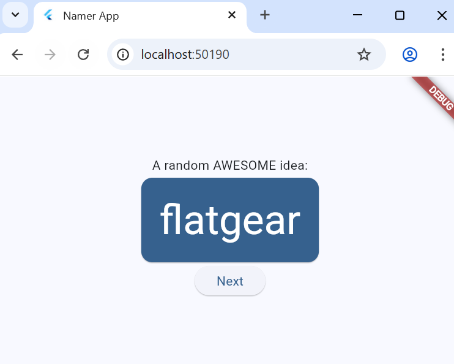

### Menempatkan UI di tengah
Setelah pasangan kata acak dihadirkan dengan gaya visual yang cukup, saatnya menempatkan UI di tengah jendela/layar aplikasi.

Pertama, ingatlah bahwa BigCard adalah bagian dari Column. Secara default, kolom menggabungkan turunan kolom di bagian atas, tetapi kita dapat mengganti ini dengan mudah. Buka metode build() MyHomePage, dan buat perubahan berikut:

lib/main.dart
```dart
// ...

class MyHomePage extends StatelessWidget {
  @override
  Widget build(BuildContext context) {
    var appState = context.watch<MyAppState>();
    var pair = appState.current;

    return Scaffold(
      body: Column(
        mainAxisAlignment: MainAxisAlignment.center,  // ← Add this.
        children: [
          Text('A random AWESOME idea:'),
          BigCard(pair: pair),
          ElevatedButton(
            onPressed: () {
              appState.getNext();
            },
            child: Text('Next'),
          ),
        ],
      ),
    );
  }
}

// ...
```
Tindakan ini menempatkan turunan dalam Column di tengah pada sumbu utamanya (vertikal).
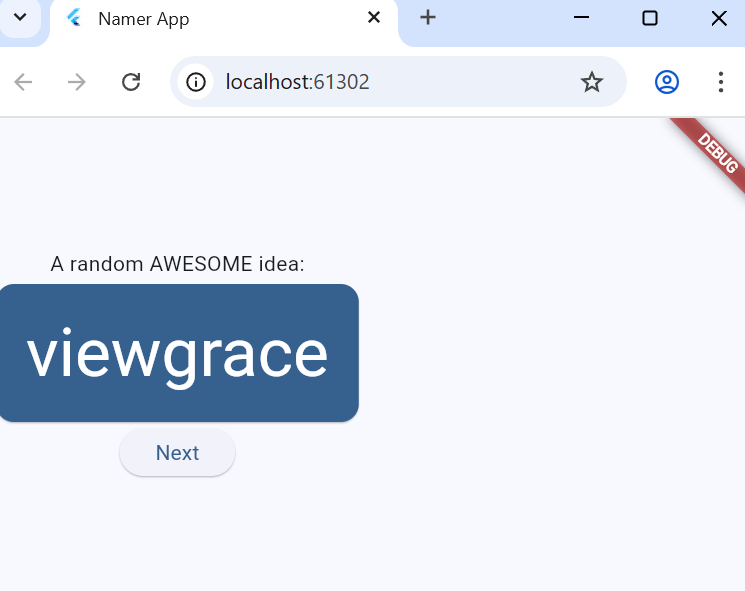

Turunan UI telah ditempatkan di tengah pada sumbu silang kolom (dengan kata lain, turunan UI telah ditempatkan di tengah secara horizontal). Namun, Column itu sendiri tidak ditempatkan di tengah dalam Scaffold. Kita dapat memverifikasi ini menggunakan Widget Inspector.

Widget Inspector itu sendiri berada di luar cakupan codelab ini, tetapi Anda dapat melihat bahwa ketika Column ditandai, kode ini tidak menghabiskan keseluruhan lebar aplikasi. Kode ini hanya menghabiskan ruang horizontal sebanyak yang diperlukan oleh turunan UI.

Anda dapat menempatkan kolom itu sendiri di tengah. Letakkan kursor Anda di Column, buka menu Refactor (dengan Ctrl+. atau Cmd+.), lalu pilih Wrap with Center.


Kini, aplikasi akan terlihat seperti berikut:

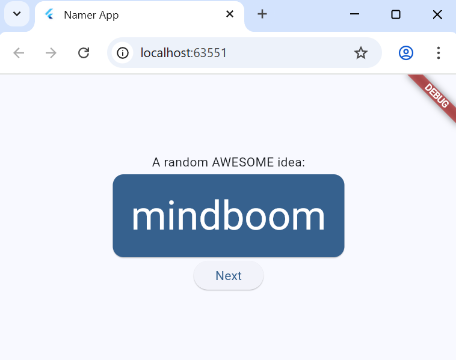

Jika mau, Anda dapat menyesuaikan tampilan ini lebih lanjut.

Anda dapat menghapus widget Text di atas BigCard. Dapat dipastikan bahwa teks deskriptif ("Ide LUAR BIASA acak:") tidak lagi diperlukan karena UI tersebut sudah jelas meskipun tanpa teks deskriptif. Selain itu, dengan begitu UI terlihat lebih bersih.
Anda juga dapat menambahkan widget SizedBox(height: 10) di antara BigCard dan ElevatedButton. Dengan begitu, ada sedikit pemisah di antara kedua widget tersebut. Widget SizedBox hanya mengambil ruang dan tidak merender apa pun dengan sendirinya. Widget ini biasa digunakan untuk membuat "jarak" visual.
Dengan perubahan opsional, MyHomePage mencakup kode berikut:

lib/main.dart
```dart
// ...

class MyHomePage extends StatelessWidget {
  @override
  Widget build(BuildContext context) {
    var appState = context.watch<MyAppState>();
    var pair = appState.current;

    return Scaffold(
      body: Center(
        child: Column(
          mainAxisAlignment: MainAxisAlignment.center,
          children: [
            BigCard(pair: pair),
            SizedBox(height: 10),
            ElevatedButton(
              onPressed: () {
                appState.getNext();
              },
              child: Text('Next'),
            ),
          ],
        ),
      ),
    );
  }
}

// ...
```
Aplikasinya akan terlihat seperti berikut:
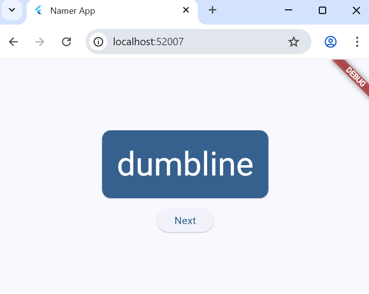

Pada bagian berikutnya, Anda akan menambahkan kemampuan untuk memfavoritkan (atau ‘menyukai') kata-kata yang dihasilkan.

### Menambahkan fungsi
Aplikasi berjalan dengan baik, dan bahkan terkadang menyediakan pasangan kata yang menarik. Namun, setiap kali pengguna mengklik Next, setiap pasangan kata hilang selamanya. Akan lebih baik untuk memiliki cara "mengingat" saran terbaik: seperti tombol 'Like'.

### Menambahkan logika bisnis
Scroll ke MyAppState dan tambahkan kode berikut:

lib/main.dart
```dart
// ...

class MyAppState extends ChangeNotifier {
  var current = WordPair.random();

  void getNext() {
    current = WordPair.random();
    notifyListeners();
  }

  // ↓ Add the code below.
  var favorites = <WordPair>[];

  void toggleFavorite() {
    if (favorites.contains(current)) {
      favorites.remove(current);
    } else {
      favorites.add(current);
    }
    notifyListeners();
  }
}

// ...
```
Periksa perubahannya:

Anda menambahkan properti baru pada MyAppState yang bernama favorites. Properti ini diinisialisasi dengan daftar kosong: [].
Anda juga menentukan bahwa daftar tersebut hanya dapat berisi pasangan kata: <WordPair>[], menggunakan generik. Hal ini membantu membuat aplikasi Anda menjadi lebih lengkap—Dart bahkan menolak menjalankan aplikasi jika Anda mencoba menambahkan apa pun selain WordPair. Oleh karena itu, Anda dapat menggunakan daftar favorites karena tidak boleh ada objek yang tidak diinginkan (seperti null) yang bersembunyi di dalamnya.
Catatan: Dart memiliki jenis koleksi selain List (ditunjukkan dengan []). Anda dapat berpendapat bahwa Set (ditunjukkan dengan {}) akan lebih masuk akal untuk koleksi favorit. Untuk membuat codelab ini sesederhana mungkin, kita hanya menggunakan satu daftar. Namun, jika mau, Anda dapat menggunakan Set sebagai gantinya. Kode ini tidak akan mengubah banyak.

Anda juga menambahkan metode baru, toggleFavorite(), yang menghapus pasangan kata saat ini dari daftar favorit (jika sudah ada), atau menambahkannya (jika belum ada). Dalam kedua kasus tersebut, kode memanggil notifyListeners(); setelahnya.
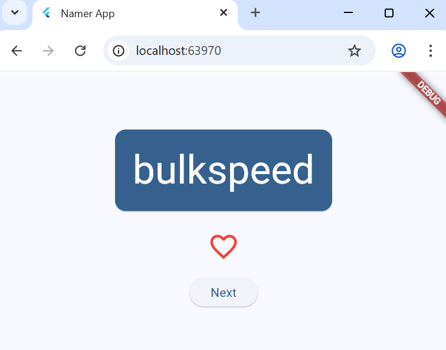

### Menambahkan tombol
Dengan terselesaikannya "logika bisnis", saatnya untuk mengerjakan antarmuka pengguna kembali. Meletakkan tombol ‘Like' di sebelah kiri tombol ‘Next' memerlukan Row. Widget Row adalah padanan horizontal dari Column, yang telah Anda lihat sebelumnya.

Pertama, gabungkan tombol yang ada pada Row. Buka metode build() MyHomePage, letakkan kursor pada ElevatedButton, buka menu Refactor dengan Ctrl+. atau Cmd+., lalu pilih Wrap with Row.
Saat menyimpan, Anda akan menyadari bahwa Row bertindak mirip dengan Column—secara default, kode ini mengumpulkan turunannya ke sebelah kiri. (Column mengumpulkan turunannya ke atas.) Untuk memperbaiki masalah ini, Anda dapat menggunakan pendekatan yang sama seperti sebelumnya, tetapi dengan mainAxisAlignment. Namun, untuk tujuan mendidik (pembelajaran), gunakan mainAxisSize. Kode ini memberi tahu Row agar tidak mengambil semua ruang horizontal yang tersedia.

Buat perubahan berikut:
```dart
lib/main.dart

// ...

class MyHomePage extends StatelessWidget {
  @override
  Widget build(BuildContext context) {
    var appState = context.watch<MyAppState>();
    var pair = appState.current;

    return Scaffold(
      body: Center(
        child: Column(
          mainAxisAlignment: MainAxisAlignment.center,
          children: [
            BigCard(pair: pair),
            SizedBox(height: 10),
            Row(
              mainAxisSize: MainAxisSize.min,   // ← Add this.
              children: [
                ElevatedButton(
                  onPressed: () {
                    appState.getNext();
                  },
                  child: Text('Next'),
                ),
              ],
            ),
          ],
        ),
      ),
    );
  }
}
```
Berikutnya, tambahkan tombol Like dan hubungkan ke toggleFavorite(). Sebagai tantangan, coba lakukan sendiri untuk pertama kali, tanpa melihat blok kode di bawah. Tidak apa-apa jika Anda tidak melakukannya dengan cara yang sama seperti yang ditunjukkan di bawah. Bahkan, jangan pikirkan tentang ikon hati kecuali Anda benar-benar menginginkan tantangan yang besar.

Tidak apa-apa jika Anda gagal—lagipula, ini pertama kalinya Anda menggunakan Flutter.


### 7. Menambahkan kolom samping navigasi
Sebagian besar aplikasi tidak dapat memuat semuanya ke dalam satu layar. Aplikasi ini mungkin dapat melakukannya, tetapi untuk tujuan pembelajaran, Anda akan membuat layar terpisah untuk bagian favorit pengguna. Untuk beralih di antara dua layar, Anda akan menerapkan StatefulWidget pertama Anda.
Untuk mencapai inti dari langkah ini secepat mungkin, pisahkan MyHomePage menjadi 2 widget terpisah.

Pilih keseluruhan MyHomePage, hapus, dan gantikan dengan kode berikut:

lib/main.dart
```dart
// ...

class MyHomePage extends StatelessWidget {
  @override
  Widget build(BuildContext context) {
    return Scaffold(
      body: Row(
        children: [
          SafeArea(
            child: NavigationRail(
              extended: false,
              destinations: [
                NavigationRailDestination(
                  icon: Icon(Icons.home),
                  label: Text('Home'),
                ),
                NavigationRailDestination(
                  icon: Icon(Icons.favorite),
                  label: Text('Favorites'),
                ),
              ],
              selectedIndex: 0,
              onDestinationSelected: (value) {
                print('selected: $value');
              },
            ),
          ),
          Expanded(
            child: Container(
              color: Theme.of(context).colorScheme.primaryContainer,
              child: GeneratorPage(),
            ),
          ),
        ],
      ),
    );
  }
}

class GeneratorPage extends StatelessWidget {
  @override
  Widget build(BuildContext context) {
    var appState = context.watch<MyAppState>();
    var pair = appState.current;

    IconData icon;
    if (appState.favorites.contains(pair)) {
      icon = Icons.favorite;
    } else {
      icon = Icons.favorite_border;
    }

    return Center(
      child: Column(
        mainAxisAlignment: MainAxisAlignment.center,
        children: [
          BigCard(pair: pair),
          SizedBox(height: 10),
          Row(
            mainAxisSize: MainAxisSize.min,
            children: [
              ElevatedButton.icon(
                onPressed: () {
                  appState.toggleFavorite();
                },
                icon: Icon(icon),
                label: Text('Like'),
              ),
              SizedBox(width: 10),
              ElevatedButton(
                onPressed: () {
                  appState.getNext();
                },
                child: Text('Next'),
              ),
            ],
          ),
        ],
      ),
    );
  }
}

// ...
```
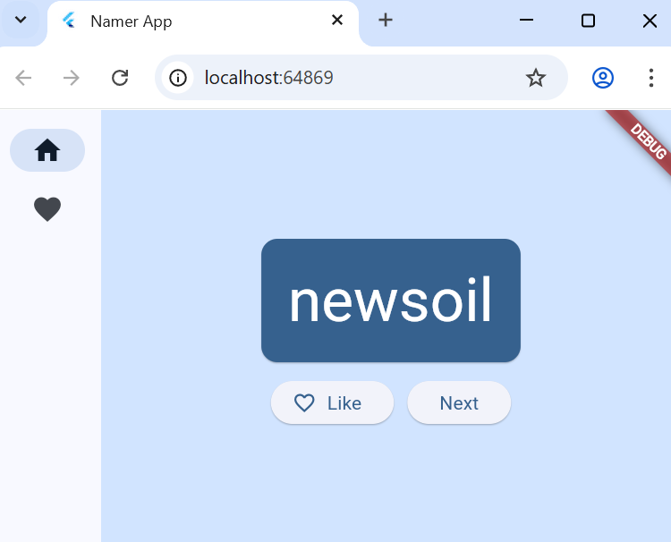
Saat disimpan, Anda akan melihat sisi visual UI telah siap—tetapi tidak bekerja. Mengklik ♥︎ (hati) pada kolom samping navigasi tidak melakukan apa pun.
Di dalam widget Expanded, ada Container berwarna, dan ada GeneratorPage di dalam container.
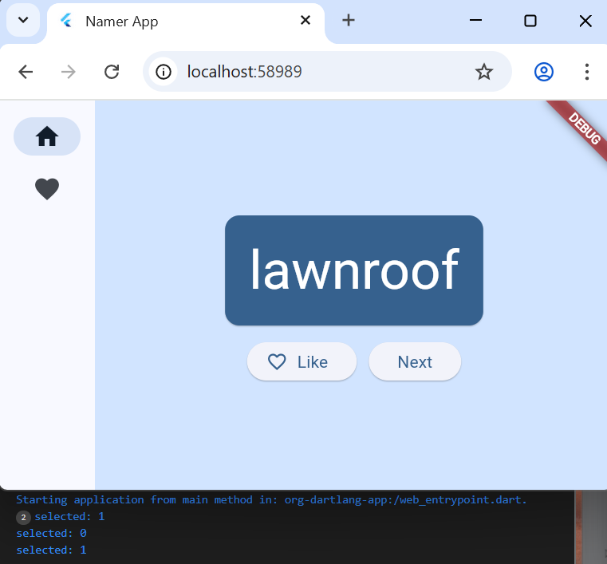

### Widget stateless versus stateful
Sampai sekarang, MyAppState telah memenuhi semua kebutuhan status Anda. Itulah mengapa semua widget yang telah Anda tulis sejauh ini adalah stateless. Widget-widget tersebut tidak memiliki status yang dapat diubah. Tidak ada widget yang dapat mengubah widget itu sendiri—widget tersebut harus melalui MyAppState.

Hal ini akan segera berubah.

Anda memerlukan suatu cara untuk menyimpan nilai selectedIndex kolom samping navigasi. Anda juga ingin dapat mengubah nilai ini dari dalam callback onDestinationSelected.

Anda dapat menambahkan selectedIndex sebagai properti tambahan MyAppState.
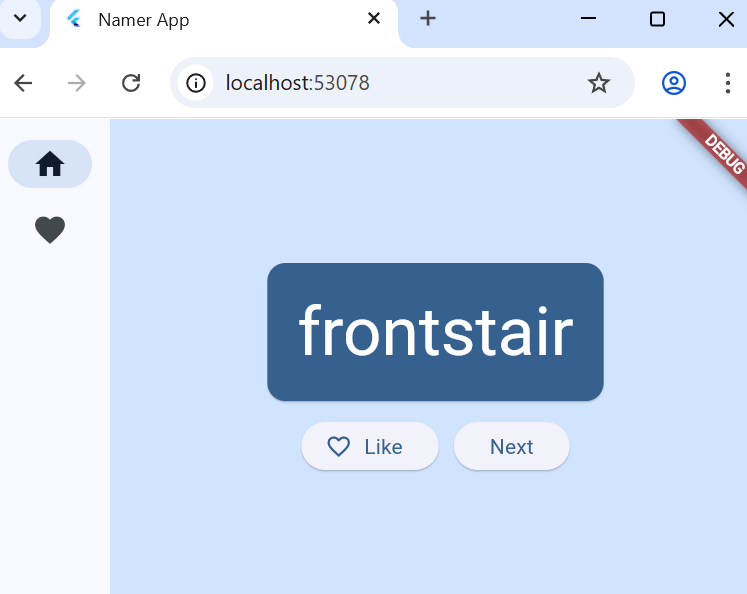

### setState
Widget stateful baru hanya perlu melacak satu variabel: selectedIndex. Buat 3 perubahan berikut untuk _MyHomePageState:

lib/main.dart
```dart
// ...

class _MyHomePageState extends State<MyHomePage> {

  var selectedIndex = 0;     // ← Add this property.

  @override
  Widget build(BuildContext context) {
    return Scaffold(
      body: Row(
        children: [
          SafeArea(
            child: NavigationRail(
              extended: false,
              destinations: [
                NavigationRailDestination(
                  icon: Icon(Icons.home),
                  label: Text('Home'),
                ),
                NavigationRailDestination(
                  icon: Icon(Icons.favorite),
                  label: Text('Favorites'),
                ),
              ],
              selectedIndex: selectedIndex,    // ← Change to this.
              onDestinationSelected: (value) {

                // ↓ Replace print with this.
                setState(() {
                  selectedIndex = value;
                });

              },
            ),
          ),
          Expanded(
            child: Container(
              color: Theme.of(context).colorScheme.primaryContainer,
              child: GeneratorPage(),
            ),
          ),
        ],
      ),
    );
  }
}

// ...
```


### Tingkat respons
Berikutnya, buat kolom samping navigasi menjadi responsif. Dengan kata lain, buat agar kolom samping navigasi menampilkan label secara otomatis (menggunakan extended: true) saat ada ruang yang cukup.
widget yang digunakan adalah LayoutBuilder. 
```dart
// ...

class _MyHomePageState extends State<MyHomePage> {
  var selectedIndex = 0;

  @override
  Widget build(BuildContext context) {
    Widget page;
    switch (selectedIndex) {
      case 0:
        page = GeneratorPage();
        break;
      case 1:
        page = Placeholder();
        break;
      default:
        throw UnimplementedError('no widget for $selectedIndex');
    }

    return LayoutBuilder(builder: (context, constraints) {
      return Scaffold(
        body: Row(
          children: [
            SafeArea(
              child: NavigationRail(
                extended: constraints.maxWidth >= 600,  // ← Here.
                destinations: [
                  NavigationRailDestination(
                    icon: Icon(Icons.home),
                    label: Text('Home'),
                  ),
                  NavigationRailDestination(
                    icon: Icon(Icons.favorite),
                    label: Text('Favorites'),
                  ),
                ],
                selectedIndex: selectedIndex,
                onDestinationSelected: (value) {
                  setState(() {
                    selectedIndex = value;
                  });
                },
              ),
            ),
            Expanded(
              child: Container(
                color: Theme.of(context).colorScheme.primaryContainer,
                child: page,
              ),
            ),
          ],
        ),
      );
    });
  }
}
```


### Menambahkan halaman Baru
Jika Anda ingin mencoba hal baru, coba lakukan langkah ini sendiri. Tujuan Anda adalah menampilkan daftar favorites dalam widget stateless baru, FavoritesPage, lalu menampilkan widget tersebut, bukan Placeholder.
```dart
// ...

class FavoritesPage extends StatelessWidget {
  @override
  Widget build(BuildContext context) {
    var appState = context.watch<MyAppState>();

    if (appState.favorites.isEmpty) {
      return Center(
        child: Text('No favorites yet.'),
      );
    }

    return ListView(
      children: [
        Padding(
          padding: const EdgeInsets.all(20),
          child: Text('You have '
              '${appState.favorites.length} favorites:'),
        ),
        for (var pair in appState.favorites)
          ListTile(
            leading: Icon(Icons.favorite),
            title: Text(pair.asLowerCase),
          ),
      ],
    );
  }
}
```


# aplikasiflutter

A new Flutter project.

## Getting Started

This project is a starting point for a Flutter application.

A few resources to get you started if this is your first Flutter project:

- [Lab: Write your first Flutter app](https://docs.flutter.dev/get-started/codelab)
- [Cookbook: Useful Flutter samples](https://docs.flutter.dev/cookbook)

For help getting started with Flutter development, view the
[online documentation](https://docs.flutter.dev/), which offers tutorials,
samples, guidance on mobile development, and a full API reference.
