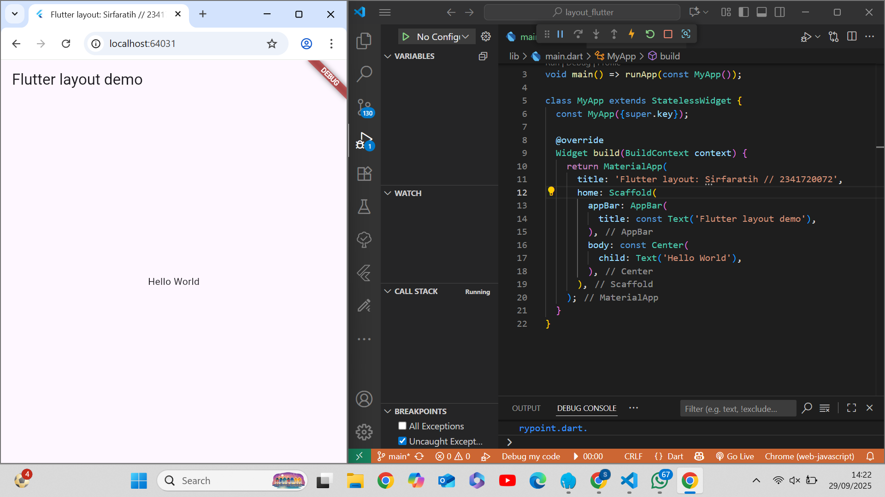
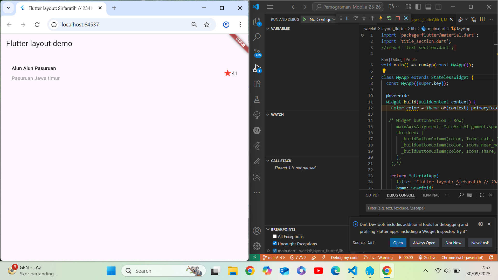
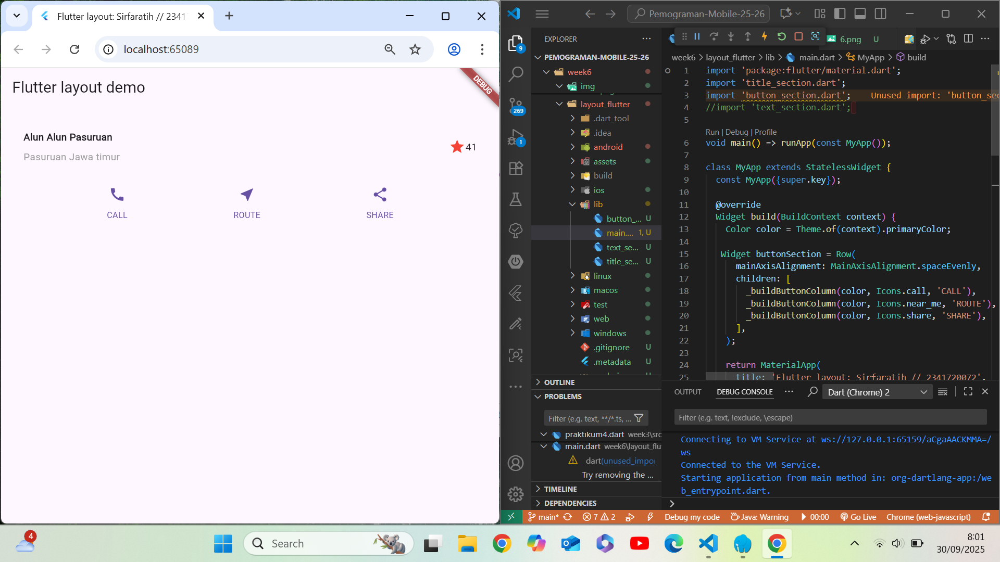
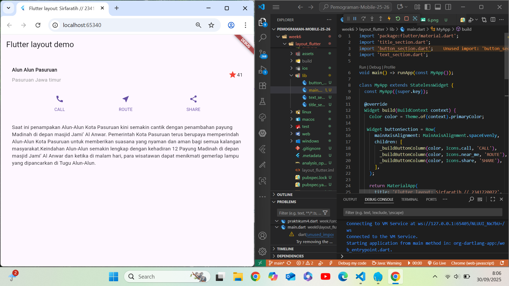
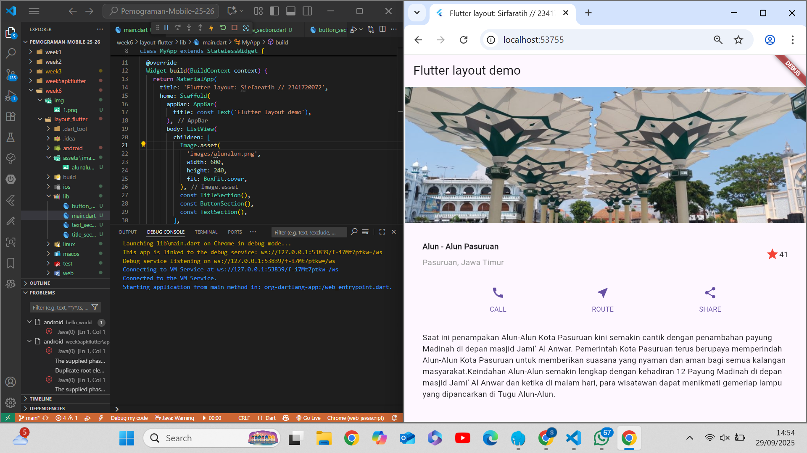
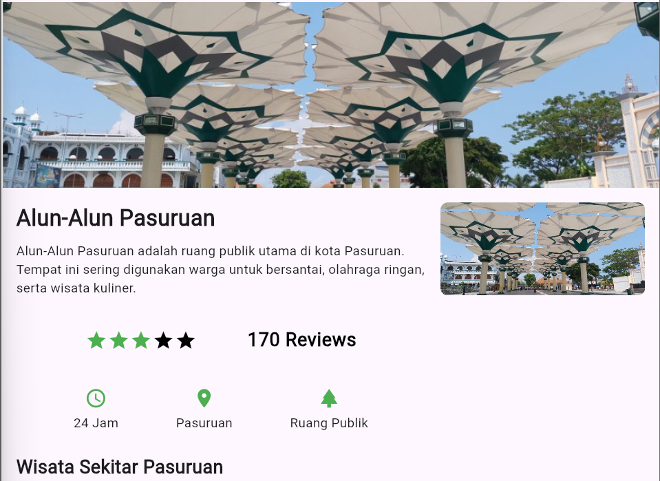
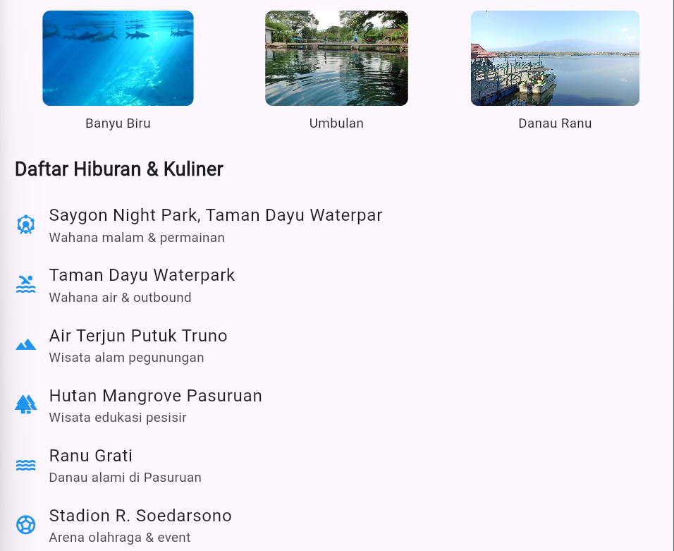
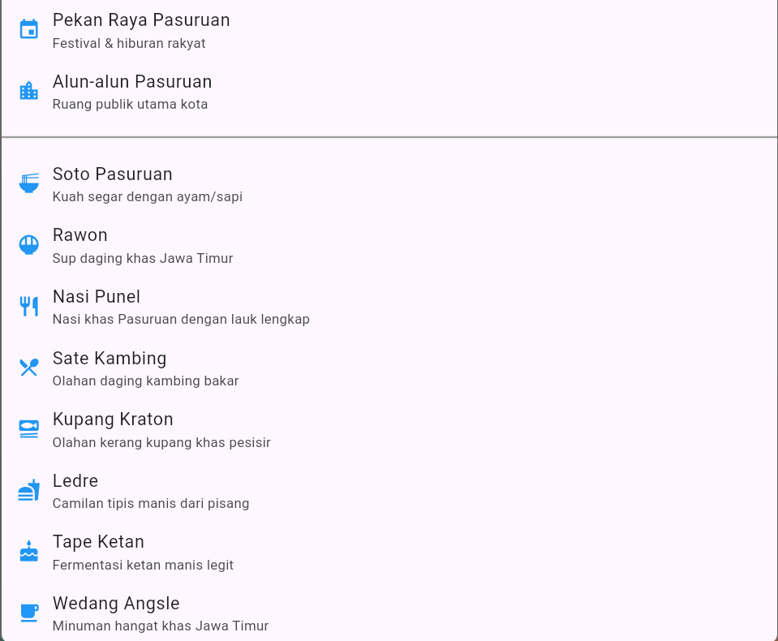
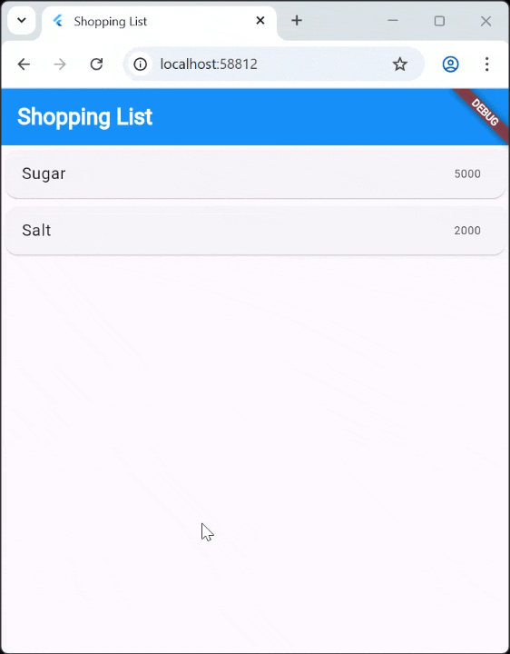

# PERTEMUAN 6 LAYOUT DAN NAVIGASI

## Praktikum 1 Membangun Layout di Flutter
### Langkah 1 
Buatlah sebuah project flutter baru dengan nama layout_flutter. Atau sesuaikan style laporan praktikum yang Anda buat.
### Langkah 2
Buka file main.dart lalu ganti dengan kode berikut. Isi nama dan NIM Anda di text title.
```dart
import 'package:flutter/material.dart';

void main() => runApp(const MyApp());

class MyApp extends StatelessWidget {
  const MyApp({super.key});

  @override
  Widget build(BuildContext context) {
    return MaterialApp(
      title: 'Flutter layout: Nama dan NIM Anda',
      home: Scaffold(
        appBar: AppBar(
          title: const Text('Flutter layout demo'),
        ),
        body: const Center(
          child: Text('Hello World'),
        ),
      ),
    );
  }
}
```
### Output Program 


### Langkah 3: Identifikasi layout diagram
Langkah pertama adalah memecah tata letak menjadi elemen dasarnya:

Identifikasi baris dan kolom.
Apakah tata letaknya menyertakan kisi-kisi (grid)?
Apakah ada elemen yang tumpang tindih?
Apakah UI memerlukan tab?
Perhatikan area yang memerlukan alignment, padding, atau borders.
Pertama, identifikasi elemen yang lebih besar. Dalam contoh ini, empat elemen disusun menjadi sebuah kolom: sebuah gambar, dua baris, dan satu blok teks.
Selanjutnya, buat diagram setiap baris. Baris pertama, disebut bagian Judul, memiliki 3 anak: kolom teks, ikon bintang, dan angka. Anak pertamanya, kolom, berisi 2 baris teks. Kolom pertama itu memakan banyak ruang, sehingga harus dibungkus dengan widget yang Diperluas.
Baris kedua, disebut bagian Tombol, juga memiliki 3 anak: setiap anak merupakan kolom yang berisi ikon dan teks.
Setelah tata letak telah dibuat diagramnya, cara termudah adalah dengan menerapkan pendekatan bottom-up. Untuk meminimalkan kebingungan visual dari kode tata letak yang banyak bertumpuk, tempatkan beberapa implementasi dalam variabel dan fungsi.

### Langkah 4: Implementasi title row
Pertama, Anda akan membuat kolom bagian kiri pada judul. Tambahkan kode berikut di bagian atas metode build() di dalam kelas MyApp:
```dart
Widget titleSection = Container(
  padding: const EdgeInsets.all(...),
  child: Row(
    children: [
      Expanded(
        /* soal 1*/
        child: Column(
          crossAxisAlignment: ...,
          children: [
            /* soal 2*/
            Container(
              padding: const EdgeInsets.only(bottom: ...),
              child: const Text(
                'Wisata Gunung di Batu',
                style: TextStyle(
                  fontWeight: FontWeight.bold,
                ),
              ),
            ),
            Text(
              'Batu, Malang, Indonesia',
              style: TextStyle(...),
            ),
          ],
        ),
      ),
      /* soal 3*/
      Icon(
       ...,
        color: ...,
      ),
      const Text(...),
    ],
  ),
);
``` 
/* soal 1 */ Letakkan widget Column di dalam widget Expanded agar menyesuaikan ruang yang tersisa di dalam widget Row. Tambahkan properti crossAxisAlignment ke CrossAxisAlignment.start sehingga posisi kolom berada di awal baris.

/* soal 2 */ Letakkan baris pertama teks di dalam Container sehingga memungkinkan Anda untuk menambahkan padding = 8. Teks ‘Batu, Malang, Indonesia' di dalam Column, set warna menjadi abu-abu.

/* soal 3 */ Dua item terakhir di baris judul adalah ikon bintang, set dengan warna merah, dan teks "41". Seluruh baris ada di dalam Container dan beri padding di sepanjang setiap tepinya sebesar 32 piksel. Kemudian ganti isi body text ‘Hello World' dengan variabel titleSection seperti berikut:


## Praktikum 2:  Implementasi button row
### Langkah 1 Buat method Column _buildButtonColumn
Bagian tombol berisi 3 kolom yang menggunakan tata letak yang sama—sebuah ikon di atas baris teks. Kolom pada baris ini diberi jarak yang sama, dan teks serta ikon diberi warna primer.

Karena kode untuk membangun setiap kolom hampir sama, buatlah metode pembantu pribadi bernama buildButtonColumn(), yang mempunyai parameter warna, Icon dan Text, sehingga dapat mengembalikan kolom dengan widgetnya sesuai dengan warna tertentu.

```dart
class MyApp extends StatelessWidget {
  const MyApp({super.key});

  @override
  Widget build(BuildContext context) {
    // ···
  }

  Column _buildButtonColumn(Color color, IconData icon, String label) {
    return Column(
      mainAxisSize: MainAxisSize.min,
      mainAxisAlignment: MainAxisAlignment.center,
      children: [
        Icon(icon, color: color),
        Container(
          margin: const EdgeInsets.only(top: 8),
          child: Text(
            label,
            style: TextStyle(
              fontSize: 12,
              fontWeight: FontWeight.w400,
              color: color,
            ),
          ),
        ),
      ],
    );
  }
}
```
### Langkah 2: Buat widget buttonSection
Buat Fungsi untuk menambahkan ikon langsung ke kolom. Teks berada di dalam Container dengan margin hanya di bagian atas, yang memisahkan teks dari ikon.

Bangun baris yang berisi kolom-kolom ini dengan memanggil fungsi dan set warna, Icon, dan teks khusus melalui parameter ke kolom tersebut. Sejajarkan kolom di sepanjang sumbu utama menggunakan MainAxisAlignment.spaceEvenly untuk mengatur ruang kosong secara merata sebelum, di antara, dan setelah setiap kolom. Tambahkan kode berikut tepat di bawah deklarasi titleSection di dalam metode build():

lib/main.dart (buttonSection)
```dart
Color color = Theme.of(context).primaryColor;

Widget buttonSection = Row(
  mainAxisAlignment: MainAxisAlignment.spaceEvenly,
  children: [
    _buildButtonColumn(color, Icons.call, 'CALL'),
    _buildButtonColumn(color, Icons.near_me, 'ROUTE'),
    _buildButtonColumn(color, Icons.share, 'SHARE'),
  ],
);
```
### Langkah 3: Tambah button section ke body
Tambahkan variabel buttonSection ke dalam body seperti berikut:
```dart
return MaterialApp(
  title: 'Flutter layout demo',
  home: Scaffold(
    body: Column(
      children: [
        titleSection,
        buttonSection, // ← menambahkan buttonSection ke body
      ],
    ),
  ),
);
```


## Praktikum 3: Implementasi text section
### Langkah 1: Buat widget textSection
Tentukan bagian teks sebagai variabel. Masukkan teks ke dalam Container dan tambahkan padding di sepanjang setiap tepinya. Tambahkan kode berikut tepat di bawah deklarasi buttonSection:
```dart
Widget textSection = Container(
  padding: const EdgeInsets.all(32),
  child: const Text(
    'Carilah teks di internet yang sesuai '
    'dengan foto atau tempat wisata yang ingin '
    'Anda tampilkan. '
    'Tambahkan nama dan NIM Anda sebagai '
    'identitas hasil pekerjaan Anda. '
    'Selamat mengerjakan 🙂.',
    softWrap: true,
  ),
);
```
Dengan memberi nilai softWrap = true, baris teks akan memenuhi lebar kolom sebelum membungkusnya pada batas kata.

### Langkah 2: Tambahkan variabel text section ke body
Tambahkan widget variabel textSection ke dalam body seperti berikut:
```dart
return MaterialApp(
  title: 'Flutter layout demo',
  home: Scaffold(
    children: [
      titleSection,
      buttonSection,
      textSection,
    ],
  ),
),
```


## Praktikum 4: Implementasi image section
Selesaikan langkah-langkah praktikum berikut ini dengan melanjutkan dari praktikum sebelumnya.

### Langkah 1: Siapkan aset gambar
Anda dapat mencari gambar di internet yang ingin ditampilkan. Buatlah folder images di root project layout_flutter. Masukkan file gambar tersebut ke folder images, lalu set nama file tersebut ke file pubspec.yaml seperti berikut:

```dart
flutter:
uses-material-design: true
assets:
  -images/laku.jpg
```
Contoh nama file gambar di atas adalah lake.jpg

Tips

Perhatikan bahwa pubspec.yaml sensitif terhadap huruf besar-kecil, jadi tulis assets: dan URL gambar seperti yang ditunjukkan di atas.
File pubspec juga sensitif terhadap spasi, jadi gunakan indentasi yang tepat.
Anda mungkin perlu memulai ulang program yang sedang berjalan (baik di simulator atau perangkat yang terhubung) agar perubahan pubspec dapat diterapkan.
### Langkah 2: Tambahkan gambar ke body
Tambahkan aset gambar ke dalam body seperti berikut:
```dart
Image.asset(
  'images/lake.jpg',
  width: 600,
  height: 240,
  fit: BoxFit.cover,
),
```
BoxFit.cover memberi tahu kerangka kerja bahwa gambar harus sekecil mungkin tetapi menutupi seluruh kotak rendernya.
### Langkah 3: Terakhir, ubah menjadi ListView
Pada langkah terakhir ini, atur semua elemen dalam ListView, bukan Column, karena ListView mendukung scroll yang dinamis saat aplikasi dijalankan pada perangkat yang resolusinya lebih kecil.
```dart
body: Coolumn(
  body: ListView(

  )
)
```


## Tugas Praktikum 1
1. Selesaikan Praktikum 1 sampai 4, lalu dokumentasikan dan push ke repository Anda berupa screenshot setiap hasil pekerjaan beserta penjelasannya di file README.md!
2. Silakan implementasikan di project baru "basic_layout_flutter" dengan mengakses sumber ini: https://docs.flutter.dev/codelabs/layout-basics
3. Kumpulkan link commit repository GitHub Anda kepada dosen yang telah disepakati!

# LAPORAN TUGAS PRAKTIKUM 1 NOMOR 2





## Praktikum 5: Membangun Navigasi di Flutter


## Tugas Praktikum 2
1. Untuk melakukan pengiriman data ke halaman berikutnya, cukup menambahkan informasi arguments pada penggunaan Navigator. Perbarui kode pada bagian Navigator menjadi seperti berikut. 
```dart 
Navigator.pushNamed(context, '/item', arguments: item);
```

### kode program 
```dart 
import 'package:flutter/material.dart';
import 'package:belanja/models/item.dart';
import 'package:belanja/pages/item_page.dart';

class HomePage extends StatelessWidget {
  final List<Item> items = [
    Item('Sugar', 5000),
    Item('Salt', 2000),
  ];

  HomePage({super.key});

  @override
  Widget build(BuildContext context) {
    return Scaffold(
      appBar: AppBar(
        backgroundColor: Colors.blue,
        title: const Text(
          'Shopping List',
          style: TextStyle(
            color: Colors.white,
            fontWeight: FontWeight.bold,
          ),
        ),
      ),
      body: ListView.builder(
        itemCount: items.length,
        itemBuilder: (context, index) {
          final item = items[index];
          return InkWell( 
            onTap: () {
              Navigator.push(
                context,
                MaterialPageRoute(
                  builder: (context) => ItemPage(item: item),
                ),
              );
            },
            child: Card(
              child: ListTile(
                title: Text(item.name),
                trailing: Text(item.price.toString()),
              ),
            ),
          );
        },
      ),
    );
  }
}
```
### Output


2. Pembacaan nilai yang dikirimkan pada halaman sebelumnya dapat dilakukan menggunakan ModalRoute. Tambahkan kode berikut pada blok fungsi build dalam halaman ItemPage. Setelah nilai didapatkan, anda dapat menggunakannya seperti penggunaan variabel pada umumnya. (https://docs.flutter.dev/cookbook/navigation/navigate-with-arguments)
```dart
final itemArgs = ModalRoute.of(context)!.settings.arguments as Item;
```
### Output


3. Pada hasil akhir dari aplikasi belanja yang telah anda selesaikan, tambahkan atribut foto produk, stok, dan rating. Ubahlah tampilan menjadi GridView seperti di aplikasi marketplace pada umumnya.
#### class main.dart
```dart
import 'package:flutter/material.dart';
import 'package:belanja/pages/home_page.dart';

void main() {
  runApp(const MyApp());
}

class MyApp extends StatelessWidget {
  const MyApp({super.key});

  @override
  Widget build(BuildContext context) {
    return MaterialApp(
      title: 'Belanja App',
      theme: ThemeData(
        appBarTheme: const AppBarTheme(
          backgroundColor: Colors.blue,
          titleTextStyle: TextStyle(
            color: Colors.white,
            fontSize: 20,
            fontWeight: FontWeight.bold,
          ),
          iconTheme: IconThemeData(color: Colors.white), 
        ),
      ),
      home: HomePage(),
    );
  }
}
```

#### class item_page.dart
```dart
import 'package:flutter/material.dart';
import 'package:belanja/models/item.dart';

class ItemPage extends StatelessWidget {
  final Item item;

  const ItemPage({super.key, required this.item});

  @override
  Widget build(BuildContext context) {
    return Scaffold(
      appBar: AppBar(
        backgroundColor: Colors.blue,
        title: Text(item.name),
      ),
      body: Padding(
        padding: const EdgeInsets.all(16.0),
        child: Column(
          children: [
            Image.asset(
              item.imagePath,
              height: 200,
              width: double.infinity,
              fit: BoxFit.cover,
            ),
            const SizedBox(height: 20),
            Text(
              item.name,
              style: const TextStyle(fontSize: 24, fontWeight: FontWeight.bold),
            ),
            Text("Rp ${item.price}"),
            const SizedBox(height: 10),
            Text(item.description),
          ],
        ),
      ),
    );
  }
}
```
#### clas home_page.dart
```dart
import 'package:flutter/material.dart';
import 'package:belanja/models/item.dart';
import 'package:belanja/pages/item_page.dart';

class HomePage extends StatelessWidget {
  final List<Item> items = [
    Item('Beras', 12000, 'assets/image/beras.jpeg', 'Beras premium kualitas terbaik'),
    Item('Gula', 5000, 'assets/image/gula.jpg', 'Gula manis alami'),
    Item('Minyak', 14000, 'assets/image/minyak.jpg', 'Minyak goreng 1 liter'),
    Item('Telur', 22000, 'assets/image/telur.jpeg', 'Telur ayam kampung segar'),
  ];

  HomePage({super.key});

  @override
  Widget build(BuildContext context) {
    return Scaffold(
      appBar: AppBar(
        backgroundColor: Colors.blue,
        title: const Text(
          'Shopping List',
          style: TextStyle(color: Colors.white),
        ),
      ),
      body: GridView.builder(
        padding: const EdgeInsets.all(10),
        gridDelegate: const SliverGridDelegateWithFixedCrossAxisCount(
          crossAxisCount: 2,          
          crossAxisSpacing: 10,       
          mainAxisSpacing: 10,        
          childAspectRatio: 3 / 4,   
        ),
        itemCount: items.length,
        itemBuilder: (context, index) {
          final item = items[index];
          return InkWell(
            onTap: () {
              Navigator.push(
                context,
                MaterialPageRoute(builder: (context) => ItemPage(item: item)),
              );
            },
            child: Card(
              elevation: 4,
              child: Column(
                crossAxisAlignment: CrossAxisAlignment.center,
                children: [
                  Expanded(
                    child: Image.asset(
                      item.imagePath,
                      fit: BoxFit.cover,
                      width: double.infinity,
                    ),
                  ),
                  Padding(
                    padding: const EdgeInsets.all(8.0),
                    child: Column(
                      children: [
                        Text(item.name, style: const TextStyle(fontWeight: FontWeight.bold)),
                        Text("Rp ${item.price}"),
                      ],
                    ),
                  ),
                ],
              ),
            ),
          );
        },
      ),
    );
  }
}
```

#### class item.dart
```dart
class Item {
  final String name;
  final int price;
  final String imagePath;
  final String description;

  Item(this.name, this.price, this.imagePath, this.description);
}
```
### Output program 


4. Silakan implementasikan Hero widget pada aplikasi belanja Anda dengan mempelajari dari sumber ini: https://docs.flutter.dev/cookbook/navigation/hero-animations

#### kode clas item.dart
```dart
class Item {
  final String name;
  final int price;
  final String imageUrl;
  final String description;

  Item(this.name, this.price, this.imageUrl, this.description);
}
```
#### kode class home_page.dart
```dart
import 'package:flutter/material.dart';
import 'package:belanja/models/item.dart';
import 'package:belanja/pages/item_page.dart';

class HomePage extends StatelessWidget {
  final List<Item> items = [
    Item('Beras', 12000, 'assets/image/beras.jpeg', 'Beras premium kualitas terbaik'),
    Item('Gula', 5000, 'assets/image/gula.jpg', 'Gula manis alami'),
    Item('Minyak', 14000, 'assets/image/minyak.jpg', 'Minyak goreng 1 liter'),
    Item('Telur', 22000, 'assets/image/telur.jpeg', 'Telur ayam kampung segar'),
  ];

  HomePage({super.key});

  @override
  Widget build(BuildContext context) {
    return Scaffold(
      appBar: AppBar(
        backgroundColor: Colors.blue,
        title: const Text(
          'Shopping List',
          style: TextStyle(color: Colors.white),
        ),
      ),
      body: GridView.builder(
        padding: const EdgeInsets.all(10),
        gridDelegate: const SliverGridDelegateWithFixedCrossAxisCount(
          crossAxisCount: 2,          
          crossAxisSpacing: 10,       
          mainAxisSpacing: 10,        
          childAspectRatio: 3 / 4,    
        ),
        itemCount: items.length,
        itemBuilder: (context, index) {
          final item = items[index];
          return InkWell(
            onTap: () {
              Navigator.push(
                context,
                MaterialPageRoute(builder: (context) => ItemPage(item: item)),
              );
            },
            child: Card(
              elevation: 4,
              child: Column(
                crossAxisAlignment: CrossAxisAlignment.center,
                children: [
                  Expanded(
                    child: Hero(
                      tag: item.imageUrl,
                      child: Image.asset(
                        item.imageUrl,
                        fit: BoxFit.cover,
                        width: double.infinity,
                      ),
                    ),
                  ),
                  Padding(
                    padding: const EdgeInsets.all(8.0),
                    child: Column(
                      children: [
                        Text(item.name, style: const TextStyle(fontWeight: FontWeight.bold)),
                        Text("Rp ${item.price}"),
                      ],
                    ),
                  ),
                ],
              ),
            ),
          );
        },
      ),
    );
  }
}
```

#### kode class item_page.dart 
```dart
import 'package:flutter/material.dart';
import 'package:belanja/models/item.dart';

class ItemPage extends StatelessWidget {
  final Item item;

  const ItemPage({super.key, required this.item});

  @override
  Widget build(BuildContext context) {
    return Scaffold(
      appBar: AppBar(
        backgroundColor: Colors.blue,
        title: const Text(
          'Shopping List',
          style: TextStyle(
            color: Colors.white,
            fontWeight: FontWeight.bold,
          ),
        ),
        actions: [
          IconButton(
            icon: const Icon(Icons.shopping_cart),
            onPressed: () {
            },
          ),
        ],
      ),
      body: SingleChildScrollView(
        child: Column(
          crossAxisAlignment: CrossAxisAlignment.start,
          children: [
            Hero(   // Hero yang nyambung dengan home_page.dart
              tag: item.imageUrl,
              child: Image.asset(
                item.imageUrl,
                width: double.infinity,
                height: 250,
                fit: BoxFit.cover,
              ),
            ),
            const SizedBox(height: 16),
            Padding(
              padding: const EdgeInsets.all(16.0),
              child: Column(
                crossAxisAlignment: CrossAxisAlignment.start,
                children: [
                  Text(
                    item.name,
                    style: const TextStyle(
                      fontSize: 24,
                      fontWeight: FontWeight.bold,
                    ),
                  ),
                  const SizedBox(height: 8),
                  Text(
                    "Rp ${item.price}",
                    style: const TextStyle(
                      fontSize: 20,
                      color: Colors.green,
                    ),
                  ),
                  const SizedBox(height: 16),
                  Text(
                    item.description,
                    style: const TextStyle(
                      fontSize: 16,
                    ),
                  ),
                ],
              ),
            ),
          ],
        ),
      ),
    );
  }
}
```

#### kode class main.dart 
```dart
import 'package:flutter/material.dart';
import 'package:belanja/pages/home_page.dart';

void main() {
  runApp(const MyApp());
}

class MyApp extends StatelessWidget {
  const MyApp({super.key});

  @override
  Widget build(BuildContext context) {
    return MaterialApp(
      title: 'Belanja App',
      theme: ThemeData(
        appBarTheme: const AppBarTheme(
          backgroundColor: Colors.blue,
          titleTextStyle: TextStyle(
            color: Colors.white,
            fontSize: 20,
            fontWeight: FontWeight.bold,
          ),
          iconTheme: IconThemeData(color: Colors.white), 
        ),
      ),
      home: HomePage(),
    );
  }
}
```
#### Output


5. Sesuaikan dan modifikasi tampilan sehingga menjadi aplikasi yang menarik. Selain itu, pecah widget menjadi kode yang lebih kecil. Tambahkan Nama dan NIM di footer aplikasi belanja Anda.


6. Selesaikan Praktikum 5: Navigasi dan Rute tersebut. Cobalah modifikasi menggunakan plugin go_router, lalu dokumentasikan dan push ke repository Anda berupa screenshot setiap hasil pekerjaan beserta penjelasannya di file README.md. Kumpulkan link commit repository GitHub Anda kepada dosen yang telah disepakati!
