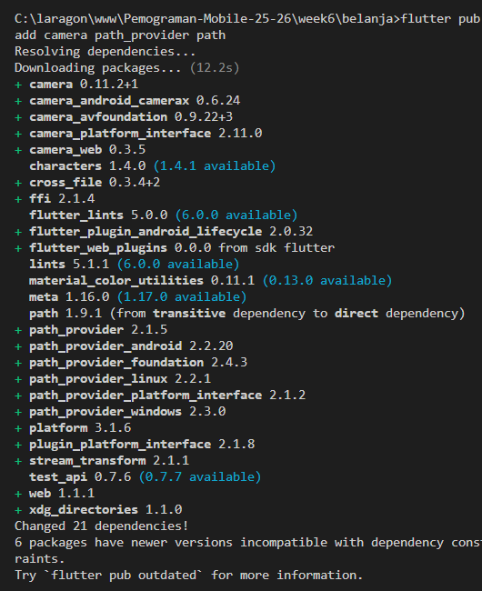

# PERTEMUAN 9 Kamera

## Praktikum 1: Mengambil Foto dengan Kamera di Flutter

### Langkah 1: Buat Project Baru
Saya memakai projek Belanja

### Langkah 2: Tambah dependensi yang diperlukan
Untuk menambahkan dependensi plugin, jalankan perintah flutter pub add seperti berikut di terminal:
```dart
flutter pub add camera path_provider path
```


### Langkah 3: Ambil Sensor Kamera dari device
cek jumlah kamera di perangkat 
```dart
import 'package:flutter/material.dart';
import 'package:camera/camera.dart';
import 'package:belanja/pages/home_page.dart';


Future<void> main() async {
  WidgetsFlutterBinding.ensureInitialized();

  final cameras = await availableCameras();
  final firstCamera = cameras.first;
  runApp(MyApp(camera: firstCamera));
}
class MyApp extends StatelessWidget {
  const MyApp({super.key, required this.camera});

  final CameraDescription camera;

  @override
  Widget build(BuildContext context) {
    return MaterialApp(
      debugShowCheckedModeBanner: false,
      title: 'Belanja App',
      theme: ThemeData(
        primarySwatch: Colors.blue,
        appBarTheme: const AppBarTheme(
          backgroundColor: Colors.blue,
          titleTextStyle: TextStyle(
            color: Colors.white,
            fontSize: 20,
            fontWeight: FontWeight.bold,
          ),
          iconTheme: IconThemeData(color: Colors.white),
        ),
      ),
      home: HomePage(),
    );
  }
}
```

### Langkah 4: Buat dan inisialisasi CameraController

```dart
import 'package:flutter/material.dart';
import 'package:camera/camera.dart';

class TakePictureScreen extends StatefulWidget {
  const TakePictureScreen({
    super.key,
    required this.camera,
  });
  final CameraDescription camera;

  @override
  TakePictureScreenState createState() => TakePictureScreenState();
}

class TakePictureScreenState extends State<TakePictureScreen> {
  late CameraController _controller;
  late Future<void> _initializeControllerFuture;

  @override
  void initState() {
    super.initState();
    _controller = CameraController(
      widget.camera,
      ResolutionPreset.medium,
    );
    _initializeControllerFuture = _controller.initialize();
  }

  @override
  void dispose() {
    _controller.dispose();
    super.dispose();
  }

  @override
  Widget build(BuildContext context) {
    return Container();
  }
}
```
### Langkah 5 Gunakan CameraPreview untuk menampilkan preview foto
Gunakan widget CameraPreview dari package camera untuk menampilkan preview foto. Anda perlu tipe objek void berupa FutureBuilder untuk menangani proses async.
```dart
@override
Widget build(BuildContext context) {
  return Scaffold(
    appBar: AppBar(
      title: const Text('Take a picture - Belanja App'),
    ),
    body: FutureBuilder<void>(
      future: _initializeControllerFuture,
      builder: (context, snapshot) {
        if (snapshot.connectionState == ConnectionState.done) {
          return CameraPreview(_controller);
        } else {
          return const Center(child: CircularProgressIndicator());
        }
      },
    ),
  );
}
```

### Langkah 6 Ambil foto dengan CameraController
Membuat floattingactionbutton untuk mengambil gambar menggunakna takepicture().
```dart
floatingActionButton: FloatingActionButton(
    onPressed: () async {
      try {
         await _initializeControllerFuture;
        final image = await _controller.takePicture();
        if (!mounted) return;
        ScaffoldMessenger.of(context).showSnackBar(
            SnackBar(content: Text('Gambar disimpan di: ${image.path}')),
         );

        } 
        catch (e) {
            print(e);
        }
    },
)
```
### Lnagkah 7 Buat widget baru displaypcturescreen

```dart
import 'dart:io';
import 'package:flutter/material.dart';

class DisplayPictureScreen extends StatelessWidget {
  final String imagePath;

  const DisplayPictureScreen({super.key, required this.imagePath});

  @override
  Widget build(BuildContext context) {
    return Scaffold(
      appBar: AppBar(
        title: const Text('Display the Picture - 2341720072'),
        backgroundColor: Colors.blue,
      ),
      body: Center(
        child: Image.file(File(imagePath)),
      ),
    );
  }
}
```

### Langkah 8  edit main.dart

```dart
runApp(
    MaterialApp(
      theme: ThemeData.dark(),
      home: TakePictureScreen(
        camera: firstCamera,
      ),
      debugShowCheckedModeBanner: false,
    ),
  );
```

### Langkah 9 menampilkan hasil foto
Tambahkan kode seperti berikut pada bagian try / catch agar dapat menampilkan hasil foto pada DisplayPictureScreen.
```dart
try {
    await _initializeControllerFuture;
    final image = await _controller.takePicture();

    if (!context.mounted) return;
    await Navigator.of(context).push(
        MaterialPageRoute(
            builder: (context) => DisplayPictureScreen(
                imagePath: image.path,
            ),
        ),
    );
}
```

### Hasil akhir 


# belanja

A new Flutter project.

## Getting Started

This project is a starting point for a Flutter application.

A few resources to get you started if this is your first Flutter project:

- [Lab: Write your first Flutter app](https://docs.flutter.dev/get-started/codelab)
- [Cookbook: Useful Flutter samples](https://docs.flutter.dev/cookbook)

For help getting started with Flutter development, view the
[online documentation](https://docs.flutter.dev/), which offers tutorials,
samples, guidance on mobile development, and a full API reference.
