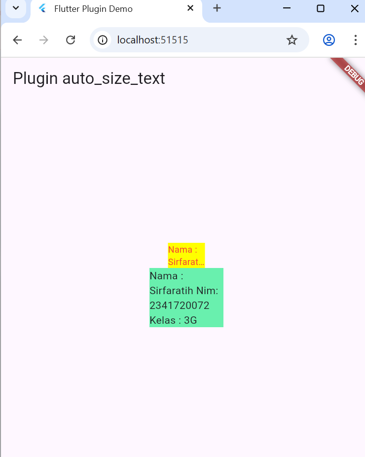

# PERTEMUAN 7 Manajemen Plugin

## Praktikum Menerapkan Plugin di Project Flutter
### Langkah 1 Buat project Baru
Buatlah sebuah project flutter baru dengan nama flutter_plugin_pubdev. Lalu jadikan repository di GitHub Anda dengan nama flutter_plugin_pubdev.
### Langkah 2: Menambahkan Plugin
Tambahkan plugin auto_size_text menggunakan perintah berikut di terminal
```dart
flutter pub add auto_size_text
```

Jika berhasil, maka akan tampil nama plugin beserta versinya di file pubspec.yaml pada bagian dependencies.
### Langkah 3: Buat file red_text_widget.dart
Buat file baru bernama red_text_widget.dart di dalam folder lib lalu isi kode seperti berikut.
```dart
import 'package:flutter/material.dart';

class RedTextWidget extends StatelessWidget {
  const RedTextWidget({Key? key}) : super(key: key);

  @override
  Widget build(BuildContext context) {
    return Container();
  }
}
```

### Langkah 4 : Tambah Widget AutoSizeText
Masih di file red_text_widget.dart, untuk menggunakan plugin auto_size_text, ubahlah kode return Container() menjadi seperti berikut.
```dart
return AutoSizeText(
      text,
      style: const TextStyle(color: Colors.red, fontSize: 14),
      maxLines: 2,
      overflow: TextOverflow.ellipsis,
);
```

Setelah Anda menambahkan kode di atas, Anda akan mendapatkan info error. Mengapa demikian? Jelaskan dalam laporan praktikum Anda! Eror muncul karena dua alasan yaitu plugin belum diimport, dan variabel text belum didefinisikan.

### Langkah 5 :  Buat Variabel text dan parameter di constructor
Tambahkan variabel text dan parameter di constructor seperti berikut.
```dart
final String text;

const RedTextWidget({Key? key, required this.text}) : super(key: key);
```
### Langkah 6 :  Tambahkan widget di main.
Buka file main.dart lalu tambahkan di dalam children: pada class _MyHomePageState

```dart
Container(
   color: Colors.yellowAccent,
   width: 50,
   child: const RedTextWidget(
             text: 'You have pushed the button this many times:',
          ),
),
Container(
    color: Colors.greenAccent,
    width: 100,
    child: const Text(
           'You have pushed the button this many times:',
          ),
),
```


## Tugas Praktikum 
1. Selesaikan Praktikum tersebut, lalu dokumentasikan dan push ke repository Anda berupa screenshot hasil pekerjaan beserta penjelasannya di file README.md!
2. Jelaskan maksud dari langkah 2 pada praktikum tersebut! <br>
Jawaban: Menambahkan dependensi eksternal dengan perintah flutter pub add auto_size_text berfungsi untuk menambahkan plugins auto_size_text ke file puspec.yaml pada bagian dependencies. 
3. Jelaskan maksud dari langkah 5 pada praktikum tersebut! <br>
Jawaban: pada langkah tersebut ada tambahan kode 
```dart 
final String text;
const RedTextWidget({Key? key, required this.text}) : super(key: key);
```
final String text; akan mendeklarasikan variabel yang digunakan untuk menyimpan teks yang akan ditampilkan. required this.text untuk memastikan parameter text harus diisi ketika widget RedTextWidget dipanggil. Const untuk membuat widget menjadi immutable, artinya nilainya tidak dapat diubah setelah dibuat, sehingga efisien saat rebuild UI.
4. Pada langkah 6 terdapat dua widget yang ditambahkan, jelaskan fungsi dan perbedaannya! <br>
Jawaban : Widget pertama untuk menggunakna plugin auto_size_text, terberwarna merah, ukuran font otomatis menyesuaikan agar muat dalam lebar 50 piksel. 
Widget kedua untuk Menggunakan widget bawaan Flutter (Text), Warna teks default (hitam), Ukuran font tidak otomatis menyesuaikan, Jika teks terlalu panjang, maka akan terpotong keluar dari batas container.
5. Jelaskan maksud dari tiap parameter yang ada di dalam plugin auto_size_text berdasarkan tautan pada dokumentasi ini ! <br>
Jawaban: 
### Parameter Plugin `auto_size_text`

| Parameter         | Tipe           | Fungsi                                                                                     |
|-------------------|----------------|---------------------------------------------------------------------------------------------|
| `text`            | `String`       | Isi teks yang akan ditampilkan                                                              |
| `style`           | `TextStyle`    | Mengatur tampilan teks seperti warna, ukuran, font, dan tebal huruf                         |
| `maxLines`        | `int`          | Menentukan jumlah baris maksimal yang boleh ditampilkan                                     |
| `overflow`        | `TextOverflow` | Menentukan perilaku teks jika melebihi batas (misalnya: `ellipsis` → potong dengan “…”)     |
| `minFontSize`     | `double`       | Ukuran font minimum agar teks tetap muat                                                    |
| `maxFontSize`     | `double`       | Ukuran font maksimum yang bisa digunakan                                                    |
| `stepGranularity` | `double`       | Mengatur seberapa halus perubahan ukuran font ketika menyesuaikan ruang                     |
| `presetFontSizes` | `List<double>` | Daftar ukuran font yang akan dicoba secara berurutan untuk menemukan ukuran terbaik         |
| `textAlign`       | `TextAlign`    | Mengatur posisi teks (kiri, tengah, kanan, atau rata kanan kiri)                            |
| `softWrap`        | `bool`         | Menentukan apakah teks boleh pindah baris otomatis                                          |
| `wrapWords`       | `bool`         | Jika `false`, kata tidak akan dipotong di tengah saat membungkus teks                       |


6. Kumpulkan laporan praktikum Anda berupa link repository GitHub kepada dosen!